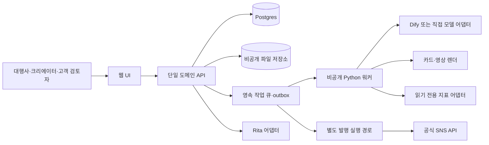

# 콘텐츠 운영 제품: 개발·데이터·모델 검증 설계

작성 2026-09-29. **목표 설계이며 구현 완료 명세가 아니다.** 이번 작업은 기존 Rita·트렌드·카드뉴스 자산을 읽은 조사와 공개 공식 문서에 근거한다. 앱 수정, 계정 연결, API 권한 신청, 실제 발행은 하지 않았다. 필드와 대표 API는 `proposedcontracts.json`에 정리했다. 해당 JSON은 검토용 계약 초안이지 실행 가능한 DB migration이나 완성된 OpenAPI가 아니다.

**일정·예산 우선순위:** 최종 masterplan의 07 실행계획에 있는 R0/R1/R2… 릴리스 정의가 일정·예산의 기준이다. 아래 P0/P1/P2/P3는 기술 확장 수준이며 같은 번호의 릴리스와 일대일 대응하지 않는다. 최종 R1에는 계정 분석 없이 고객 자료에서 만든 후보 3개와 선택 이력을 추가한다. 현재 운영 가정은 창업자 본인·조유경 학생 1명(주4~5시간)·AI/Codex다. 개발자는 시제품 뒤 확인된 보안·권한·운영 항목만 인계하며 비용은 별도 산정한다. 이전 학생 2명·개발자 24–40시간·총 468–650만원은 현 운영안에 적용하지 않는다. 아래의 더 좁은 카드 P0 16–24시간 보강 사례는 전체 R1 예산을 대체하지 않는다.

## 1. 먼저 결정할 구조

첫 고객은 여러 브랜드를 관리하는 소규모 대행사다. 같은 핵심 기능을 1인 크리에이터에게도 제공하되, 첫 화면과 권한을 단순화한다. 고객 유형별로 별도 서비스를 세 개 만들지 않는다.

| 고객 상태 | 첫 진입 | 제공할 근거 | 다음 행동 |
|---|---|---|---|
| 대행사 | 고객사 선택 → 이번 콘텐츠 목적·자료 | 해당 브랜드 규칙·이전 승인본·가능한 자체 계정 성과 | 검토 가능한 콘텐츠 초안 → 고객 승인 |
| 운영 중인 크리에이터 | 자기 목표 → 선택적 읽기 전용 계정 연결 | 본인 최근 콘텐츠와 같은 형식의 기준선 | 다음 시도 3개 중 선택 → 하나 제작 |
| 새 크리에이터 | 분야·목표·가능한 제작 방식 | 허용된 사례·편집자 규칙, 계정 데이터가 없음을 표시 | 시작용 소재·템플릿 → 첫 게시 준비 |

첫 사용에 계정 연동이나 API 키 발급을 강제하지 않는다. 자료를 넣고 샘플을 본 뒤 저장·협업할 때 로그인하며, 진단이 필요할 때 별도로 SNS를 연결한다. 미연결 상태에서 제공하는 사례 기반 제안을 '내 계정 분석'이라고 표현하지 않는다.

목표 흐름은 **목적 → 계정 점검 → 소재·콘텐츠 제안 → 제작·편집 → 승인·발행 → 결과 확인**이다. 처음부터 이 전부를 완성해야 첫 고객을 받을 수 있는 것은 아니다. 초기 직접사용 제품은 목적·자료 → 카드 제작·수정 → 확정·내보내기로 닫고, 나머지를 검증 단계별로 추가한다.

### 추천 배치 구조

**모듈형 단일 백엔드**를 권한다. 인증·고객사·제작·승인·사용량·연결은 한 코드베이스, 한 Postgres에서 시작한다. 렌더·수집·추론은 웹 요청과 분리된 비공개 워커 프로세스로 실행한다. 장시간 생성 때문에 웹 요청을 열어두지 않는다. 하나의 저장소 안에서 경계를 나누는 것으로 충분하며, 초기부터 서비스별 서버·Kubernetes·분산 feature store를 운영할 이유가 없다.

| 요소 | 초기 선택안 | 판단 근거·변경 조건 |
|---|---|---|
| UI | TypeScript 웹앱, 폼 기반 카드 편집 | 학생이 이미 다루는 프레임워크를 우선. TS/React가 확정된 팀이면 그 생태계 사용. 프레임워크 교체 자체를 목표로 삼지 않음 |
| 도메인 API | Python FastAPI 후보 | 기존 트렌드·렌더가 Python이어서 재사용 경계가 명확. 다만 팀의 현행 인증·배포 골격이 다른 언어로 안정적이면 유지하고 Python 워커만 분리 |
| DB | 관리형 Postgres | 관계·버전·원장·테넌트 제약을 함께 관리. 기존 공유 SQLite DB를 고객별 SaaS DB로 그대로 노출하지 않음 |
| 인증 | 관리형 인증 + 서버 검증 + 조직 멤버십 | 비밀번호·메일 인증을 직접 개발하지 않음. 인증 서비스의 user_id가 브랜드 권한을 대신하지 않음 |
| 파일 | 비공개 객체 저장소 + 짧은 접근 URL | 산출물·원본을 임의 URL만 알면 조회할 수 없도록 함. SNS 가져오기용 URL도 대상 버전·파일·시간 범위로 제한 |
| 작업 | 작은 규모는 Postgres 작업 테이블·임대 잠금·outbox | 재시도·중복·장애 복구를 검증한 구현 하나를 사용. 작업량·분리 배포가 커지면 Celery와 관리형 broker 등으로 교체. 큐 제품 이름만으로 정확히 한 번 실행이 보장되지는 않음 |
| 생성 | Dify 어댑터 또는 직접 모델 API | 입력/출력 JSON 경계 고정. Dify 노드 구조와 모델 이름이 프런트엔드·DB 계약이 되지 않게 함 |
| 분석 | SQL/배치 Python → 검증 후 선택적 ML | 초기 진단·기준선에 GPU·벡터 DB·온라인 학습은 필수 아님 |

공개된 기존 카드 렌더 서버를 그대로 상품 백엔드로 붙이지 않는다. 조사한 로컬 서버에는 파일 열기·저장·서버 편집용 경로와 공개 산출물 경로가 함께 있었다. 렌더 함수와 검증한 템플릿만 추출하고, 외부 입력을 제한하는 비공개 워커로 감싼다. 이는 로컬 코드 경계의 평가이며 현재 배포 서버를 침투 시험한 결과는 아니다. 기존 Dify 주소·입출력도 복사본에서만 수정·검증한다.

## 2. 모듈 경계와 사용자 권한

`workspace/tenant`는 대금을 내는 대행사 또는 1인 사업자의 작업실이다. `brand`는 그 안에서 작업하는 고객사·채널 브랜드다. 한 사람이 여러 작업실에 속할 수 있다. 고객 검토자를 초대했다고 대행사의 다른 브랜드를 열람하게 하지 않는다.

역할은 `owner`, `admin`, `editor`, `reviewer`, `analyst`, `billing_manager`를 기준으로 하되 최소 출시에는 owner/editor/reviewer로 좁힌다. 단순 역할명 외에 브랜드별 허용 범위와 `publish` 같은 행위 권한을 검사한다. 관리자라는 이유로 고객 계정 연결이나 발행 동의를 자동 획득하지 않는다.

| 모듈 | 소유하는 상태 | 허용된 출력·부작용 |
|---|---|---|
| 목적·브랜드 | 목표·톤·금칙·승인본·권리 | 제작 brief, 브랜드 규칙 버전 |
| 계정·진단 | 연결 권한·계정·게시물·관측값 | 사실 요약·결측·비교 기준. 발행 없음 |
| 소재·추천 | 후보와 출처·선택 이유·노출·반응 | 편집 가능한 제작안. 타사 소재 복제권을 부여하지 않음 |
| 콘텐츠 | 구조화된 카드/영상 프로젝트·버전 | 미리보기·내보내기·제한된 부분 수정 |
| 승인 | 정확한 콘텐츠 버전·검토자·결정 | 승인/반려. 새 버전 자동 승인 없음 |
| 발행 | 계정·권한·승인·예약·외부 상태 | 오직 승인된 불변 버전을 게시 |
| 성과 | 게시 ID·정의가 있는 관측값 | 시간대·형식별 비교, 추천 가설 검토 |
| 운영·과금 | 사용 예약·실제 원가·청구·감사 | 비용 상한·운영 복구. 성장 효과 증명과 별개 |

DB는 테넌트 소유 테이블에 `(tenant_id, id)` 유일 키를 두고, 해당 테이블 간 참조는 `FOREIGN KEY (tenant_id, brand_id)` 같은 복합 FK로 묶는다. `brand_id`가 유효하다는 것만 검사해서 다른 고객의 브랜드와 연결되면 안 된다. 서버의 권한 검사와 Postgres RLS를 함께 사용한다. 앱 DB 계정은 owner/superuser/BYPASSRLS 역할을 사용하지 않고, 풀링된 연결에 테넌트 문맥이 남지 않게 트랜잭션별로 설정·해제한다. RLS를 켰어도 소유자·특권 역할의 우회와 FK 등 예외가 있다는 점을 배포 검사에 넣는다. [Postgres 공식 RLS 문서](https://www.postgresql.org/docs/18/ddl-rowsecurity.html)

워커가 `tenant_id`를 전달받았다는 이유만으로 작업을 신뢰하지 않는다. DB에 저장된 작업·사용자 권한·브랜드 범위를 다시 읽고 실행한다. 삭제·연결 해제·권한 철회가 예약 작업보다 우선한다. 운영자 접근은 이유·시간·범위를 기록하고 기본적으로 원문·토큰을 로그에 남기지 않는다.

## 3. 데이터 계약: 무엇을 남겨야 재현하고 개선할 수 있나

모든 시간은 UTC `timestamptz`로 저장하고 표시 시간대는 별도 필드로 둔다. 사용자에게 보이는 '9월 29일'을 원본 시간으로 대체하지 않는다. 원본 수치, 플랫폼이 정의한 지표, 우리가 계산한 지표, 사용자가 입력한 값, LLM이 붙인 분류를 각각 구분한다.

| 묶음 | 주요 테이블·핵심 필드 | 핵심 참조·검사 |
|---|---|---|
| 조직·브랜드 | tenants, users, memberships, brand_grants, brands, brand_profile_versions, goals | user는 인증 식별자, brand는 tenant FK. 프로필/목표 버전은 제작 시점에 고정 |
| 동의·자료 권한 | consents, rights_grants, rights_bindings, deletion_requests | `process_for_user`, `display_reference`, `benchmark`, `train`, `evaluate`, `reuse_media`, `publish` 별도 목적. 고객 허락과 플랫폼 허용 조건을 함께 기록 |
| 계정 연결 | external_connections, social_accounts | provider, API version, 실제 scopes, token vault reference, expiry, revoked_at. 토큰 원문 DB·브라우저 저장 금지 |
| 원자료·게시 | source_items, content_posts | 출처·취득 방식·권리·관측시점·외부 게시 ID·게시시각·형식·유료노출 여부 known/unknown |
| 지표 | metric_definitions, metric_snapshots | metric key+API version+분모/단위+유기적/광고 포함 여부+period. account 또는 post 중 정확히 하나 |
| 특징·정답 | feature_definitions, feature_values, label_annotations, outcome_labels | feature cutoff, available_at, 정의 버전. 사람/LLM의 콘텐츠 태그와 성과 정답을 분리 |
| 후보·추천·실험 | brief_options, recommendations, recommendation_candidates, recommendation_exposures, recommendation_feedback, experiments, experiment_assignments | P0는 자료 기반 후보·선택 이력, P1 이후에는 candidate set, policy version, position, 실제 노출, 선택/수정/게시, 배정 확률·대상 |
| 학습·추론 | dataset_manifests, dataset_members, model_versions, model_runs | 자료 계보·권리 검사·분할 해시·학습 코드/모델 버전·평가 결과·실행 비용 |
| 제작·승인 | artifacts, artifact_versions, artifact_files, approval_versions | 콘텐츠 JSON·asset checksum·caption·template version. 승인은 본 버전 digest에 고정 |
| 실행·발행 | async_jobs, outbox_events, publishing_jobs, publishing_attempts | idempotency key, lease, retry, 외부 컨테이너/게시 ID, unknown 상태와 확인 기록 |
| 돈·감사·통합 | usage_reservations, usage_ledger, billing_events, audit_events, integration_subjects | 실제 원가와 고객 청구량 분리, 중복 결제 이벤트 방지, Rita subject는 검증 후 로컬 권한 매핑 |

### 처음부터 전부 만들지 않는다

JSON의 `phase`가 범위를 나눈다. P0는 직접사용 카드 제작·버전·내보내기·최소 권한·사용량이다. P1은 정식 계정 연결·수집·기준선·추천 노출 기록이다. P2는 발행·제한된 영상 경로다. P3는 데이터 권리와 검증이 충족된 뒤의 학습·실험 운영이다. 목표 테이블 목록이 첫 12주 작업 지시서는 아니다.

R1의 자료 기반 후보 3개는 P0 `brief_options`에 출처·후보·선택 여부만 기록해 시작할 수 있다. 고급 성과 예측을 붙이지 않아도 후보→선택→초안의 제품 경험은 제공한다. P1의 추천·노출·성과 이력과 P3의 실험 확률 기록은 다음 기술 단계다. JSON에서 이후 단계 테이블을 참조하는 열과 FK는 `introduced_in_phase`까지 미루며, 첫 DB migration에서 전체 스키마를 생성하라는 뜻이 아니다.

### 지표 스냅샷의 정확한 의미

한 행은 '지금 확인한 값'이지 과거에 실제로 알려져 있던 값이 아니다. `observed_at`(서버가 받은 시각), `metric_as_of`(플랫폼이 명시한 측정 기준시각, 없으면 null), `period_start/end`, `published_at`, `api_version`, `source_type`, `completeness`를 남긴다. API가 알리지 않은 측정 기준시각을 수집시각과 같다고 꾸미지 않는다.

`value=null`일 때 `not_supported`, `insufficient_audience`, `not_collected`, `provider_delay`, `permission_missing`, `deleted`, `unknown` 등을 구분한다. 실제 0과 결측을 같은 그래프로 그리지 않는다. 누적 도달 수를 여러 게시물에서 합한 값을 고유 도달 인원이라고 부르지 않는다. 지표 정의가 바뀌면 새 definition ID를 만들고 옛 수치와 자동 연결하지 않는다.

### 권리·보존·삭제

권리 원장은 자료별·목적별로 `allowed/denied/pending/expired`를 결정하며, 거부·만료가 있으면 실행 전에 중단한다. OAuth 동의는 서비스 계정 분석에 필요한 접근을 부여할 수 있지만, 다른 고객을 위한 모델 학습·벤치마크·미디어 재사용까지 자동 허용하지 않는다. 플랫폼 조건·고객 계약·원저작물 권리는 각각 검토한다. '공개 게시물'과 '상업적 학습·재배포가 허용된 자료'는 다르다.

특히 Meta Platform Terms 5.b.ii는 기술 제공자의 고객 데이터 처리를 그 고객의 지시·목적에 제한하고 고객별 분리 보관을 요구한다. 따라서 **Meta 고객 계정 데이터를 다른 고객을 위한 모델 학습에 합치는 것은 기본 금지**로 설계한다. 고객이 동의 버튼을 누르는 것만으로 제공자 제한을 해제하지 않는다. 자기 계정 분석도 허용된 목적·처리 범위 안에서 수행하고, 공동 모델 연구는 별도로 학습 사용권과 제공자 조건이 확인된 자료로 분리한다. JSON의 학습 테이블은 tenant 범위를 유지하며 일반 고객 자료의 무제한 풀링 경로를 제공하지 않는다. [Meta Platform Terms, 3.a.viii·5.b.ii](https://developers.facebook.com/terms/)

YouTube 자료로 만든 파생 점수도 무조건 재사용할 수 없다. 공식 추가 정책은 승인된 분석 사용에 특정 파생 지표와 보존 예외를 설명한다. 승인 범위 안에서도 플랫폼 원본 지표와 자체 계산을 구분하고, 통계와 텍스트의 보존 조건이 다르다. 기존 트렌드 코드가 실행된다는 사실은 상용 제품에서 점수·태그·학습에 사용할 권한의 증거가 아니다. 승인·허용 여부가 불명확한 기능은 비활성화하고 고객이 권리를 가진 자료와 자체 편집자 평가로 시작한다. [YouTube 파생 지표 추가 정책](https://developers.google.com/youtube/terms/derived-metrics-policy)

보존은 데이터 종류마다 설정한다. 다음은 법정 보존기간이라는 주장이 아닌 **운영 정책 초안**이다. 제공자 약관·고객 계약·법적 의무가 우선하며, 기간만료 작업을 실제로 시험해야 한다.

- OAuth 토큰: 해제 즉시 서버 사용 중단·금고 폐기. 승인 취소 API가 있다면 호출하고 실패 상태를 기록한다.
- 업로드·작업물: 활성 계약 중 필요한 범위, 삭제 요청 시 온라인 자료를 지체 없이 접근 차단하고 정해진 삭제 SLA에 따라 제거. 삭제 대기 기간·백업 만료 기간을 계약 전에 확정한다.
- 로그: 원문 없는 진단 로그만 짧게 보존. 예를 들어 일반 진단 로그 30일을 시작안으로 두되 운영·정책 검토로 확정한다. 계정/행동 로그도 개인정보일 수 있다.
- 플랫폼 원자료: 제공자별 만료·재조회 규칙을 `rights_grants.expires_at`, `source_items.refresh_due_at`와 수집 어댑터로 집행한다. 무기한 데이터 호수를 만들지 않는다.
- 과금 증빙: 콘텐츠 원문과 분리해 필요한 항목만 보존. 실제 법정 기간은 적용 법률·계약 검토 후 확정한다.
- 학습: dataset member→원본→권리→모델 버전 계보를 남긴다. 삭제·동의 철회 시 미래 학습 제외, 관련 캐시/배치 제거, 영향을 받는 모델 배포 중단·재학습 판단을 수행한다. 이미 학습한 모델에서 개인 기여가 즉시 완전히 제거된다고 보장하지 않는다.

## 4. Instagram 연결과 제작·발행

초기 정식 연결 후보는 Instagram Login이다. Business/Creator 프로페셔널 계정이 대상이며 Facebook 페이지가 필요하지 않다. 사람이 개인 창작자라는 뜻과 계정 유형 Personal을 혼동하지 않는다. 외부 고객용 운영에는 필요한 권한의 Advanced Access, App Review, Business Verification 상태를 확인해야 한다. 자체 개발 계정의 조회 성공은 외부 고객 연동 완료가 아니다. [Instagram Login](https://developers.facebook.com/documentation/instagram-platform/instagram-api-with-instagram-login), [접근 수준](https://developers.facebook.com/documentation/instagram-platform/overview)

읽기 전용은 `instagram_business_basic`, `instagram_business_manage_insights`를 필요한 범위로 요청한다. 발행 기능을 켤 때 `instagram_business_content_publish`를 별도로 요구한다. 시작부터 DM·댓글 관리·광고 권한을 묶지 않는다. 100명 미만 계정은 일부 지표가 제한될 수 있지만 전체 연결 불가를 뜻하지 않는다. 미디어 종류·API 버전·권한에 따라 실제 지원되는 지표를 capability로 저장한다. [Insights](https://developers.facebook.com/documentation/instagram-platform/insights), [계정 지표](https://developers.facebook.com/documentation/instagram-platform/api-reference/instagram-user/insights)

초기에는 최근 게시물과 필요한 소수 지표를 제한 주기로 조회한다. Instagram Login의 Insights webhook을 전제로 설계하지 않는다. API 응답의 제한·지연·권한 오류를 처리하고, 고객당 동시 조회·일일 원가·전체 제공자 쿼터를 나눠 관리한다. 스토리와 일반 게시물, account period와 media lifetime을 섞지 않는다. 캐러셀 카드별 이탈이나 세부 시청 유지 곡선이 제공되는 것으로 가정하지 않는다. [미디어 지표](https://developers.facebook.com/documentation/instagram-platform/reference/instagram-media/insights)

심사 대기 때 CSV/고객 제공 자료로 진단 가치를 시험할 수 있다. 이 경우 화면과 데이터의 `source_type=customer_import`, 추출시각·추출범위·누락을 표시하고 정식 API 연동·실시간 갱신이라고 부르지 않는다. 화면에서 확인하지 못한 숫자를 채워 넣지 않는다.

### 편집 경계

카드 v1은 2개 정도의 검증된 템플릿, 카드 수 6 또는 8, 제목/본문/근거/사진 선택/브랜드 색/카드 순서 같은 제한된 폼을 제공한다. 직접 문구 수정은 즉시 미리보기와 새 버전에 반영한다. AI 부분 수정은 선택한 카드·필드만 바꾸고, 전체 재생성보다 원본과 차이를 명확하게 보여준다. 텍스트 넘침·저작권 자료 누락·렌더 실패를 사용자에게 되돌린다. 생성 결과가 완벽하지 않아도 고객이 스스로 마무리할 수 있어야 한다.

영상은 첫 단계에 대본·장면 지시·자막 파일·소재 목록을 내보내는 경로로 시작한다. 그다음 고객 소유 영상의 컷 선택·자막·세로 크롭·브랜드 인트로 등 제한된 편집을 추가한다. Canva/CapCut급 타임라인, 여러 모델의 영상 생성, 음원 라이선스 자동 해결은 별도 프로젝트다. 자막 수정·소재 교체·렌더 취소·재시작·용량/시간 제한·권리 확인까지 있어야 편집 기능이 완료된 것이다.

### 발행 상태와 안전한 재시도

`draft → queued → preflight → container_created → processing → publish_requested → published`를 기본 성공 경로로 둔다. `failed_retryable`, `failed_final`, `unknown`, `cancelled`를 별도로 둔다. 실제 provider 상태와 우리 작업 상태를 분리한다.

예약 직전과 실행 직전에 계정 연결·게시 권한·현재 승인·사용료 상한·삭제/취소 여부·미디어 적합성을 검사한다. 승인 digest는 artifact_version, caption, asset checksum, target account와 공개 옵션을 포함한다. 예약 시간만 변경할 수 있는 허용 범위는 계약으로 정하며, 콘텐츠·대상 계정이 바뀌면 새 승인을 받는다.

외부 publish 요청 후 응답이 유실되면 `unknown`으로 둔다. 실패라고 단정해서 즉시 다시 보내지 않는다. 저장한 container/post ID, 제공자 상태 조회와 최근 게시 결과를 확인하고, 확정할 수 없으면 운영자 확인으로 넘긴다. 클라이언트의 idempotency key와 DB unique key는 우리 서버의 중복을 막지만 제공자가 정확히 한 번 게시했음을 보장하지 않는다. 재시도는 제공자 오류 종류·Retry-After·지수 backoff+jitter·최대 시도/기간을 적용한다.

이미지 게시 형식 등은 최신 공식 조건으로 검사한다. 현재 PNG 렌더러만으로 발행 준비가 끝나는 것이 아니며, 허용 형식 변환과 접근 가능한 임시 미디어 URL이 필요하다. 쿼터 숫자를 UI·코드에 영구 고정하지 않고 실제 사용 한도 endpoint와 오류를 반영한다. [Content Publishing](https://developers.facebook.com/documentation/instagram-platform/content-publishing)

### 생성 비용·사용량

모델 실행 전에 `usage_reservations`로 상한을 예약하고 완료 후 실제 토큰·모델·재시도·렌더초·비용을 원장에 정산한다. 동시 요청이 한도를 뚫지 않도록 DB에서 원자적으로 처리한다. 사용자 실패 요청의 환급과 실제 발생한 내부 비용을 구분한다. API timeout 뒤 실행 완료 여부가 불확실하면 비용도 provisional 상태로 남긴다. 무료 체험·학생 테스트·고객 유료 사용량을 구분한다.

Dify에는 서버가 생성한 허용 범위의 입력과 run_id만 전달한다. 고객 SNS 토큰·다른 브랜드 자료·결제 자격증명은 전달하지 않는다. 워크플로/프롬프트/모델 버전과 입력 스키마를 기록하고 구조화 출력 검증에 실패하면 고객 결과물로 확정하지 않는다. 생성 텍스트가 외부 도구 실행 지시가 되지 않도록 데이터와 명령을 분리한다.

## 5. 분석·추천·예측은 세 가지 다른 문제다

1. **설명:** 내 계정에서 어떤 형식·소재가 어떤 결과를 보였는가. 관측치·비교 집단·결측을 정확히 보여준다.
2. **예측/순위:** 제작 전에 알 수 있는 정보로 후보 결과를 어느 정도 구분할 수 있는가. 외부 검증으로 평가한다.
3. **개입 효과:** 이 추천을 보여줘서 실제 업무·성과가 좋아졌는가. 추천 노출과 실행을 기록하고 가능하면 무작위 실험으로 평가한다.

과거 인기 게시물을 잘 맞추는 모델이 좋은 소재를 추천한다는 보장은 없다. 실제 올라간 콘텐츠만 관측되므로 제작자가 선택하지 않은 후보의 성과는 모른다. 미게시 후보를 조회수 0으로 학습시키면 안 된다. 목표는 '바이럴 공식을 알아냈다'가 아니라 **고객이 더 적은 수정으로 다음 좋은 시도를 완성하도록 돕는 것**이다.

### 먼저 만들 기준선

자료가 없는 새 계정에는 목표·제작 가능성·브랜드 적합성 규칙으로 추천한다. 예상 조회수 숫자를 꾸미지 않는다. 이력이 적으면 자기 계정의 최근 같은 형식 결과와 허용된 비교 집단의 요약을 신뢰도에 따라 결합한다. 한두 개의 대박 게시물이 기준을 지배하지 않도록 중앙값·절사 요약·수축 추정 후보를 비교한다.

비교 집단은 국가/언어·주제·형식·계정 규모·유료/유기적·게시 후 경과시간을 가능한 범위에서 맞춘다. 너무 좁아 표본이 사라지면 상위 집단으로 넓히고 그 사실을 표시한다. 다른 고객의 성과를 원문이나 식별 가능한 집계로 노출하지 않는다. 사용 권한 없는 풀링 자료는 사용하지 않는다.

초기 추천은 3개 후보에 '내 목표에 맞는 이유', '내 과거 콘텐츠에서 확인한 사실', '아직 검증하지 않은 가설', '제작 부담'을 보여준다. 한 후보를 선택하면 자료·템플릿·대본이 이어지는 것이 데이터 대시보드 하나를 더 만드는 것보다 중요한 검증 대상이다.

### 특징의 시점: 데이터 누수를 막는 규칙

모든 학습 행에는 `decision_at`을 둔다. 특징은 그 시점 전에 발생했고 그때 실제 시스템이 이용할 수 있었던 정보만 사용한다. `event_time <= decision_at`뿐 아니라 `available_at <= decision_at`도 만족해야 한다. 게시물의 최종 수정 캡션을 원래 추천 시점 입력으로 쓰지 않는다. 문서에 나중에 붙인 사람이 정답을 보고 라벨링한 설명 역시 주의한다.

허용 후보는 당시 팔로워 규모, 이전 게시물의 **당시 성숙한** 결과, 예정 형식/길이/주제/첫 문장·시각 특징, 당시 브랜드 목표, 제작 리소스, 게시 예정 시간이다. 금지 후보는 예측 대상의 게시 후 reach/views/engagement, 미래 팔로워 변화, 평생 누적 성과를 본 뒤 붙인 '대박' 태그, 나중에 수집한 경쟁 반응이다.

특히 `저장 수 ~ 콘텐츠 특징 + offset(log(게시 후 도달))`는 도달을 조건으로 한 사후 관계를 설명할 수는 있어도 제작 전 총성과 예측이 아니다. 게시 후 reach는 콘텐츠 효과의 매개·선택 결과일 수 있다. 사전 예측에 넣지 않는다. 저장/도달 비율은 관측 설명의 별도 목표이며, 총 저장 증가나 성장의 인과 효과와 구분한다. ratio 분모 0·결측·작은 분모·불확실성을 처리하고 억지로 0을 넣지 않는다.

### 성과 정답: 같은 경과시간을 비교

`outcome_labels`는 목표 지표와 고정 horizon을 명시한다. 예: 게시 7일 시점 저장 수, 게시 7일 시점 조회 수. 이것은 설계 예시이며 모든 플랫폼에서 과거 7일 값을 가져올 수 있다는 뜻이 아니다.

- 플랫폼이 7일 누적치를 정확히 제공하면 그 정의와 기준시각을 저장한다.
- 누적치만 제공하면 연결 이후 horizon 부근의 스냅샷을 수집한다. 허용 오차 창과 지연 규칙을 미리 정하고, 9일 누적치를 7일 성과로 이름만 바꾸지 않는다.
- 과거 게시물을 지금 연결한 경우 과거 7일 정답은 복원 불가일 수 있다. `horizon_unobserved`로 두고 해당 학습·평가에서 제외한다. 현재 관측 자료는 경과일을 표시한 설명에 제한적으로 사용한다.
- 아직 7일이 안 지난 게시물은 `immature/censored`, API 지연은 `delayed`, 삭제·비공개·권한 철회는 원인을 구분한다. 이들을 실패=0으로 넣지 않는다.
- 성숙한 정답만 학습에 포함하고, 포함률과 제외 사유를 계정·포맷·기간별 보고한다. 삭제·발행 선택이 결과와 연관되면 단순 완전자료 분석도 편향될 수 있음을 명시한다. 생존분석·가중치 보정은 별도 가정 검증 없이 자동 도입하지 않는다.

## 6. ML 비교 설계

| 후보 | 사용할 조건 | 장점·주의 |
|---|---|---|
| 최근 계정×형식 기준선 | 가장 먼저, 자료가 적어도 가능 | 이해하기 쉽고 비용 낮음. 최신 콘텐츠의 정답 성숙 여부를 지킴 |
| Ridge/Elastic Net `log1p(count)` | 합법적 수치/범주 특징과 충분한 독립 단위 | 기준 모델. 로그 변환 예측을 단순 exp만 해서 원래 단위 평균으로 부르면 안 됨 |
| Poisson/Negative Binomial 등 GLM | 비음수 count·과산포 등 자료 특성에 맞는 경우 | 목표와 분산 가정 점검. 사후 도달을 사전 예측 offset으로 넣지 않음 |
| 계정 혼합효과 모델 | 계정별 반복 게시가 있고 계정 차이가 큼 | 계정 random intercept 등을 기준선 후보로 사용. 새 계정에는 모집단·수축 추정; 알려지지 않은 계정 효과를 실제 값처럼 쓰지 않음 |
| XGBoost Regressor | 기준선 대비 재현 가능한 외부 개선이 있을 때 | 비선형·상호작용 후보. 튜닝·분할·누수 통제가 성능보다 먼저 |
| XGBoost Ranker | query 안 여러 후보와 유효 relevance label이 있을 때 | 실제 선택 집합과 라벨 정의 필요. rank score는 확률·예상 조회수가 아님 |

XGBoost의 Learning-to-Rank는 query group과 관련성 정답을 전제로 한다. 계정의 서로 다른 날짜 게시물을 임의로 묶는 것은 같은 순간의 선택 후보 집합과 같지 않다. 과거 게시물 순위를 맞추는 실험이라면 **후향적 대리 과제**라고 표시한다. 사람 편집자가 후보 적합성을 평가한 ranker는 편집자 선호를 예측하는 것이며 조회수 모델이 아니다. 클릭 학습은 노출 위치 편향을 포함하고, XGBoost의 관련 보정 기능도 모든 선택 편향을 해결해 주지 않는다. [XGBoost 공식 Learning to Rank](https://xgboost.readthedocs.io/en/stable/tutorials/learning_to_rank.html)

모델이 필요 없는 기능에는 LLM/ML을 붙이지 않는다. 스키마 검사, 권한, 비용 한도, 승인, 게시 중복 방지는 결정적 코드로 처리한다. LLM이 생성한 태그에는 모델/프롬프트 버전·신뢰도·사람 수정 이력을 남기며, 별도의 사람이 만든 평가표본으로 태그 품질을 확인한다. 민감 속성 추론은 추천 특징으로 추가하지 않는다.

### 분할과 튜닝

**평가 A: 기존 계정의 다음 콘텐츠.** 계정별 과거→미래 rolling origin으로 나눈다. 훈련 라벨이 시험 시작 시점에 이미 관측·성숙했는지 검사한다. 7일 성과를 목표로 하면 단순 게시일 분할 외에 해당 horizon과 제공 지연을 반영한 purge/gap이 필요하다.

**평가 B: 새 고객·새 계정.** 계정 또는 대행사를 통째로 holdout하고 미래 기간에서 평가한다. 같은 대행사의 여러 유사 브랜드가 분산되면 일반화가 부풀려질 수 있으므로 고객사/캠페인/중복 소재 묶음도 추적한다. 학습·시험에 복제된 카드·영상·유사 캡션이 들어가지 않게 그룹을 묶는다. A와 B 성능을 한 숫자로 합쳐 숨기지 않는다.

`GroupKFold`는 그룹 겹침을 막는 도구이고 `TimeSeriesSplit`은 시간 순서를 다루는 도구다. 둘 중 하나만 호출해서 두 조건을 다 만족했다고 주장하지 않는다. 우리 데이터의 시간·계정·캠페인 제약을 만족하는 분할 manifest를 만들고 assertion으로 검사한다. 전처리·결측 대체·스케일·target encoding·특징 선택·태그 사전 학습은 각 훈련 fold 안에서 수행한다. Hyperparameter 탐색은 안쪽 분할, 최종 평가는 잠근 바깥 시험자료에서 한 번 수행한다. [GroupKFold](https://scikit-learn.org/stable/modules/generated/sklearn.model_selection.GroupKFold.html), [TimeSeriesSplit](https://scikit-learn.org/stable/modules/generated/sklearn.model_selection.TimeSeriesSplit.html), [sklearn 누수 방지](https://scikit-learn.org/stable/common_pitfalls.html)

### 지표·불확실성·출시 기준

회귀는 로그 스케일 MAE, 원래 단위 MAE/적절한 count deviance, 계정별 오차를 함께 보고한다. ranker는 query별 NDCG@k 등을 산출하되 유효 후보 수·서로 다른 relevance 수준·평가 coverage를 보고한다. 같은 라벨만 있는 집합에서 완벽한 순위 점수로 포장하지 않는다. 대형 계정의 게시물 수가 평가를 독점하지 않도록 계정 또는 고객사 단위 macro 결과도 둔다.

신뢰구간은 게시물을 독립 표본으로 다루지 않는다. 주요 일반화 단위인 계정/대행사를 묶어 bootstrap하고, 시계열 의존이 크면 시간 블록도 검토한다. 독립 고객 수가 적으면 좁은 정밀도를 주장하지 않는다. 개인별 편차·오차 상위 사례·형식/규모/언어 하위집단 결과를 함께 검토한다.

확률 보정은 '이 후보가 정해진 기준을 넘을 확률' 같은 명확한 사건을 예측할 때 검토한다. 별도 calibration 자료와 Brier/log loss·reliability plot을 사용한다. **rank score에 %를 붙이지 않는다.** Count 예측은 관측/예측 비교·잔차·예측구간 coverage를 점검한다. 게시물 수가 적다고 무리하게 세밀한 확률을 보여주지 않는다. [sklearn Probability Calibration](https://scikit-learn.org/stable/modules/calibration.html)

SHAP은 모델이 어떤 입력을 활용했는지 설명하는 도구다. '첫 문장이 12자여서 저장수가 늘었다' 같은 원인 증명이 아니다. 입력 간 상관·선택 편향·측정오류가 있는 경우 더욱 그렇다. 고객 화면에는 '이 모델의 예측에 영향을 준 특징' 또는 관측 근거로 표현하며 강제적 최적화 지시로 바꾸지 않는다. [SHAP의 인과 해석 주의](https://shap.readthedocs.io/en/latest/example_notebooks/overviews/Be%20careful%20when%20interpreting%20predictive%20models%20in%20search%20of%20causal%20insights.html)

모델 착수·출시를 '게시물 5,000개' 같은 임의 수량으로 결정하지 않는다. 권리 허용률, 성숙 정답 비율, 독립 계정 수, 목표 고객·형식 coverage, 학습곡선, 기준선 대비 시간·계정 holdout 성능, 운영 비용을 함께 본다. 실용적으로 의미 있는 개선 폭은 검증 전에 고객 행동·오류 비용에 맞춰 정하고, 불확실성이 그 결정을 지지하지 않으면 기준선을 유지한다. 모든 통계 모형이 실패해도 편집·승인·제작 가치가 남는 제품이어야 한다.

## 7. 추천이 실제 도움이 되는지 검증

`recommendation_exposures`는 서버가 후보를 만들었다는 로그가 아니라 화면에 표시된 후보·순서·시각을 남긴다. `seen`, 선택, 수정, 제작 완료, 게시와 각각 연결하되 이를 하나의 성공 이벤트로 합치지 않는다. 후보 전체와 당시 eligible set, 정책 버전, 실험 배정, 선택 확률을 기록한다. 사용자가 다른 도구로 게시하면 확인 출처를 별도로 둔다.

초기 온라인 실험의 1차 결과는 정해진 시간 안 제작 완료, 사용자의 실제 수정 시간, 다음 주 재사용 등이다. 성장 결과는 같은 horizon의 보조 지표로 시작한다. 배정된 모든 고객을 포함하는 intention-to-treat와 노출/실행 이탈을 보고한다. 실제 게시한 사람만 비교하면 추천 이후 선택에 조건을 걸어 편향될 수 있다.

계정 단위 무작위 배정은 추천의 학습·행동 변화가 이어지는 간섭을 줄이는 후보지만 독립 계정이 적으면 검정력이 약하다. 주제 선택 단위 무작위화는 빠를 수 있으나 같은 계정의 연속 게시와 carryover를 고려해야 한다. 단위·지표·중단 규칙·최소 관측기간을 실험 전에 정한다. 외부 고객에게 배포된 실험은 브랜드 안전성과 권한 범위를 동일하게 유지한다.

나중에 IPS/DR 같은 off-policy 평가를 검토하려면 실제 logging policy의 알려진 행동/슬레이트 확률, overlap, consistency와 결과 관측 조건이 필요하다. softmax 예측점수를 임의로 propensity로 저장하면 안 된다. 결정적 정책이 한 후보만 보여 다른 후보의 확률이 0이었다면 그 대안을 로그만으로 신뢰성 있게 비교할 수 없다. 가중치 꼬리·effective sample size·clipping의 편향을 보고하고, DR이라는 이름만으로 인과성이 보장된다고 말하지 않는다. [Dudík·Langford·Li, Doubly Robust Policy Evaluation and Learning](https://arxiv.org/abs/1103.4601)

## 8. Rita와 연결하는 계약

현행 Rita의 인증·프록시·원가·성과 회신 API가 실제 구현되었다고 이번 조사에서 확인하지 못했다. 아래는 새 제품의 제안 계약이며 Rita 개발자와 맞춰야 한다. 임베드 URL만 등록했다고 작업·권한·과금·성과가 연동된 것은 아니다.

공용화할 것은 사용자/조직 매핑, 모듈 manifest, run 상태, 산출물 식별자와 버전, 실제 원가, 허용된 평가 요약이다. 브랜드 규칙·고객 자료·SNS 토큰·편집 UX·고객 승인 흐름은 제품이 소유한다. 마켓의 공급자 앱에 SNS 토큰을 넘기지 않는다.

- `POST /v1/integrations/rita/exchange`: 짧은 수명, 한 번만 쓰는 코드 또는 검증된 assertion을 서버 간 교환. issuer/audience/expiry/nonce/jti 확인. 로컬 user·tenant·membership을 명시적으로 매핑한다.
- `GET /v1/modules/{module_key}/manifest`: 입력/출력 schema, 버전, side_effect 수준, 필요한 권한, 예상 비용 범위. 고객 원문은 포함하지 않는다.
- `POST /v1/runs`: idempotency key + module version + permitted resource references + budget limit. 202와 run_id 반환. 토큰·임의 tenant_id를 받아 실행하지 않는다.
- `GET /v1/runs/{run_id}`: 상태·안전한 오류·산출물 참조. 산출물 URL은 권한 재검사 후 짧게 발급한다.
- outbox callback: event_id, schema_version, occurred_at, run_id, artifact/version, permission purpose, usage actual/provisional, evidence source. 서명·timestamp·재전송 한도·중복 event_id 처리.
- `POST /v1/publishing-jobs`: 별도 발행 권한·승인 digest·대상 계정 필요. 일반 run의 `side_effect=none` 결과로 자동 호출하지 않는다.

Rita 과금 이벤트는 **실행 원가**, 이 서비스의 대행사 **구독 청구**, Rita의 **마켓 수수료/공급자 정산**으로 분리한다. 생성 완료를 구매·납품 채택·실제 게시·매출 증가로 둔갑시키지 않는다. 외부 공급자가 보낸 서명은 발신자·무결성의 증거이며 결과물의 품질이나 조회수의 독립 검증은 아니다.

## 9. 반드시 지킬 10개 불변 조건

1. **고객 경계:** 요청·작업·FK·파일·다운로드·집계는 검증한 tenant와 brand 범위를 벗어나지 않는다.
2. **권리 경계:** 처리·벤치마크·학습·미디어 재사용 목적별 권리가 유효하지 않으면 해당 작업은 시작·계속되지 않는다.
3. **비밀 분리:** OAuth·모델 API 비밀은 브라우저·프롬프트·산출물·일반 로그·Rita 공급자에 전달되지 않는다.
4. **버전 승인:** 발행은 승인자가 본 정확한 콘텐츠와 대상 계정에만 적용된다. 새 편집본은 다시 승인한다.
5. **게시 불확실성:** 외부 요청 결과를 모르면 unknown이다. 확인 전 자동 재발행하지 않는다.
6. **관측 진실성:** 결측은 0이 아니며 제공자 지표·자체 계산·고객 입력·AI 분류를 구분한다.
7. **시간 일치:** 사전 예측 특징은 당시 이용 가능했고, 정답은 정의된 horizon과 성숙 조건을 충족한다.
8. **평가 독립:** 선택·튜닝·전처리에서 최종 시험자료를 사용하지 않으며 시간·계정/복제 그룹 제약을 검사한다.
9. **원가 원장:** 사용 예약·실제 비용·환급·청구는 중복 없이 재현되고 고객 실패 환급과 내부 발생 비용을 구분한다.
10. **철회·삭제 우선:** 철회된 연결·삭제된 자료는 예약·재시도·학습에 다시 나타나지 않는다. 감사에 필요한 최소 기록과 내용 삭제를 분리한다.

## 10. 사용자 흐름을 통과해야 하는 12개 E2E 수락시험

| 번호 | 시나리오 | 합격 조건 |
|---|---|---|
| E01 | 새 크리에이터가 계정 연결 없이 목표·자기 자료를 넣음 | '계정 분석 없음'이 분명하고 템플릿 초안·직접 수정·내보내기까지 완료. 예상 성과를 꾸미지 않음 |
| E02 | 대행사 A와 B에 같은 이름 브랜드, A의 고객 검토자 로그인 | A의 허용 브랜드만 보임. B의 API ID·파일 URL·작업 ID를 넣어도 거절. DB 복합 FK와 워커에서도 검사 |
| E03 | 실제 프로 계정 읽기 연결→수집→해제→재연결 | 실제 권한·계정 표시, 요청·수집시각, 결측 사유가 남음. 해제 이후 예약 수집 중단, 재연결 중복 계정/게시 없음 |
| E04 | 개인형 계정/권한 누락/지표 미지원/100명 미만/CSV 입력 | 서로 다른 안내와 capability 처리. 0으로 대체하지 않음. CSV는 정식 API 연결로 표시하지 않음 |
| E05 | 8장 초안의 3번째 카드만 텍스트·사진 수정, 렌더 실패 후 재시도 | 다른 카드가 유지되고 버전 차이·출처가 남음. 텍스트 넘침 해결 가능. 실패 작업이 확정본을 덮지 않음 |
| E06 | 고객이 v3 승인 후 편집자가 v4 생성 | v3 승인 유지, v4 미승인. 예약 대상이 v4로 조용히 바뀌지 않음. 내보내기 파일과 승인 digest 일치 |
| E07 | 같은 생성 요청 2회·동시 비용상한 도달·모델 timeout | 작업/청구 중복 없음. 예약된 한도를 초과해 새 실행하지 않음. 실제 발생 비용과 고객 차감을 별도 정산 |
| E08 | 같은 예약 중복 전송, 게시 요청 후 네트워크 끊김 | 외부 게시 여부가 unknown에 남고 확인 전 재게시 금지. 실제 게시 ID를 회수하거나 운영 확인으로 종료 |
| E09 | 게시 2일·7일·9일 스냅샷, 제공자 지연·누락·수정 | 고정 horizon 정답의 적격/지연/미관측이 구분됨. 9일 누적치가 7일 값으로 바뀌지 않음 |
| E10 | 복제 콘텐츠·미래 수치·타 계정·훈련 권리 만료를 넣은 학습 fixture | 분할·feature cutoff·rights 검사가 학습을 차단. 실행 보고서에 제외 원인·coverage 기록 |
| E11 | 추천 실험 두 정책, 실제 화면 미노출·선택·수정·미게시 포함 | 배정과 실제 노출을 구분, 알려진 확률만 저장, 미게시를 조회수 0으로 학습하지 않음. ITT 결과 재현 |
| E12 | 브랜드 삭제/연결 철회/동의 철회 중에 예약 작업·Rita callback 재시도 | 이후 실행 중단, 비밀·원본 접근 차단, 이벤트 중복 처리, 삭제 계보·백업 만료 계획·영향 모델 조치가 확인됨 |

이 시험은 목표 단계별로 활성화한다. E08을 구현하지 않은 P0가 발행 기능을 제공한다고 표시하면 안 된다. 운영 복구·권한·데이터 누수 시험은 단순히 버튼이 보이는 UI 시험으로 대체할 수 없다.

## 11. 현재 인력으로 가능한 개발 순서

본인과 조유경 학생 1명이 진행하며 학생은 주4~5시간, 12주 총48~60시간이다. 창업자 가용시간은 미정이며 AI/Codex는 구현을 보조한다. AI 코딩 도움은 구현 속도를 높일 수 있지만 고객 권한·데이터 정책·승인·장애 대응 책임을 없애지 않는다. 아래 시간은 **현행 코드 인수 전 계획 범위이며 견적·납기 약속이 아니다.** 승인 대기·운영 시간·디자인 수정·데이터 축적 기간은 별도다.

| 단계 | 실제 제공 범위 | 학생 시간 예시 | 숙련 개발/데이터 인력 예시 | 통과 조건 |
|---|---|---|---|---|
| P0 | 1브랜드 카드6/8장+캡션, 폼 수정, 버전 확정, PNG/JPEG·캡션 내보내기 | 개발36h+고객/QA36h | 기존 골격이 맞으면 16–24h의 제한된 보강. 코드 상태가 나쁘면 재산정 | 외부 고객이 운영자 대필 없이 자기 자료로 완성, 30일 내 재사용·유료 갱신 가능성 확인 |
| P1a | Instagram 읽기 연결·권한·계정/게시/스냅샷·해제 | 추가 개발/QA 24–40h 범위 | OAuth/토큰/심사/수집 24–40h 범위 | 심사 승인과 실제 외부 고객 연결·해제·결측 시험. 승인 대기 제외 |
| P1b | 목적별 계정 점검·기준선·소재3개·노출/채택 기록 | 추가 24–40h | 분석 설계/검증/통합 16–32h | 기존 고객이 제안에서 제작으로 이동하고 다음 주 반복 |
| P2a | 한 플랫폼 승인·예약·발행·복구 | 추가 QA/화면 20–32h | 발행 상태/재조정/운영 32–56h | 중복·unknown·철회·쿼터 시험 통과, 운영 책임자 지정 |
| P2b | 고객 소유 영상의 제한된 자막·크롭·템플릿 편집 | 별도 QA/사용성 24–40h | 영상 처리·미리보기·자원 제한 48–80h | 고객 직접 수정·완료, 원가/실패율 허용. 범용 영상 편집기는 제외 |
| P3 | 적법한 학습자료·기준선 비교·모델 registry·평가·shadow | 라벨/QA 24–40h | 데이터/통계 전문가 40–80h 이상 초기 실험 | holdout 개선·권리·운영비가 출시를 지지. 모델 수집기간·RCT 기간 별도 |

이 표를 단순 합산해 확정 일정으로 제시하지 않는다. P1a와 P1b는 기존 구현·목표 고객에 따라 범위를 교환할 수 있고, P2b와 P3는 가치가 확인되지 않으면 하지 않는다. 순서를 달리해 크리에이터 분석을 먼저 검증하려면 P0 영상/디자인 확장을 줄이고 P1에 자원을 옮긴다. 현재 12주 72시간 안에 위 전부를 넣는 계획은 성립하지 않는다.

초기 추가 숙련 개발 16–24시간은 좁은 카드 SaaS 보강 가정이다. 이 금액·시간에 OAuth·지표·ML·영상·자동 발행이 이미 포함되어 있다고 해석하면 안 된다. 월 30만원 실비는 개발 인건비가 아니다. 창업자는 고객 모집·제품 판단·민감한 운영 결정의 책임자, 학생 1은 UI/통합, 학생 2는 고객 실험·QA·자료 정리, 디자이너는 템플릿 품질, 숙련 개발자는 권한·배포·비밀·비동기/발행 경계를 맡는 구성이 현실적이다. 학생의 주 4.5시간을 24시간 장애 대응 약속으로 쓰지 않는다.

후보 3개·선택 기록까지 포함한 R1은 두 사람이 시제품을 만든 뒤 권한·보안·배포 위험을 확인해 개발자 범위를 정한다. 현 시점에 숙련 개발 시간이나 비용을 확정하지 않는다. 첫 36건의 자료를 평가표에 따라 분류하는 코딩은 개발 코딩과 다른 작업이다. 경영 학생 약 3.6시간+분석 전문가 약 3.6시간+함께 판정 기준을 맞추는 약 5시간을 우선 소요 가정으로 잡았으며, 전문 투입은 위 측정 예산에 포함된다. 이후 P3 표의 라벨/QA 24–40시간과 추가 자료 코딩 40–100시간 같은 확장 작업은 초기 36건과 별도로, 실제 표본·평가 단위·합의율을 보고 재산정한다. 36건으로 성장 예측 모델의 일반화나 제품 효과를 입증했다고 판단하지 않는다.

## 12. 출시 전에 남은 확인

현행 Rita 저장소 소유·접근, 사용 중 인증·결제·DB·배포 구조, 개발자의 실제 숙련도, Meta 앱/권한/사업 확인 상태, SNS/원자료별 학습·파생 지표 허용 조건, 상업 사용 템플릿/폰트/사진 권리, 고객의 실제 수정 부담과 지불 의사를 확인해야 한다. 이 중 해결되지 않은 항목은 기능을 비활성화하거나 범위를 줄여 처리한다. '대시보드가 있다'는 것과 '고객 성과 개선을 검증했다'는 것은 별개의 완료 조건이다.

기존 자산의 확인 범위는 08 출처 문서와 이전 Rita 자산 보고서에 연결되어 있다. 기존 앱과 원본은 변경하지 않았다.
