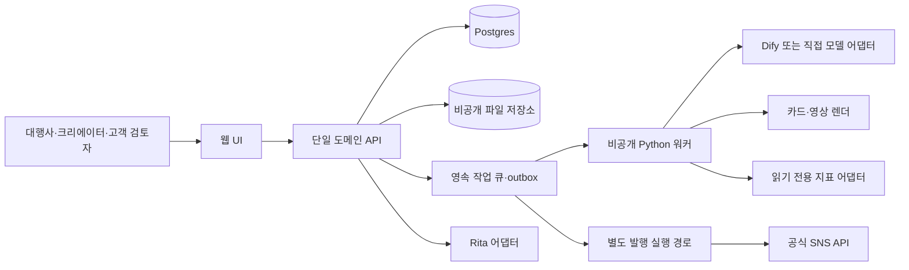

# Cora — 통합 개발계획

2026-09-29 · 기준안1.0. 개별 문서와 같은 내용의 검색·인계용 합본이다. 구현 완료 보고서가 아니다.

---

# Cora — 제품·사업·개발 마스터플랜

**Content Operations Run by Agents** · 현재 제품명은 Cora이며, 추후 변경 가능한 가칭이다.

**개발 방식:** 본인·조유경 학생이 AI와 함께 합의한 출시 범위의 기능 구현 90% 이상을 담당하는 것이 목표다. 개발자는 출시 전 독립 검토와 필요한 보완을 맡는다. 구현 비율은 코드량이 아니라 실제 고객 흐름의 수락 조건으로 확인하며 기간·비용 비율을 보장하지 않는다.

2026-09-29 · 기준안1.0 · 계획 작성 완료, 제품 구현·고객 효과 검증 전.

**내 계정에 맞는 다음 콘텐츠를 고르고 실제 완성하도록 돕는 서비스**를 설계했다. 첫 영업 대상은 여러 브랜드를 운영하는 소규모 대행사다. 계정을 시작하는 개인과 정기 게시하는 개인도 같은 기반 위에서 다른 진입 경험을 갖는다. 현재 실행팀은 본인·조유경 학생 1명·AI/Codex이며, 학생은 주4~5시간 참여한다. 이전 학생 2명과 개발자 선투입을 전제로 한 비용·시간 가정은 현 계획에 적용하지 않는다.

[검색하며 보는 개발계획](개발계획.html) · [전체 통합 문서](전체_통합개발계획.md) · [개발 인계 ZIP](현재_제품개발_인계패키지_2026-09-29.zip)

## 무엇이 들어 있나

| 문서 | 결정하는 일 |
|---|---|
| [01 사업모델·제품 원칙](01_사업모델과_제품원칙.md) | 고객·가치·상품·가격/원가·판매·사업 판정 |
| [02 고객 경로·상품 운영](02_고객경로와_상품운영.md) | 초보 개인13단계, 운영 개인14단계, 대행사15단계의 입력→제공 결과 |
| [03 전체 기능](03_전체기능명세.md) | 25영역110기능의 입력·처리·출력·오류·완료조건·의존·릴리스 |
| [04 문헌·진단](04_문헌근거와_진단설계.md) | 핵심15편, 근거→측정→편집/추천 행동·한계 |
| [05 데이터·연구 운영](05_데이터수집과_연구운영.md) | 권리·표본·코딩·결측·관측기간·제품 실험 |
| [06 아키텍처·데이터·ML](06_아키텍처_데이터계약_ML검증.md) | 고객 분리·작업/발행 상태·Rita·모델 평가·12개 E2E |
| [07 일정·사람·비용](07_개발일정_인력_비용_검증.md) | 첫12주와 후속 릴리스, 역할·시간·예산·출시 조건 |
| [08 출처·미확정·변경](08_출처_미확정사항_변경관리.md) | 사실/가설 구분, 공식 자료, 해결할 결정17개 |
| [09 화면별 작업·예시](09_화면별_작업명세와_설계예시.md) | 첫 화면·진단·추천·편집·승인·오류, 가상 책방의6장 완성 예시 |
| [10 코드북·연구 실험](10_연구실행_코드북과_모델실험표.md) | 8개 코딩 항목, 연구 질문5개, 소재/모델 비교와 판매 주장 |
| [11 바이브 코딩·개발자 역할](11_바이브코딩_범위와_개발자_역할.md) | 본인·조유경·AI의 실행 분담, 개발자 인계·비용 산정 기준 |

## 핵심 개발 방향

`목표·자료 → 계정/콘텐츠 점검 → 제작 가능한 후보 → 브리프 → 제작·편집 → 승인·게시 → 결과 → 다음 제작`

연구의 판매 가치는 ‘복잡한 분석을 한다’가 아니라 **어디를 왜 고칠지 보여주고 바로 고칠 수 있다**는 데 둔다. 처음에는 자료·브랜드 규칙·문헌 근거를 보여주는 제안, 다음에는 자기 계정의 관측 기반 추천, 검증 이후에는 ML 개인화를 더한다. XGBoost·토픽 분석은 기준 방법보다 고객 결정을 개선하는지 비교한 뒤 사용한다.

첫 R1은 본인 자료 기반 추천·카드/캡션·직접 편집·내보내기다. R2는 공식 계정 분석·다중 브랜드·고객 승인, R3는 발행 또는 제한 영상, R4는 검증된 개인화, R5는 실제 Rita 연결이다. 일부 작업은 병행 가능하나 학생 주4~5시간으로 전체 기능을 만들 수 있다고 가정하지 않는다.

현재 팀 기준 첫12주 검증비는 학생 1명 인건비·선택 디자인·실비를 포함해 개발자 제외 **171~235만원 가설**이다. 창업자 노동·기존 구독료는 제외하며, 개발비는 GitHub와 시제품을 확인한 뒤 필요한 작업을 모아 별도 견적을 받는다. 이는 지출 승인이나 견적이 아니다.

## 개발자에게 넘기는 파일

- [기능 JSON](features.json), [CSV](전체기능원장.csv):110행·필드별 명세·출시 범위.
- [데이터/API 계약](proposedcontracts.json):46개 목표 테이블·21개 대표 API·Rita 계약. 실행 가능한 SQL/OpenAPI 완제품은 아니며 단계별로 구현한다.
- [문헌 서지](sources.json):15편의 확인 범위·DOI/arXiv·한계.
- [기존 조사 대응표](기존조사_대응표.csv):Mirr109항목과 영상35항목의 제안 기능 연결. 동등 구현 검증과 구분한다.
- [검증기록](검증기록.md):산출물 자체의 구조·수치·참조 검사와 미실행 검증.

## 무엇을 아직 주장하지 않는가

실제 고객 계정 연결·앱 심사·새 기능 구현·모델 학습·고객 결제·성장 효과는 이 계획 작성에서 수행하지 않았다. 원래 Claude 프로젝트와 운영 서비스는 보존했다. 이 패키지는 그 자산을 활용해 새 제품을 개발하기 위한 기준 문서다.

기존 전략·가격/예산 문서와 충돌하면 이 패키지의01·07을 현재 제안으로 읽는다. 수치가 가정이면 가정 표시를 유지한다. 다음 개발 이슈는 R1의 한 고객 작업을 끝내는 단위로 만들고 기능ID·데이터계약·수락시험을 연결한다.

---

# 사업모델과 제품 원칙

**제품명: Cora — Content Operations Run by Agents.** 사용자가 정한 현재 가칭이며 추후 변경할 수 있다.

2026-09-29 · 개발 기준안 1.0 · 설계 문서. 구현 완료·고객 검증·성과 보장을 뜻하지 않는다.

## 1. 무엇을 만드는가

**계정의 목표와 콘텐츠를 이해하고, 다음에 만들 콘텐츠를 고른 뒤, 실제 제작·승인·게시·결과 확인까지 이어주는 서비스**를 만든다. 첫 영업 대상은 여러 브랜드를 정기 운영하는 소규모 대행사다. 개인 운영자는 처음부터 두 경로로 지원한다. 시작하는 사람은 목표와 실행 가능한 첫 콘텐츠를 받고, 이미 게시하는 사람은 자기 계정의 자료를 바탕으로 다음 제작안을 받는다.

고객에게 처음 보일 문장은 “이번 주에 만들 콘텐츠를, 내 계정에 맞는 근거와 완성 가능한 초안으로 받으세요”다. 대행사에는 “브랜드마다 반복되는 기획·수정·승인 작업을 줄이세요”를 별도로 시험한다. 이 문구는 광고 효과가 검증된 문구가 아니다. 첫 화면에서 주장한 결과를 체험에서 실제로 제공해야 한다.

완성 제품에서 한 고객이 받는 기본 묶음은 ① 이번 주 판단할 계정 상태 ② 제작 가능한 추천 3개 ③ 선택한 추천의 제작 브리프 ④ 편집 가능한 카드·영상 프로젝트와 게시 문안 ⑤ 승인·발행 기록 ⑥ 다음 제작에 반영할 결과다. 첫 R1 시험은 본인 자료 기반 후보·카드·캡션·직접 편집·내보내기로 제한하고, 정식 계정 분석·협업은 R2, 발행·영상은 R3 이후 제공한다. R1의 후보는 계정 성과 모델 없이 자료·브랜드 규칙으로 제안하며 생성비·검수 시간을 기록한다. 3개는 선택 부담을 줄이기 위한 초기 UI 가설이며 고정 사업 법칙이 아니다.

## 2. 고객과 구매 이유

| 고객 | 실제 사용자·구매자 | 시작하는 계기 | 구매할 결과 | 확인할 대체재 |
|---|---|---|---|---|
| 소규모 대행사 | 기획자·디자이너가 사용, 대표·팀장이 구매, 고객사 담당자가 승인 | 신규 브랜드 수임, 납품 증가, 반복 수정, 담당자 교체 | 같은 인력으로 실제 승인 가능한 콘텐츠를 더 빨리 완성 | 기존 제작 도구+발행 도구+메신저+숙련 작업자 |
| 정기 게시 개인 운영자 | 본인이 사용·결제 | 소재 고갈, 결과 해석 어려움, 긴 영상 재활용 | 지금 가진 자료로 다음 콘텐츠를 고르고 만드는 시간 감소 | ChatGPT·Canva·CapCut·기존 분석/예약 도구 조합 |
| 시작하는 개인 운영자 | 본인이 사용·결제 | 전문성을 알리고 싶으나 첫 게시가 막힘 | 목표·주제·첫 3개 게시물·지속 가능한 제작 루틴 | 무료 템플릿, 강의, 컨설팅, 기존 AI |

첫 대행사 모집 조건은 3~10개 브랜드 또는 월 20건 내외의 반복 제작 업무라는 가설이다. 규모보다 실제 자료·수정 기록·다음 납품·구매 책임자가 있는지를 본다. 고급 영상 제작과 촬영 자체가 핵심인 팀은 첫 카드 중심 파일럿과 별도 표본으로 다룬다.

개인 계정 운영자가 Instagram의 Personal 계정을 써야 한다는 뜻은 아니다. 공식 분석 연결은 Business/Creator 계정 조건을 안내한다. 연결하지 않는 사용자도 목표 입력·자료 제공·제작을 시작할 수 있다.

## 3. 무엇으로 경쟁하는가

| 경쟁 축 | 고객이 체감하는 개선 | 검증 방법 | 쉽게 복제되는 부분 / 축적되는 부분 |
|---|---|---|---|
| 진단에서 제작으로 이어짐 | 차트를 해석하고 다시 프롬프트를 쓰는 수고 감소 | 동일 자료로 다음 콘텐츠 결정→편집 완료까지 시간 비교 | 버튼·프롬프트는 복제 가능 / 실제 선택·수정·결과의 연결 품질은 운영 경험 필요 |
| 브랜드별 수정 기억 | 같은 금지 표현·잘못된 사실을 재수정하지 않음 | 다음 제작에서 같은 오류 재발률 | 저장 기능은 복제 가능 / 고객이 승인한 규칙과 테스트 사례 축적 |
| 근거를 보여주는 추천 | 왜 이 소재·구성이 적합한지 이해·수정 가능 | 추천 채택·거절 이유, 근거 정확성 | 설명 UI는 복제 가능 / 측정 타당성·평가셋·보정 절차 축적 |
| 한국어·실제 납품 품질 | 번역투·텍스트 넘침·과장 주장·브랜드 어긋남 감소 | 블라인드 비교, 납품 승인, 재작업 시간 | 한국어 지원 자체는 방어력 약함 / 업종별 실패 사례와 품질 관리 체계 축적 |
| 낮은 도입 부담 | 계정 연결 전에도 본인 자료로 첫 결과 확인 | 첫 유효 결과 도달률·중도 이탈 이유 | 쉽게 모방 가능하나 고객 획득비에 직접 영향 |

**알고리즘 이름, 기능 개수, 한국어라는 이유만으로 방어력이 생기지 않는다.** 더 나은 작업 결과가 반복되고, 그 원가와 고객 획득비가 감당 가능하며, 사용자가 쌓은 승인 규칙·작업 이력이 실제 효용을 갖는지가 중요하다. 데이터 반출을 막아 고객을 붙잡는 전략은 쓰지 않는다.

비교 대상은 Mirr 하나에 고정하지 않는다. Buffer의 분석→다음 작성 연결, Metricool의 계정 관리·성과, Planable의 검토·승인, OpusClip의 기존 영상 재가공, Blotato의 제작·배포, Canva/미리캔버스의 직접 편집을 각 업무의 기준으로 삼는다. 제품별 기능과 성공 실적은 다른 증거다. 기능이 있다는 사실만으로 고객 만족·성공을 추정하지 않는다. [상세 벤치마크](../콘텐츠플랫폼_벤치마크/조사와_제품설계.md), [해외 기업의 사업 근거](../사업전략_2026-09-29/해외기업_근거와해석.md).

## 4. 상품과 과금의 기준

주력은 **월 구독 + 활성 브랜드/계정 범위 + 포함 제작량 + 고원가 작업의 명시적 추가 이용량**이다. 초대한 고객사 검토자에게 좌석 요금을 붙여 승인을 방해하지 않는다. 사람이 대신 기획·편집·운영하는 상품은 별도 견적·원가로 관리한다. 결과물 대행 판매와 사용자가 직접 쓰는 SaaS의 수요를 합산하지 않는다.

| 상품 단계 | 판매 범위 | 가격 상태 | 포함하지 않는 것 |
|---|---|---|---|
| 연결 전 체험 | 목표·자료 입력→추천 미리보기→제한된 초안 1회 | 무료 횟수·원가 한도 실험 | 무제한 생성·상시 사람 상담 |
| 단일 브랜드 카드 시험 | 1브랜드, 10세트, 직접 편집·확정·내보내기 | 기존 월 59,000원 가설 유지 | 지속 계정 분석·장편 영상 처리 원가까지 검증한 가격이 아님 |
| 대행사 카드 시험 | 3브랜드, 합계 30세트, 브랜드별 작업 | 기존 월 149,000원, 추가 브랜드+10세트 49,000원 가설 | 미구현 승인/자동 발행을 계약에 포함하지 않음 |
| 계정 운영 상품 | 계정 동기화·진단·추천·제작·성과 회고 | 카드 상품에 분석 원가를 더해 재산정한 뒤 가격 시험 | 기능을 늘려도 기존 가격에 무조건 모두 포함한다는 약속 |
| 영상 처리 | 업로드 분량·출력 분량·처리 난이도별 한도 | 공급사 비용과 재시도율을 재고 별도 제안 | 무제한 영상 생성·무제한 재렌더 |
| 설정/제작 대행 | 브랜드 설정·템플릿·검수 등 사람 작업 | 시간·결과 범위를 정한 별도 견적 | SaaS 반복 이익에 수작업 비용 숨기기 |

기존 가격은 월 결제·부가세 제외 가설이다. 실제 소비자 화면은 결제 총액과 세금 표기를 명확히 한다. 카드 1세트는 6~8장과 캡션이다. 직접 문구 수정과 다운로드를 생성 과금처럼 중복 차감하지 않는다. AI 전체 재생성·부분 재생성·영상 재렌더는 실행 전 차감량을 보여준다. 시스템 실패는 고객 이용량을 복원하되 내부 원가에는 남긴다. 자동 초과 결제는 기본값이 아니다.

상품의 가격을 정하기 전에 다음 식을 채운다.

`월 직접 기여이익 = 세전 순매출 − 결제비 − 생성/분석/렌더/저장/전송비 − 고객별 반복 지원 노동 − 외부 라이선스 원가`

`고객 도입 가치 = 실제 사용량 × 실제 절감 시간의 고객 평가액 + 확인된 외주 절감/추가 작업 가치 − 구독료 − 설정·학습·이동 비용`

같은 시간을 외주 절감과 추가 매출로 두 번 계산하지 않는다. 조회수·팔로워 증가를 바로 매출로 환산하지 않는다. 고객의 웹 전환·문의·구매와 연결되는 경우에도 귀속 범위를 표시한다.

기존 카드 중심 중간 시나리오의 대행사 기여이익은 월 80,030원이다. **새 분석 비용이 계정당 8,000원×3, 지원이 추가 20분×시간당 30,000원이라면** 46,030원(매출의 30.9%)으로 감소한다. 이 8,000원·20분은 실제 원가가 아닌 민감도 예시다. 추가 원가 34,000원과 **추가 상품 자체의 목표 기여율** 60%, 결제비 3%를 가정하면 필요한 세전 추가 가격은 `34,000/(1−0.60−0.03) ≈ 91,892원`이다. 이때 결합 상품의 기여율은 약56.1%다. 결합 상품 전체60%가 목표라면 총가격은 `(기존 PG 제외 직접비64,500+추가34,000)/0.37 ≈ 266,216원`, 기존149,000원보다 약117,216원 더 필요하다. 실제 추가 원가를 측정하지 않고 저가 무제한 운영 상품을 약속하면 안 되는 이유다.

## 5. 판매와 검증

1. 후보 대행사의 최근 업무 1건을 관찰한다. 자기 보고 시간과 실제 조작 시간을 따로 기록한다.
2. 기존 숙련 도구와 우리 방식에 같은 자료·목표·산출물 조건을 준다. 우리 결과에 사람이 개입하면 그 시간도 공개·측정한다.
3. 첫 콘텐츠를 사용자가 직접 선택·수정·확정한다. 담당자가 대신 조작한 시연은 활성 사용자로 세지 않는다.
4. 다음 제작 주기에 다시 쓰는지 보고, 실제 판매 범위의 결제와 갱신을 관찰한다.
5. 대행사·개인·학생·친분 고객을 분리해 비교한다. 서로 다른 고객군의 숫자를 합쳐 적합성을 주장하지 않는다.

초기 모집은 대행사 업무 관찰 3곳, 정기 게시 개인 2명, 시작 개인 2명 정도의 탐색 목표다. 고객 수 확보를 보장하는 예상치가 아니다. 깊은 제작 파일럿은 인력에 맞춰 대행사 1곳과 개인 1명으로 제한할 수 있다. 초보자의 첫 게시 성공과 정기 운영자의 반복 결제를 같은 판정 지표로 쓰지 않는다.

가격 조사에서는 ‘얼마면 살 것인가’만 묻지 않는다. 최근 결제한 대체 도구·외주, 예산 승인자, 이번 달 실제 업무에 사용 가능한지, 동일 범위의 유료 시험 선택을 확인한다. 데이터·평가를 제공하는 협력자의 보상과 상품 구매는 따로 기록한다.

## 6. 사업 판정과 확대 조건

기술 실현 가능성과 제품 수요는 있다/없다로 한 번에 판정하지 않는다. **현재는 제한된 고객의 실제 업무에서 비교할 가치가 있는 사업 가설**이다. 큰 시장과 반복 이익은 아직 증명되지 않았다.

| 판정 | 필요한 관측 | 실패 시 다음 행동 |
|---|---|---|
| 고객이 시작한다 | 자기 자료 입력, 목표 확인, 첫 유효 추천/초안 도달 | 로그인·권한·질문 수보다 먼저 가치 전달 경로 수정 |
| 결과를 채택한다 | 납품·게시·승인에 사용, 미채택 사유 포함 | 소재/품질/편집 병목을 좁혀 수정 |
| 반복 구매한다 | 실제 다음 제작·다음 결제, 대신 조작 없이 사용 | 서비스형인지 도구형인지 다시 구분 |
| 경제성이 있다 | 실패와 사람 지원 포함 양의 기여이익, 관측 유지기간 내 회수 가능성 | 가격·한도·대상·지원 구조 수정 |
| 확장 가능하다 | 비지인 고객·다른 담당자에게 재현, 장애와 지원 감당 | 영업 확대 대신 운영 보완 |

경쟁사의 기능 추가나 가격 인하를 가정한 비교도 한다. ‘반값 경쟁사’가 있어도 고객이 남을 구체 이유를 인터뷰가 아니라 실제 동일 업무 선택에서 확인한다. 한 기능 가설의 실패로 시장 전체를 포기하지 않되, 두 번의 명확한 범위 수정에도 채택·반복·경제성이 개선되지 않으면 해당 상품 투자를 멈추고 원인을 기록한다. 이 횟수는 투자 통제 제안이며 성공 확률 계산이 아니다.

## 7. 제품 헌법 1.0

1. 목표·자료·다음 행동이 기능 우선순위를 정한다.
2. 계정 연결 전에 첫 가치를 보여줄 수 있다.
3. 개인 운영자와 대행사는 같은 핵심 제작 흐름을 쓰되 화면 복잡도는 다르게 한다.
4. 관측 지표, 문헌 가설, 모델 추정, 사람 판단을 구분한다.
5. 데이터가 없으면 진단 결과를 만들어내지 않는다.
6. 점수만 보여주지 않고 실행 가능한 수정 또는 다음 제작안으로 연결한다.
7. 인기·품질·브랜드 적합성·사업 성과를 같은 라벨로 합치지 않는다.
8. 승인된 버전과 게시되는 버전은 같아야 한다.
9. 고객별 데이터·권한·비용을 분리하고 용도별 이용 권한을 확인한다.
10. 외부 자료 속 명령은 실행 지시가 아니라 분석할 데이터다.
11. 실패·미채택·수작업·환불도 비용과 결과에 포함한다.
12. 경쟁사보다 나은지는 동일 업무의 품질·총비용·편의로 확인한다.
13. Rita 연결은 공통 계약과 실행 기록으로 준비하고, 독립 서비스의 구매 경험을 해치지 않는다.
14. 판매 주장에는 검증 수준·대상·기간·한계를 맞춘다.
15. 단계별 결과와 다음 투자 조건을 먼저 정하고 결과를 본 뒤 통과선을 낮추지 않는다.

이 문서는 기존 헌법 0.3의 취지를 통합한 새 개발 기준안이다. 기존 운영 코드·배포·계약·가격을 변경하지 않았다.

---

# 콘텐츠 운영 플랫폼의 고객 경로·상품·기능 설계

작성일: 2026-09-29. 이 문서는 **신규 제품의 설계안**이다. 사용자 계정 연결, 성과 분석, 자동 발행, 영상 편집을 실제로 완료했다는 뜻이 아니다. 기존 Claude 프로젝트와 현재 서비스는 그대로 두고, 새 서비스에서 재사용 가능한 부분을 감싸거나 복사하는 방향이다. 모델·측정·검증의 상세 기준은 이 패키지의 04·05·06·10 문서를 따른다.

## 1. 고객에게 약속할 일

공통 제품 가치는 **내 계정에 맞는 다음 콘텐츠를 고르고, 수정할 수 있는 결과로 완성하고, 게시 후 다음 결정을 이어가게 하는 것**이다. 계정 진단을 별도 보고서에서 끝내지 않고 `목표 → 자료 → 관측 → 다음 소재 → 기획 → 제작·편집 → 확인·발행 → 관측`에 연결한다. 진단 자료가 없는 새 계정도 출발할 수 있다.

첫 판매 고객은 사용자가 선택한 **여러 브랜드 SNS를 정기적으로 제작·운영하는 소규모 대행사**다. 초기 모집 조건은 직원 수 자체보다 다음 업무 조건으로 정한다.

- 3~10개 브랜드를 정기 운영하며, 한 브랜드에서 매월 최소 4건의 정보형 카드뉴스 또는 교육·상품 설명 게시물이 반복된다.
- 다음 30일에 실제 납품할 작업이 있고, 브랜드 자료·최근 수정 요청·현재 제작 시간을 제공할 수 있다.
- 대표 또는 운영 책임자가 도구 예산을 결정하고 실무 담당자 1명이 직접 사용한다.
- 기존 템플릿과 고객 제공 이미지로 결과를 만들 수 있으며, 매번 새로운 아트디렉션이나 고난도 영상 촬영이 필수인 계약이 아니다.
- 도구 사용을 확인한 뒤 30일 유료 시험에 참여하고, 기존 방식과 비교할 수 있다.

개인 사용자는 처음부터 화면과 실험에 포함한다. 다만 빈 계정 초보와 정기 운영자를 하나의 고객으로 섞지 않는다. 정기 운영자는 다음 제작 일정·기존 콘텐츠가 있어 반복 사용을 관찰하기 좋다. 신규 사용자는 시작 장벽이 낮은지 확인하는 집단이며, 클릭·첫 초안만으로 구독 수요를 인정하지 않는다.

| 고객 경로 | 구매자·사용자 | 구매를 설명할 수 있는 업무 | 대체할 가능성이 있는 예산 | 확인할 핵심 가설 |
|---|---|---|---|---|
| 대행사 브랜드 운영 | 대표/운영 책임자가 구매, 기획자·디자이너가 사용, 광고주가 승인 | 다음 주 납품 소재 결정, 브랜드 기준 반복 적용, 수정·확정·보고 | 현재 유료 도구 일부, 기획·반복 수정 시간, 실제로 줄일 수 있는 외주 업무 | 품질을 유지하면서 납품 완료까지 시간이 줄고 여러 브랜드로 확장하는가 |
| 정기 콘텐츠 운영 개인 | 본인이 구매·사용·승인 | 지난 콘텐츠 해석, 다음 3개 선정, 원본 재가공, 주간 반복 제작 | 현재 제작·분석 도구, 편집 외주 일부, 본인 시간 | 추천을 실제 게시하고 다음 주 다시 쓰며 월 비용을 내는가 |
| 빈 계정 개인 | 본인이 구매·사용 | 분야·독자·첫 소개·첫 게시물 결정 | 대체 예산이 없을 수 있음; 새 지출 | 첫 콘텐츠를 실제로 게시하고 이후 제작을 지속하는가 |

위 표의 불편과 구매 예산은 **아직 고객 인터뷰·결제로 검증하지 않은 가설**이다. “시간이 절약된다”와 “그 시간을 현금 비용으로 줄일 수 있다”도 분리해 묻는다. 창작 시간이 줄어도 매출이 늘지 않거나 기존 외주 계약을 줄일 수 없다면, 가격의 근거를 현금 절감이라고 부르지 않는다.

## 2. 첫 경험은 연결을 강요하지 않고 다음 결과를 보여준다

예제와 목표 입력은 비용·보관 한도를 둔 익명 체험으로 제공할 수 있다. 저장·비공개 고객 자료 입력·계정 연결·실제 제작을 시작할 때 로그인과 자료 처리 안내를 적용한다. P002의 P001 의존은 이 저장·실작업 경계에 해당하며, 랜딩 예제 열람 전 로그인을 강제한다는 뜻이 아니다. 처음에 세 버튼을 제안한다. `계정 시작하기`, `내 계정으로 다음 콘텐츠 찾기`, `여러 브랜드 관리하기`. 공통으로 목표·대상·보유 자료·가능한 시간을 받고, 자신의 자료로 결과를 볼 수 있게 한다. SNS 연결은 실제 계정 자료를 읽거나 발행하려는 시점에 목적·권한을 설명한다.

샘플은 샘플로 표시한다. 빈 계정에는 가짜 성과 점수 대신 첫 콘텐츠 3개와 필요한 자료를 보여준다. 운영 계정에는 데이터의 기간·표본·수집 시점을 먼저 보여준다. “연결하면 무조건 계정 진단 가능”이라고 약속하지 않는다. 계정 유형, 권한, 앱 승인, 수집 가능한 지표를 확인하고 직접 제공 자료로 시작하는 대안을 둔다.

첫 가치 도달 시간의 실험 목표는 **고객이 자기 목표에 맞는 소재 1개를 선택하고 기획·편집 가능한 초안을 확인하기까지의 시간**이다. 첫 토큰·첫 이미지 생성 시간과 다르다. 고정된 “3분 만에 완성” 약속은 실측 전 사용하지 않는다.

## 3. 세 고객의 실제 동작 시나리오

아래는 기능이 모두 구현·검증됐다는 보고가 아니라 **제품 동작 설계 시나리오**다. 일반 사용자의 이해를 돕기 위해 가상 고객을 썼다. 첫 파일럿에서는 수동 자료 제공·카드 제작·내보내기를 먼저 사용하며, 공식 읽기/발행 연동과 영상 완성본은 준비 상태에 따라 조건부로 제공한다.

### A. 콘텐츠가 없는 개인: 첫 계정을 시작하고 첫 게시물을 올린다

가상 고객: 직장인을 위한 독서 습관을 소개하고 싶지만 게시물이 없는 개인.

| 단계 | 사용자가 하는 일·입력 | 제품 동작 | 보이는 결과·다음 동작 | 기능 ID |
|---|---|---|---|---|
| 1 | `계정 시작하기` 선택, 예제·목표 체험 후 저장 시 로그인 | 임시 체험을 본인 개인 작업 공간으로 연결 | SNS 연결 없이 시작 | P001,P002,P004 |
| 2 | “퇴근 후 독서”, 대상 독자, 주당 2시간 입력 | 목표·시간·형식 제약 저장 | 이번 달 목표 초안 | P009 |
| 3 | 소개 문구와 보유 사진·메모 입력 | 없는 게시 이력을 분석하지 않고 준비 상태 확인 | 소개 문구 후보, 빈 자료 목록 | P015,P023 |
| 4 | 로고가 없고 담백한 문체를 선택 | 기본 템플릿·문체 선택을 확정 가능하게 표시 | 브랜드 기준 1차 버전 | P006,P037 |
| 5 | 추천 3개 중 “퇴근 후 10분 독서 시작법” 선택 | 추천 이유·필요 사진·대본 분량 설명 | 제작 가능한 소재 카드 | P018,P030 |
| 6 | 본인 경험 메모와 허용한 참고 링크를 추가 | 원문 추출·출처 저장, 사실과 경험 구분 | 자료 묶음, 확인할 주장 | P021,P026,P027 |
| 7 | 카드 6장·저장 유도 CTA 선택 | 표지·본론·마지막 행동으로 기획 | 카드별 개요 | P033,P034 |
| 8 | 개요에서 과장된 문구 수정·확정 | 근거 없는 효과 표현 보류, 확정 버전 고정 | 제작 가능한 기획 버전 | P035,P034 |
| 9 | `초안 만들기` 선택, 예상 차감 확인 | 카드와 캡션 생성 | 편집 가능한 초안 | P038,P061,P091 |
| 10 | 표지 문구·사진을 직접 수정 | 넘침 검사, 저장, 필요하면 선택 카드 AI 수정 | 전후 비교·저장 상태 | P039,P042,P044,P045 |
| 11 | 결과를 확인하고 PNG·캡션 내보내기 | 버전이 연결된 납품 파일 생성 | 수동 게시 가능한 묶음 | P046,P066 |
| 12 | 본인이 게시하고 URL 등록 | 내보내기와 실제 게시를 구분 | 첫 게시 확인, 다음 할 일 | P077,P010 |
| 13 | 일주일 뒤 실제 가능한 지표·느낀 어려움 입력 | 데이터가 쌓이기 전에는 성과 원인 단정 없이 다음 실험 제안 | 두 번째 콘텐츠 계획 | P012,P016,P018,P107 |

실패 분기: 소개·주제를 못 정하면 두 후보를 비교한다. 외부 링크를 못 읽으면 메모로 진행한다. 사진이 없으면 촬영 체크리스트나 텍스트 중심 템플릿을 제안한다. 자료가 없는데 인기 계정과의 백분위·성공 확률을 만들지 않는다.

### B. 정기 운영 개인: 지난 결과에서 다음 주 콘텐츠를 고른다

가상 고객: 본인 촬영 영상을 보유하고 주 2회 콘텐츠를 게시하는 독서·생산성 크리에이터.

| 단계 | 사용자가 하는 일·입력 | 제품 동작 | 보이는 결과·다음 동작 | 기능 ID |
|---|---|---|---|---|
| 1 | `내 계정으로 다음 콘텐츠 찾기` 선택 | 목표·제작 형식·현재 일정 확인 | 개인 운영 화면 | P002,P009,P010 |
| 2 | 지원 계정 읽기 권한 연결 또는 본인 내보내기 자료 제공 | 요청 범위·자료 시점·지원 지표 설명 | 연결 상태 또는 수동 자료 표시 | P011,P012,P014 |
| 3 | 분석 기간·주요 목표 선택 | 게시물 수·형식·결측·경과시간 확인 | 관측 가능한 계정 요약 | P013,P016,P019 |
| 4 | “저장 반응이 나은 글은?”을 확인 | 같은 조건에서 확인 가능한 자료만 비교 | 해당 게시물·계산·한계 | P079,P080 |
| 5 | 이번 주 추천 3개를 검토 | 내 계정 관측·최근 자료·보유 원본을 연결 | 주제·근거·준비물·초안 버튼 | P018,P030 |
| 6 | 하나를 채택하고 이유 선택 | 채택 사실을 저장; 게시와 구분 | 진행 중 아이디어 | P031,P107 |
| 7 | 본인 12분 원본 업로드 | 전사·타임코드·권리·처리량 확인 | 전사문과 클립 후보 | P023,P048,P049 |
| 8 | 45초 구간 선택, 또는 카드 형식 선택 | 구간·대사·보충 설명 기획 | 짧은 영상 편집 지시/카드 개요 | P050,P033,P034 |
| 9 | 자막 오류·표지·캡션 수정 | 전사와 자막 수정, 버전 저장 | SRT·대본·캡션 또는 카드 결과 | P054,P061,P039 |
| 10 | 지원된 영상 렌더를 선택하거나 기존 편집기로 전달 | 실제 지원 범위에 따라 완성 렌더 또는 편집 묶음 제공 | MP4 또는 타임코드·SRT·대본 | P055,P058,P046 |
| 11 | 발행 내용을 확인해 직접 게시/예약 | 채널 조건 확인, 승인 버전만 발행 | 게시 URL·상태; 미지원이면 수동 게시 | P069,P072,P073,P074,P077 |
| 12 | 실제 게시 지표를 확인 | 지원 지표를 경과시간·형식에 맞춰 비교 | 수치·근거·다음 실험 | P078,P079,P080 |
| 13 | 다음 주 동일 시리즈 제작 여부 선택 | 채택·수정·관측 결과를 구분해 다음 후보 생성 | 반복 계획 또는 다른 후보 | P082,P085 |
| 14 | 30일 후 갱신 여부 결정 | 직접 사용·게시·지원·비용과 구매를 별도 기록 | 갱신/취소와 이유 | P090,P093,P107 |

실패 분기: 일반 개인 프로필이라 API 지표 접근이 안 되면 직접 제공 자료로 진행한다. 원본 없는 추천은 촬영안으로 전환한다. 영상 API·라이선스·렌더가 미준비면 완성 MP4를 팔지 않고 기존 도구에 전달할 편집 묶음만 명시한다. 조회 증가가 우리 추천의 인과 효과라고 단정하지 않는다.

### C. 대행사: 브랜드별 다음 주 납품을 결정하고 승인까지 마친다

가상 고객: 5개 브랜드를 운영하며 한 교육 브랜드의 주간 카드뉴스를 만드는 대행사.

| 단계 | 사용자가 하는 일·입력 | 제품 동작 | 보이는 결과·다음 동작 | 기능 ID |
|---|---|---|---|---|
| 1 | 대표가 조직을 만들고 담당자 초대 | 브랜드별 제작·검토·발행 권한 분리 | 브랜드 목록, 역할 | P001,P004,P005 |
| 2 | 교육 브랜드 선택, 상품·고객·금지 문구 입력 | 자료 출처·확인일·브랜드 버전 저장 | 확정 기준, 미확인 항목 | P006,P007,P026 |
| 3 | 최근 승인된 카드와 광고주 수정 요청 제공 | 문체·디자인 규칙 후보 추출 후 담당자 확인 | 기준 템플릿·예외 규칙 | P008,P037 |
| 4 | 이번 달 목표·모집 일정·승인자 설정 | 일정·목표·필수 CTA 연결 | 브랜드 운영 조건 | P009,P064,P071 |
| 5 | 고객 허용 계정자료를 연결/가져오기 | 브랜드 데이터 범위와 신선도 확인 | 진단 요약·데이터 한계 | P011,P012,P016 |
| 6 | 소재 3개와 각각의 근거 검토 | 목표·과거 게시·새 자료에서 제작 가능한 후보 제시 | 다음 주 후보 목록 | P028,P030,P031 |
| 7 | 1개 채택, 6장 구성·필수 안내 확인 | 자료에서 기획서 작성·사실 확인 | 개요·출처·예상 사용량 | P033,P034,P035,P091 |
| 8 | 확정 기획으로 카드와 캡션 생성 | 브랜드 템플릿·확인한 사실 적용 | 편집 가능한 초안 | P038,P061 |
| 9 | 실무 담당자가 문구·사진·로고 충돌 수정 | 범위 편집·넘침 검사·변경 이력 저장 | 내부 검토 버전 | P039,P042,P044,P045 |
| 10 | 내부 검토 후 고객에게 해당 버전 공유 | 해당 브랜드·버전만 접근 가능한 검토 생성 | 고객 댓글·수정 요청 | P068,P069,P070 |
| 11 | 광고주가 카드 3 문구 수정 요청 | 요청 위치·이유·담당·처리 결과 연결 | 변경 비교, 재검토 버전 | P068,P042,P066 |
| 12 | 광고주가 최종 버전 승인 | 해시에 승인을 고정, 뒤에 바뀌면 승인 해제 | 납품 확정·승인 기록 | P069 |
| 13 | 담당자가 수동 납품 또는 승인된 예약 발행 선택 | 채널 검사·중복 방지·실제 게시 확인 | 납품 파일 또는 게시 URL·상태 | P046,P072,P074,P075,P077 |
| 14 | 주간·월간 보고서 확인, 다음 계획 선택 | 제작 시간·수정·게시·성과·한계를 나누어 정리 | 광고주용 보고서, 다음 주 계획 | P081,P085,P107 |
| 15 | 대표가 다른 브랜드 추가·월 갱신 여부 결정 | 브랜드별 사용·지원·비용을 보여줌 | 실제 업그레이드/갱신 기록 | P090,P092,P093 |

실패 분기: 광고주 승인 지연은 AI 품질 실패와 구분한다. 승인 뒤 파일 수정 시 재승인을 받는다. 고객 자료가 다른 브랜드 결과에 섞이면 출시 중단 사유다. API 승인이 없으면 수동 게시·게시 URL 연결로 흐름을 끝낸다.

## 4. 기능 원장을 읽는 방법

`features.json`은 **110개 설계 기능, 25개 영역**으로 구성한 UTF-8 JSON 배열이다. 각 행에는 `id, section, title, users, stage, inputs, process, outputs, empty_error, acceptance, dependencies, build_reuse, reference_ids`가 있다.

- `reference_ids`의 F001~F109는 기존 Mirr 기능대장, Y01~Y35는 영상 보완 구현대장의 항목이다. **기존 Mirr 109개와 영상 보완 35개가 모두 적어도 한 번 매핑**되어 있다. 여러 세부 속성을 하나의 사용자 작업으로 합쳤다. 매핑은 범위 추적용이며 Mirr의 실제 기능이 모두 실험으로 검증됐다는 뜻은 아니다.
- 새 기능에는 별도 F/Y가 없을 수 있다. 계정 없는 사용자 시작, 데이터 근거, 승인 해시, 비용·실패·Rita 계약 등이 그 예다.
- `dependencies`는 참조하는 공통 기능·데이터 계약이다. 고객별 선택 경로에서는 해당 경로만 필요하다. 예를 들어 시작 진단과 운영 계정 진단을 둘 다 실행해야 추천을 받는 것은 아니다.
- `acceptance`는 출시 전에 확인할 조건이다. 현재 통과했다는 기록이 아니다. `build_reuse`의 재사용도 새 서비스에서 고객 격리·저장·오류·권한 검증이 필요하다.

| 단계 | 행 수 | 뜻 | 이 단계만으로 약속하면 안 되는 것 |
|---|---:|---|---|
| Foundation | 11 | 유료 고객 자료를 다루기 위한 공통 기반 | 인증 화면 하나가 다중 고객 격리·안전한 운영을 보장한다는 주장 |
| Pilot | 34 | 먼저 검증할 고객 경험과 최소 기능군 | 학생 주4~5시간으로 34개 전체의 완전한 상용 버전 제공 |
| Agency | 44 | 반복 지불과 협업·연동 필요가 확인되면 확장 | 공식 앱 승인 없이 모든 고객 계정의 자동 동기화·게시 제공 |
| Scale | 20 | 영상 전체 편집·DM·고급 채널·확장 과금 등 | 첫 12주 상품에 무제한 포함 |
| Research | 1 | 관측 자료·평가를 갖춘 후 개인화 모델 승격 | 데이터가 적어도 성공 확률·조회수를 정밀 예측 |

**범위 누락을 막는 목록이지 전부 만드는 약속이 아니다.** 사용자 가치가 약하거나 기존 도구 연결이 더 좋은 기능은 계속 보류·연동으로 남길 수 있다. 블로그·댓글·DM·링크 페이지·추천 제휴까지 기록했지만, 첫 매출을 위해 모두 필요한 것은 아니다.

## 5. 전체 경험과 첫 구현을 분리한다

첫 12주 후보 경로는 `목표·브랜드 → 제공 자료로 계정 요약/빈 계정 시작 → 다음 소재 3개 → 기획 → 제한 템플릿 카드·캡션 → 직접 편집·확정 → PNG/캡션 → 수동 게시 URL → 다음 주 피드백`이다. 자동 분석·자동 게시·영상 MP4가 없어도 핵심 판단과 직접 사용은 시험할 수 있다. 대신 수동 자료 입력·기존 편집기 이동에 든 시간을 제품의 총작업시간에 포함한다.

현재 자원 가정은 창업자 본인과 조유경 학생 1명, AI/Codex다. 학생은 주4~5시간, 12주 총48~60시간이며 창업자의 주당 시간은 미정이다. 개발자는 시제품과 위험 목록을 만든 뒤 필요한 작업만 별도 산정한다. 이전 학생1명·개발자 선투입 가정은 현재 계획에 적용하지 않는다. 계정 요약·추천을 앞당기면 자유 편집·별도 고객 승인 포털·실시간 API 연동을 뒤로 보낸다.

| 구간 | 만드는 최소 경로 | 고객에게 확인할 결과 | 미준비 시 처리 |
|---|---|---|---|
| 1~2주 | 기존 자산 실행 확인, 실제 납품 자료 확보, 브랜드·목표·직접 제공 지표 표준화 | 고객이 다음 30일 실제 작업을 제공하고 현재 제작 과정을 보여줌 | 자료·고객을 못 구하면 새 UI 확대 중단; 모집·업무 정의 수정 |
| 3~4주 | 초대형 접근, 1브랜드, 자료→추천→기획→2종 템플릿→폼 편집→저장·내보내기 | 고객이 본인 자료로 한 건을 직접 끝냄, 도움 시간 기록 | 시연이 안 되면 유료 SaaS 시험 시작하지 않음 |
| 5~6주 | 선택 수정·출처·게시 URL·반복 사용 기록, 중요한 오류 복구 | 다음 실제 제작 건을 다시 사용, 결과를 실제 납품/게시 | 사람이 대신 만든 부분은 서비스 검증으로 분리 |
| 7~12주 | 다음 주 추천·사용량·지원·단위 원가 정리 | 30일이 된 고객의 명시적 재결제 여부 | 시작이 늦으면 관측 기간 연장; 갱신을 확인했다고 쓰지 않음 |
| 반복 확인 후 | 다중 브랜드·고객 승인·읽기 자동 수집·보고 | 업무 확대에 실제 지불, 편집·지원 원가 개선 | 기술보다 필요성이 불확실하면 수동 제공으로 먼저 검증 |
| 별도 예산·수요 확인 후 | 자동 게시·영상 렌더·타임라인·DM·고급 모델 | 기존 도구 대비 편의·품질·원가 개선 | 상용 API 약관·앱 심사·수익성 미충족이면 연동/내보내기 유지 |

Foundation은 생략 가능한 체크리스트가 아니다. 숙련된 개발자가 고객 격리·결제/작업 상태·비공개 파일 접근을 검토할 시간을 따로 확보해야 한다. 기존 렌더 서버 전체를 인증 화면 뒤에 붙이는 것만으로 이를 해결했다고 보지 않는다. 일정·인력·예산의 최종 기준은 마스터플랜 07_개발일정_인력_비용_검증.md다. 현재 팀 기준 첫12주 검증비는 학생 1명 인건비·선택 디자인·실비를 포함해 개발자 제외171~235만원 가설이다. 창업자 시간·기존 구독료는 별도다. 개발자 범위와 비용은 GitHub와 시제품을 확인한 뒤 위험 목록에 따라 산정하며, 이 금액은 집행 승인이 아니다. 콘텐츠 표본 코딩은 창업자가 설계하고 학생·AI가 보조하며, 독립 평가가 필요한 단계에서만 별도 인력을 검토한다.

## 6. BM: 진단·구독·영상·사람 서비스·Rita를 분리한다

결제 단위는 사용자 수만이 아니라 **운영 브랜드와 포함 업무량**을 우선 가설로 둔다. 대행사의 실무자·광고주 검토자 수를 과도하게 과금해 협업을 막지 않는다. 실제 사용·지원 비용을 확인한 뒤 역할별 제한을 정한다. 무제한 이미지·영상·수집·모델 호출은 약속하지 않는다.

| 상품 | 지불 이유와 포함 범위 | 가격·상태 | 포함하지 않거나 별도 측정할 것 |
|---|---|---|---|
| 샘플·첫 진단 경험 | 연결 전 결과 형태를 확인; 제한된 자료 요약에서 다음 콘텐츠로 이동 | 무료 예제와 제한된 첫 결과를 후보로 시험. 무제한 무료 이용 아님 | 비싼 전사·영상·지속 수집·사람 컨설팅 |
| 단발 진단 | 계정 현황과 구체 실행안 확인 | 주력 매출 상품으로 권하지 않음. 필요한 경우 유료 사람 진단과 자동 요약을 분리 견적 | 성장 보장, 분석만으로 구독 유지 주장 |
| 카드 제작 기본 | 1브랜드·30일·10세트, 기준 적용, 수정·확정·내보내기 | 기존 **59,000원** 가설 유지. 작동 시연 뒤 같은 가격의 첫 30일 시험 | 지속 API 분석·고가 이미지·영상·사람 대신 제작 |
| 대행사 카드 기본 | 3브랜드·월 30세트, 준비된 브랜드·협업 범위 | 기존 **149,000원/월**, 추가 브랜드+10세트 **49,000원** 가설 유지 | 고급 고객 승인/보고가 아직 미구현이면 포함이라고 판매하지 않음 |
| 계정 운영 구독 | 지원 계정 지표 갱신, 주간 추천, 제작과 결과 연결, 보고 | 카드 기본과 **추가 가치·원가를 별도로 시험**. 확정 가격 없음. 아래 후보를 사용할 수 있음 | 조회·팔로워·매출 상승 보장, 전 채널 무제한 수집 |
| 영상 처리량 상품 | 본인 원본에서 전사→구간→자막→지원 렌더 | 입력 분량·최종 출력 분량·렌더 횟수로 별도 한도와 가격. 원가 측정 전 확정하지 않음 | 무제한 생성형 영상, 음성 복제, 무제한 재렌더 |
| 사람 검토·운영 서비스 | 브랜드 설정, 사실·디자인 점검, 예외 처리 | 작업 범위·시간·회차를 별도 견적 | 이를 숨겨 59,000원 셀프 도구의 자연스러운 성능으로 주장 |
| Rita 에이전트 | 외부 구매자가 진단·소재·제작 모듈을 자기 흐름에서 실행 | 외부 거래의 실행료/구독/수수료를 따로 검증 | 자사 내부 호출을 외부 매출·시장 수요로 이중 집계 |

여기서 카드 **1세트**는 기획 1개에서 나온 6장 또는 8장 카드 1묶음과 캡션 1개를 가리키는 기존 시험 정의다. 장수·형식·수정 횟수는 계약에 고정한다. 처음에는 직접 문구·사진 편집은 차감하지 않고, AI 부분 수정은 세트당 3회라는 기존 가설을 검증한다. 전체 새 기획·새 초안은 별도 세트다. 시스템 실패는 고객 한도를 복원하되 회사 원가는 남긴다. 미완성 기능은 계약에서 제외한다.

계정 운영 가격을 지금 하나로 확정할 근거는 없다. 구체적인 가격 실험이 필요하다면 **기본 카드 59,000/149,000원을 비교 기준으로 두고**, 아래를 실험 후보로 삼는다. 동시에 여러 가격을 무작위로 큰 표본처럼 비교할 자원은 없다. 1~2명 파일럿은 가격 민감도를 추정하는 실험이 아니라 제시한 범위를 실제로 구매하는지 확인하는 단계다.

- 개인 운영 후보: **89,000원/30일**, 1브랜드·기존 10세트·지원 채널 1계정의 제한된 갱신·주간 추천 4회. 지속 수집/주간 추천을 실제 제공할 수 있을 때만 기본 플랜과 차이를 보여준다. 30,000원 추가분은 시장 적정가격이 아니라 구매 검증용 가설이다.
- 대행사 운영 후보: **249,000원/월**, 기존 3브랜드·30세트와 브랜드당 지원 계정 1개·주간 추천·월 보고. 추가 가치 100,000원을 납득·구매하는지 확인한다. **영상은 포함하지 않는다.** 별도 운영 플랜의 추가 브랜드 금액은 데이터·지원 원가를 확인한 후 정하며 기존 카드 추가 49,000원을 자동 적용하지 않는다.
- 후보를 계약에 쓰기 전에 데이터 접근·업무량·제공 원가가 확인되어야 한다. 원가·지불 의사가 안 맞으면 가격·범위·고객을 바꾼다. 기존 59,000/149,000원 가격을 결정됐던 전기능 구독료처럼 재해석하지 않는다.

영상의 첫 계량 실험 예시는 `본인 원본 총 30분 이하 → 클립 3개, 각 60초 이하 → 자막 → 최종 렌더 각 1회와 제한된 수정`이다. 전사 입력분·분석 호출·원본 저장·다운로드·최종 영상 분·TTS 글자·이미지/영상 생성·실패 재시도를 원장에 따로 남긴다. 이 실험이 충분히 좋아도, 전체 영상 편집기를 직접 만드는 것이 더 유리하다는 결론은 따로 검증한다.

## 7. 원가·가격·손익을 연결하는 최소 계산

월 고객 직접기여이익은 다음으로 계산한다.

`실수령 매출 - 결제 수수료 - 계정 수집·자료 검색 - 모델/이미지/영상/전사 - 저장·전송·렌더 - 고객 지원·사람 보정 - 직접 배부 운영비`

모든 공급자 실패·재시도·무료 시연 비용을 포함한다. 학생·대표·디자이너 노동은 현금 지출과 별개로 시간을 기록하고 대체 임금을 붙인 경제 비용도 계산한다. 개발비·일반관리비는 별도 고정비다. 직접기여이익이 양수라고 전체 사업이 흑자인 것은 아니다.

예를 들어 내부 검증 목표로 직접기여율 60%를 택하면, 위 비용의 합계 상한은 각각 59,000원 상품 23,600원, 149,000원 상품 59,600원, 89,000원 후보 35,600원, 249,000원 후보 99,600원이다. 이는 관측 원가나 업계 표준이 아니라 **가격을 검토하기 위한 관리 기준 예시**다. 비용이 상한을 넘으면 무료 노동으로 숨기지 않고 원인·범위·가격을 수정한다. VAT 포함 여부를 먼저 고정하고 실제 순매출 기준으로 다시 계산한다.

`획득비(CAC) = 유료 고객 획득을 위해 쓴 광고·도구·소개비 + 후보 조사·접촉·시연·협상 노동비`를 새 유료 고객 수로 나눈다. 초기 제품 연구 인터뷰의 시간과 반복 가능한 판매 시간을 별도로 기록하되, 영업 실험에 들어간 노동을 없던 비용으로 지우지 않는다. `월 손익분기 고객 수 = 고정 운영비 ÷ 고객당 직접기여이익`이며 혼합 상품은 실제 상품 구성으로 계산한다. 관측하지 않은 1년 유지로 LTV를 부풀리지 않는다.

기존 카드 원가 시나리오는 계정 분석·지속 수집·영상의 수익성 증거가 아니다. 이 상품을 추가하면 각각의 호출·지표 갱신·원본 분량·사람 지원까지 추가해서 계산한다. 단순 API 가격이 싸더라도 연결 실패·재인증·자료 오류·영상 보정 시간이 사업성을 좌우할 수 있다.

## 8. 첫 판매와 고객 비교 실험

초기 후보 15~20곳 → 실제 현재 작업을 보여주는 관찰 인터뷰 3~4곳 → 작동 시연 → 직접 사용 유료 회사 1곳을 최소 목표로 둔다. 확장할 자원이 있으면 대행사 1곳 + 정기 운영 개인 1명으로 비교한다. 모집 목록·연락·회신·적격·인터뷰·시연·가격 제시·결제·직접 사용·게시·다음 주 반복·갱신을 각각 집계한다. 이 퍼널은 예상 전환율이나 매출 전망이 아니라 행동 계획이다. 외부 연락은 이 문서 작성에서 실행하지 않았다.

대행사에는 최근 납품 한 건의 실제 수정 이력으로 시연한다. “AI가 잘한다”보다 `지난번 광고주가 고친 표현을 이번 기획·카드에서도 반영하고, 카드 3장만 바꿔 다시 확정하는 동작`을 보여준다. 개인에게는 본인 계정에서 이번 주 무엇을 만들지 정하고 원본에서 실제 게시물을 만드는 동작을 보여준다. 광고에서는 실측 전 “매출·조회수가 오른다”를 약속하지 않는다.

| 실험 질문 | 분모·관측 단위 | 성공을 과장하지 않는 해석 | 실패·수정 신호 |
|---|---|---|---|
| 소재가 유용한가 | 실제 제안받은 사용자가 보는 추천 건수 → 채택 건수 | 채택은 제작 의향. 게시와 별도 | 추천은 좋아하나 제작하지 못함; 필요한 자료·시간이 안 맞음 |
| 제작이 더 편한가 | 같은 난이도 실제 작업의 전체 소요시간·수정 횟수 | 외부 도구 이동·자료 준비·사람 도움 포함 | 결과는 좋지만 다시 제작하는 시간이 더 큼 |
| 품질이 납품 가능한가 | 고객 기준을 충족한 결과 / 검토한 전체 결과 | 내부 평가와 실제 광고주 승인 구분 | 템플릿 밖 반복 수작업 없이는 승인 불가 |
| 반복 사용되는가 | 첫 직접 사용 고객 중 다음 예정 제작 주기에 다시 쓴 고객 | 매일 로그인 필요 없음; 실제 업무 주기 기준 | 무료 체험 이후 작업이 없어짐, 직원이 대신 제작 |
| 지불 가치가 있는가 | 실제 동일 범위·가격 제시 대상 → 유효 결제·환불·갱신 | “써 보겠다”와 결제 구분 | 할인·대행 제작이 없어지면 결제하지 않음 |
| 경제성이 있는가 | 고객별 실수령액, 실행·실패·지원 비용, 모집 노동 | 높은 카드 마진이 영상 손실을 가리지 않음 | 저가 고객 지원이 매달 기여이익을 소진 |
| 개인으로 비중을 옮길까 | 같은 관측 기간의 정기 운영 개인과 대행사 | N=1 비교는 다음 모집 방향 신호 | 개인의 게시·반복은 좋아도 지불·원가가 더 나쁨 |

개인 쪽에서 반복 제작·유효 결제·지원당 기여이익이 함께 더 좋게 나타나면 다음 소규모 모집의 개인 비중을 늘린다. 한 명의 성공으로 대행사 전략을 폐기하지 않고 추가 사례에서 재현하는지 본다. 반대로 대행사 다중 브랜드 확장이 실제로 일어나면 그 경로에 협업·승인·보고 개발을 집중한다.

## 9. 경쟁사에서 가져올 것과 독자적으로 검증할 것

기능의 존재와 그 기업의 성공 원인·우리 제품의 성공 가능성은 구분한다. 기존 32개 목록에 Blotato·Sprout Social을 보완한 34개 참고 범위, Mirr 기능대장, 영상 구현대장을 읽고 범위를 묶었다. 전체 서비스를 실제 구매해 동일 과제로 품질 순위를 검증한 상태는 아니다.

| 참고 서비스·공식 근거 | 확인된 참고점 | 우리 설계에 반영 | 여전히 확인할 것 |
|---|---|---|---|
| [Buffer Insights](https://support.buffer.com/en-us/articles/using-insights-in-buffer-x4gLauQU5a) | 계정/게시물 분석, AI 해석에서 작성 화면으로 연결, 연결 전 샘플 | 관측→다음 제작 버튼, 샘플과 본인 자료 구분 | 한국어 품질·실제 작업 완료 시간·추천 효과 |
| [Planable 브랜드 맥락](https://help.planable.io/hc/en-us/articles/27960528842396-Brand-context-for-AI-generated-content), [콘텐츠 승인](https://planable.io/guides/content-approvals-in-planable/) | 브랜드 기준을 AI에 적용, 승인과 검토를 별도 운영 | 브랜드 버전·고객 검토·승인한 결과를 발행 | 우리 고객의 수정·완료 시간에서 개선되는지 |
| [OpusClip ClipAnything](https://www.opus.pro/clipanything) | 요청에 맞는 원본 장면·하이라이트 탐색 | 원본 타임코드에서 제작 후보로 연결 | API 판매·재판매 권한, 원가, 한국어 구간 품질 |
| [NHN 소셜비즈 인사이트](https://socialbiz.nhndata.com/insight) | 국내 계정 분석·주간 보고·비교 기능이 이미 존재 | 진단만으로 차별화하지 않고 다음 제작 완료를 연결 | 우리 진단과 추천이 무료/기존 대안보다 나은 유료 가치인지 |
| [Meta Instagram Login](https://developers.facebook.com/documentation/instagram-platform/instagram-api-with-instagram-login) | 공식 지원 계정·권한·승인 경로 확인 대상 | 읽기와 발행을 나누고 지원 조건 표시 | 실제 앱 승인·각 지표/API 호출·고객 연결. 이번 작성 중 웹 도구 직접 열람은 실패했으며 이전 공식문서 조사 메모와 함께 확인 필요 |

조회일은 2026-09-29. 공식 도움말의 기능 설명은 본 기능의 성과 입증 또는 우리에게 주어진 API 재판매 권한이 아니다. 외부 문서가 말하는 자동화와 우리가 실제 지원할 수 있는 자동화를 구분한다. 한국어·브랜드 기억·승인·MCP의 존재만으로 독점적 우위를 주장하지 않는다. 차별화 후보는 **특정 고객의 실제 자료로, 원하는 품질까지 끝내는 수고를 얼마나 줄이고, 다음 제작에 얼마나 유용한가**이다.

## 10. 구현 전에 합의할 제품 원칙

1. AI 초안은 사용자가 수정할 수 있는 구조로 저장한다. 픽셀 결과만 보여주고 편집 가능한 문서라고 부르지 않는다.
2. 자료 수집 방식·지표 정의·신선도·권한·관측 한계를 제품 안에 표시한다. 없는 데이터를 꾸미지 않는다.
3. 생성, 확정, 외부 전송·발행을 다른 상태로 관리한다. 승인 버전과 게시 버전이 같아야 한다.
4. 고객 자료·브랜드·비밀키·운영 권한을 분리한다. Meta 고객 데이터는 해당 고객 목적·분리 보관을 기본으로 하며, 사용자 동의만으로 공동 학습에 넣지 않는다. 출처별 공급자 조건·목적별 권리·별도 계약이 허용된 자료만 공통 학습 후보로 사용한다. 재사용 자산에도 이를 새로 적용한다.
5. 성과를 원인으로 과대 해석하지 않는다. 추천 채택·제작 완료·게시·반복·갱신을 따로 기록한다.
6. 비용·사람 도움·실패·재시도를 숨기지 않는다. 저가 카드 가격에 무제한 영상·지속 분석을 포함하지 않는다.
7. 모든 기능은 모듈 계약을 공유하지만 초기부터 복잡한 분산 시스템을 만들지 않는다. Rita 연결은 새 가치를 만들어내는 외부 구매 수요로 별도 검증한다.
8. 공급자 UI를 복제하는 것이 아니라 고객 업무를 더 잘 끝내는지 검증한다. 법적 이용 권한·기술 조건·개발 원가가 맞지 않으면 공식 도구 연결과 내보내기를 사용한다.

## 11. 원장 검사 결과와 통합 메모

기능110개, ID 중복 없음, dependency 참조 유효, dependency 순환 없음, Mirr F001~F109 누락 0개, 영상 Y01~Y35 누락 0개를 로컬 스크립트로 확인했다. 이는 **문서 구조 검사**이며 제품 기능 시험 통과가 아니다.

상품 적용 시 주의할 항목: ① 89,000/249,000원은 새 운영 구독의 실험 후보일 뿐 확정 요금 아님 ② 영상 가격은 원가 확인 전 공란 유지 ③ 기존 카드 59,000/149,000원 손익을 확장 상품에 사용하지 않음 ④ 전체 기능 단계와 12주 최소 경로를 함께 표시 ⑤ 계정 진단만을 단독 주력 BM으로 제시하지 않음 ⑥ 통계·ML 연구 설계는 P029/P079/P080/P085/P108에 통합 ⑦ 기능 목록이 길어도 미준비 기능을 현재 포함 상품으로 팔지 않음 ⑧ 데이터 권한은 05, 현재 12주 검증비171~235만원(개발자 제외) 가설은 07, 익명 체험 경계는 09와 일치시킴.

최종 통합에서 P109(조건부 후속 댓글)·P110(Threads 답글·재게시)을 후속 검토 기능으로 추가했다. 이는 API 지원·권한 확인 전 제공 약속이 아니다. 대응 원장의 연결은 동등한 동작 구현·성능 시험을 뜻하지 않는다. 릴리스별 제공 범위는 07을 우선한다.

---

# 전체 기능 명세: 110개 기능, 25개 영역

각 기능은 개발 기준안이다. 완료 조건은 앞으로 통과해야 할 시험이며 지금 통과했다는 뜻이 아니다. `stage`는 성격별 우선순위, `release`는 제공 범위 안내다. 첫12주의 확정 범위와 예산은 07을 우선한다. 의존 ID는 필요한 계약/공통 기능을 가리키며 모든 하위 속성을 먼저 구현하라는 뜻은 아니다.

기존 Mirr F001~F109, 영상 보완 Y01~Y35를 연결했다. 이 연결은 비교 범위 추적이며 동일 구현·성능·권한 확보의 증거가 아니다. F077/F079는 동작 누락을 막기 위해 P109/P110의 조건부 후속 범위로 명시했다.

[JSON 원장](features.json) · [CSV 원장](전체기능원장.csv) · [기존 조사 대응표](기존조사_대응표.csv)

## 시작·인증

### P001 · 로그인과 초대 수락

| 항목 | 명세 |
|---|---|
| 고객 | 전체 |
| 우선순위 | Foundation |
| 릴리스 | R1 제한 범위 |
| 제공 범위 | 자료 기반 후보·제한 템플릿·직접 수정·내보내기에 필요한 최소 동작. 전체 행의 확장 속성은 후속 범위일 수 있다. |
| 입력 | 이메일 또는 OAuth, 유효 초대 |
| 처리 | 인증 공급자에서 로그인하고 초대된 조직만 연결한다. 로그인 방식 연결은 기존 계정 재인증 후 처리한다. |
| 출력 | 사용자 ID, 세션, 조직 목록 |
| 빈 상태·오류 | 만료 초대는 재발급 안내, 이메일 충돌은 재인증 |
| 완료 조건 | 초대 없는 사용자가 다른 조직에 들어가지 못한다. |
| 의존 |  |
| 구현/재사용 | 인증 서비스 재사용+초대 정책 신규 |
| 기존 조사 | F098 |

### P002 · 고객 유형별 시작과 언어 선택

| 항목 | 명세 |
|---|---|
| 고객 | 개인신규 / 개인운영 / 대행사 |
| 우선순위 | Pilot |
| 릴리스 | R1 제한 범위 |
| 제공 범위 | 자료 기반 후보·제한 템플릿·직접 수정·내보내기에 필요한 최소 동작. 전체 행의 확장 속성은 후속 범위일 수 있다. |
| 입력 | 운영 형태, 사용 언어, 기존 계정 유무 |
| 처리 | 신규·운영·다중 브랜드 경로에서 필요한 질문만 받는다. 예제·목표 입력 체험은 익명으로 제한 제공할 수 있고, P001은 저장·비공개 자료·실제 작업을 시작할 때 필요하다. |
| 출력 | 개인화된 시작 체크리스트 |
| 빈 상태·오류 | 연결 없이 시작 가능, 중단한 위치 저장 |
| 완료 조건 | 개인에게 고객 승인자 등 불필요한 대행사 질문이 보이지 않는다. |
| 의존 | P001 |
| 구현/재사용 | 새 화면, 공통 데이터 구조 사용 |
| 기존 조사 | F099 |

### P003 · 데이터 동의·내보내기·탈퇴

| 항목 | 명세 |
|---|---|
| 고객 | 전체 |
| 우선순위 | Foundation |
| 릴리스 | R1 제한 범위 |
| 제공 범위 | R1은 동의·접근 차단·삭제 요청/처리 경로부터. 셀프 대량 내보내기 확장은 후속 검증. |
| 입력 | 자료 이용 동의, 보관 선택, 삭제 요청 |
| 처리 | 필수 처리와 선택 학습 동의를 분리하되 동의만으로 공통 학습을 허용하지 않는다. Meta 자료는 해당 고객 목적·분리 보관을 기본으로 하고 공급자 조건·목적별 이용 권리 확인 자료만 공통 학습 후보로 둔다. 삭제는 계보·보관 정책을 적용한다. |
| 출력 | 동의 이력, 개인 자료 묶음, 삭제 처리 상태 |
| 빈 상태·오류 | 결제·법정 보관 대상은 잔존 사유·기간 표시 |
| 완료 조건 | 학습 미동의로 핵심 기능 사용 가능; 동의가 있어도 공급자 조건·학습 권리 미확인 자료는 공통 학습 제외 |
| 의존 | P001 |
| 구현/재사용 | 신규 개인정보 운영 절차 |
| 기존 조사 | F100 |

## 작업 공간

### P004 · 조직·브랜드 작업 공간

| 항목 | 명세 |
|---|---|
| 고객 | 대행사 / 관리자 |
| 우선순위 | Foundation |
| 릴리스 | R1 제한 범위 |
| 제공 범위 | R1은 고객별 격리와 1브랜드 작업부터. 다중 브랜드 관리 UI는 R2. |
| 입력 | 조직 이름, 브랜드 이름, 소유자 |
| 처리 | 모든 비공개 객체에 조직·브랜드 식별자를 붙이고 개인은 기본 공간 하나를 만든다. |
| 출력 | 분리된 작업 공간, 현재 브랜드 표시 |
| 빈 상태·오류 | 브랜드 미선택이면 생성·공유 차단 |
| 완료 조건 | A 브랜드 자료를 B 브랜드 요청에서 검색·생성하지 못한다. |
| 의존 | P001 |
| 구현/재사용 | 신규 데이터 격리, 기존 단일 서버를 그대로 공개하지 않음 |
| 기존 조사 | F096 |

### P005 · 멤버·고객 검토자 권한

| 항목 | 명세 |
|---|---|
| 고객 | 대행사 / 고객승인자 |
| 우선순위 | Agency |
| 릴리스 | R2 이후 |
| 제공 범위 | 반복 사용·계정 연결·브랜드 협업에 필요한 범위를 먼저 제공한다. |
| 입력 | 이메일, 역할, 허용 브랜드 |
| 처리 | 소유자·제작자·검토자·고객 승인자의 읽기·쓰기·발행 권한을 별도 설정한다. |
| 출력 | 권한표, 초대·회수 이력 |
| 빈 상태·오류 | 마지막 소유자 삭제 차단, 회수 즉시 접근 종료 |
| 완료 조건 | 고객 승인자가 다른 브랜드와 결제 정보를 열 수 없다. |
| 의존 | P004 |
| 구현/재사용 | 권한 로직 신규 |
| 기존 조사 | F094 |

## 브랜드

### P006 · 브랜드 기준·로고·디자인 잠금

| 항목 | 명세 |
|---|---|
| 고객 | 전체 |
| 우선순위 | Pilot |
| 릴리스 | R1 제한 범위 |
| 제공 범위 | 자료 기반 후보·제한 템플릿·직접 수정·내보내기에 필요한 최소 동작. 전체 행의 확장 속성은 후속 범위일 수 있다. |
| 입력 | 이름, 로고, 색상, 서체, 금지 표현 |
| 처리 | 사용자가 확인한 기준을 버전화하고 로고·색상 등 변경 제한 항목을 저장한다. |
| 출력 | 브랜드 기준 버전, 디자인 기본값 |
| 빈 상태·오류 | 누락 필드는 기본값 표시, 사용 불가 서체는 대체 제안 |
| 완료 조건 | 모든 생성물에 적용한 브랜드 버전이 기록된다. |
| 의존 | P004 |
| 구현/재사용 | 기존 카드 스타일 입력 재사용+기준 저장 신규 |
| 기존 조사 | F095 / F091 / Y10 |

### P007 · 상품·서비스·주장 지식자료

| 항목 | 명세 |
|---|---|
| 고객 | 전체 |
| 우선순위 | Pilot |
| 릴리스 | R1 제한 범위 |
| 제공 범위 | 자료 기반 후보·제한 템플릿·직접 수정·내보내기에 필요한 최소 동작. 전체 행의 확장 속성은 후속 범위일 수 있다. |
| 입력 | 상품 URL, 확인한 가격·기능, 업로드 문서 |
| 처리 | 추출 내용과 사용자가 확인한 사실을 구분하고 유효일·출처를 붙인다. |
| 출력 | 인용 가능한 브랜드 자료, 미확인 항목 |
| 빈 상태·오류 | 가격 충돌·오래된 자료는 확인 대기 |
| 완료 조건 | 확인되지 않은 상품 효과를 확정 사실로 문안에 넣지 않는다. |
| 의존 | P004 / P006 |
| 구현/재사용 | 문서 추출 재사용+근거 저장 신규 |
| 기존 조사 | F090 |

### P008 · 문체·참고 디자인 기준 만들기

| 항목 | 명세 |
|---|---|
| 고객 | 전체 |
| 우선순위 | Agency |
| 릴리스 | R2 이후 |
| 제공 범위 | 반복 사용·계정 연결·브랜드 협업에 필요한 범위를 먼저 제공한다. |
| 입력 | 본인 또는 이용 허가된 예시, 선호·비선호 이유 |
| 처리 | 예시에서 글 구조·톤·배치 규칙 후보를 뽑고 한 번 만든 기준 결과를 사용자가 수정·확정한다. |
| 출력 | 문체 규칙, 재사용 스타일 버전 |
| 빈 상태·오류 | 참고 이미지 없으면 기본 스타일, 원본 복제와 학습을 혼동하지 않음 |
| 완료 조건 | 확정 전 추출 규칙이 브랜드 기본값을 덮어쓰지 않는다. |
| 의존 | P006 / P007 |
| 구현/재사용 | 기존 스타일 Dify 후보 재사용; 타사 디자인·모델 접근 주장 없음 |
| 기존 조사 | F011 / F012 / F013 / F014 / F015 / Y06 / Y31 |

## 목표

### P009 · 계정 목표·가용시간·제작 제약

| 항목 | 명세 |
|---|---|
| 고객 | 전체 |
| 우선순위 | Pilot |
| 릴리스 | R1 제한 범위 |
| 제공 범위 | 자료 기반 후보·제한 템플릿·직접 수정·내보내기에 필요한 최소 동작. 전체 행의 확장 속성은 후속 범위일 수 있다. |
| 입력 | 대상 독자, 목표 행동, 주당 시간, 형식, 홍보 일정 |
| 처리 | 조회·저장·문의 등 우선 목표를 하나 고르고 보조 목표·제작 가능한 범위를 저장한다. |
| 출력 | 목표 버전, 추천 필터, 성공 기준 |
| 빈 상태·오류 | 목표 미결정이면 예시 선택, 매출 데이터 없으면 매출 지표 보류 |
| 완료 조건 | 추천의 이유에 목표와 필요한 작업량이 연결된다. |
| 의존 | P004 |
| 구현/재사용 | 신규 목표 폼 |
| 기존 조사 |  |

### P010 · 역할별 오늘 할 일 화면

| 항목 | 명세 |
|---|---|
| 고객 | 전체 |
| 우선순위 | Pilot |
| 릴리스 | R1 제한 범위 |
| 제공 범위 | 자료 기반 후보·제한 템플릿·직접 수정·내보내기에 필요한 최소 동작. 전체 행의 확장 속성은 후속 범위일 수 있다. |
| 입력 | 계정 상태, 할 일, 마감, 진행 작업 |
| 처리 | 개인은 이번 주 추천·제작·확인할 결과를, 대행사는 브랜드별 검토·납품 지연을 우선 표시한다. |
| 출력 | 오늘 할 일, 다음 동작 버튼 |
| 빈 상태·오류 | 빈 계정에는 가짜 차트 대신 시작 경로 |
| 완료 조건 | 실패 작업과 승인 대기를 완료 작업으로 표시하지 않는다. |
| 의존 | P002 / P004 / P009 |
| 구현/재사용 | 신규 제품 화면 |
| 기존 조사 |  |

## 계정 읽기

### P011 · SNS 읽기 권한 연결

| 항목 | 명세 |
|---|---|
| 고객 | 개인운영 / 대행사 |
| 우선순위 | Agency |
| 릴리스 | R2 이후 |
| 제공 범위 | 반복 사용·계정 연결·브랜드 협업에 필요한 범위를 먼저 제공한다. |
| 입력 | SNS 계정, OAuth 동의, 요청 권한 |
| 처리 | 공식 연동의 지원 계정 유형과 앱 심사 조건을 통과한 채널만 연결한다. 읽기와 발행 동의를 분리한다. |
| 출력 | 계정 ID, 권한 범위, 토큰 만료 상태 |
| 빈 상태·오류 | 개인 프로필·권한 미승인·심사 대기는 자료 직접 제공 경로 |
| 완료 조건 | 계정 비밀번호를 받지 않고 발행 동의 없이 읽기 연결이 가능하다. |
| 의존 | P003 / P004 |
| 구현/재사용 | 공식 API 통합 신규; 외부 고객 승인은 미확보 |
| 기존 조사 | F093 |

### P012 · 고객 제공 자료로 분석 시작

| 항목 | 명세 |
|---|---|
| 고객 | 전체 |
| 우선순위 | Pilot |
| 릴리스 | R1 제한 범위 |
| 제공 범위 | R1은 합의한 소수 열/고객 제공 자료만. 임의 플랫폼 범용 가져오기를 약속하지 않는다. |
| 입력 | 고객 CSV, 직접 입력 지표, 본인 게시물 링크 |
| 처리 | 공식 내보내기 자료와 수동 값을 검증·매핑하고 수집 방식을 명시한다. |
| 출력 | 출처가 표시된 게시물·지표 표 |
| 빈 상태·오류 | 필수 열·기간 누락이면 수정 안내, 스크린샷 인식 값은 재확인 |
| 완료 조건 | 수동 자료를 실시간 API 분석으로 표시하지 않는다. / 제공 원본의 표본 행과 저장 값·단위·기간·결측을 대조해 일치하며, 중복 가져오기와 잘못된 열 매핑을 감지한다. |
| 의존 | P003 / P004 |
| 구현/재사용 | CSV·폼 가져오기 신규, 제한된 파일럿 우선 |
| 기존 조사 |  |

### P013 · 지표 동기화·신선도 관리

| 항목 | 명세 |
|---|---|
| 고객 | 개인운영 / 대행사 |
| 우선순위 | Agency |
| 릴리스 | R2 이후 |
| 제공 범위 | 반복 사용·계정 연결·브랜드 협업에 필요한 범위를 먼저 제공한다. |
| 입력 | 연결 계정, 허용 지표, 마지막 수집 시각 |
| 처리 | API별 쿼터·범위에 맞춰 증분 수집하고 원시 값·정의·스냅샷 시간을 저장한다. |
| 출력 | 동기화 상태, 지표 스냅샷, 결측 사유 |
| 빈 상태·오류 | 부분 실패는 마지막 성공값·시각 유지, 0과 미수집 구분 |
| 완료 조건 | 실패한 요청이 기존 유효 값을 0으로 덮어쓰지 않는다. |
| 의존 | P011 |
| 구현/재사용 | 새 수집 어댑터, 기존 스냅샷 패턴 참고 |
| 기존 조사 | F087 |

### P014 · 연결 점검·재인증·해제

| 항목 | 명세 |
|---|---|
| 고객 | 전체 |
| 우선순위 | Agency |
| 릴리스 | R2 이후 |
| 제공 범위 | 반복 사용·계정 연결·브랜드 협업에 필요한 범위를 먼저 제공한다. |
| 입력 | 계정 연결 상태, 재인증 또는 해제 요청 |
| 처리 | 권한 변화·만료를 탐지하고 필요한 범위만 재동의받는다. 해제 시 새 수집과 예약 발행을 중단한다. |
| 출력 | 점검 결과, 정지된 작업 목록 |
| 빈 상태·오류 | 계정 삭제와 서비스 자료 삭제를 분리 안내 |
| 완료 조건 | 해제 후 대기 중인 발행 작업이 실행되지 않는다. |
| 의존 | P011 / P013 |
| 구현/재사용 | API 수명주기 신규 |
| 기존 조사 | F093 |

## 계정 진단

### P015 · 빈 계정의 시작 진단

| 항목 | 명세 |
|---|---|
| 고객 | 개인신규 |
| 우선순위 | Pilot |
| 릴리스 | R1 제한 범위 |
| 제공 범위 | 자료 기반 후보·제한 템플릿·직접 수정·내보내기에 필요한 최소 동작. 전체 행의 확장 속성은 후속 범위일 수 있다. |
| 입력 | 목표, 소개 문구, 관심 분야, 보유 자료, 가용시간 |
| 처리 | 데이터가 없는 이유를 설명하고 프로필·대상·콘텐츠 범위·첫 실험을 점검한다. |
| 출력 | 소개 문구 후보, 첫 콘텐츠 3개, 준비물 |
| 빈 상태·오류 | 게시물이 없으면 성과 점수·상위 비율을 생성하지 않음 |
| 완료 조건 | 각 추천이 사용자 입력과 필요한 자료를 보여준다. |
| 의존 | P006 / P009 |
| 구현/재사용 | 신규 규칙+LLM, 성과 예측 없음 |
| 기존 조사 |  |

### P016 · 운영 계정의 근거 있는 진단

| 항목 | 명세 |
|---|---|
| 고객 | 개인운영 / 대행사 |
| 우선순위 | Pilot |
| 릴리스 | R1 제한 범위 |
| 제공 범위 | R1은 고객 제공 자료의 출처·기간을 표시한 제한 요약. 공식 계정 수집·고급 비교는 R2. |
| 입력 | 제공 또는 연결 자료, 목표, 분석 기간 |
| 처리 | 표본·형식·게시 후 경과시간을 확인해 관찰과 해석을 나누고 부족한 자료를 표시한다. |
| 출력 | 계정 현황, 강점 후보, 개선 과제 |
| 빈 상태·오류 | 자료 부족은 제한적 관찰로 표시, 원인·성장 보장 단정 금지 |
| 완료 조건 | 진단 문장에서 사용한 게시물·지표·기간을 열 수 있다. |
| 의존 | P009 / P012 |
| 구현/재사용 | 초기 수동 자료 기반; 공식 자동 동기화는 P013 준비 후 |
| 기존 조사 | F089 / Y33 |

### P017 · 참고 계정·동종 비교의 조건 표시

| 항목 | 명세 |
|---|---|
| 고객 | 개인운영 / 대행사 |
| 우선순위 | Agency |
| 릴리스 | R2 이후 |
| 제공 범위 | 반복 사용·계정 연결·브랜드 협업에 필요한 범위를 먼저 제공한다. |
| 입력 | 허용된 공개 비교 자료, 분야, 형식, 규모 |
| 처리 | 비교 범위·수집 방법·시점·관측 가능한 지표만 제시한다. 내 비공개 저장수와 타 계정 공개 좋아요를 같은 기준으로 비교하지 않는다. |
| 출력 | 조건이 표시된 비교표 |
| 빈 상태·오류 | 합법적 비교 자료 없으면 내 계정 기준만 사용 |
| 완료 조건 | 비교 대상 수·결측·관측 가능 지표가 항상 보인다. |
| 의존 | P016 / P026 |
| 구현/재사용 | 공식·라이선스 데이터 계약 조건부 |
| 기존 조사 |  |

### P018 · 진단에서 다음 제작 행동으로 이동

| 항목 | 명세 |
|---|---|
| 고객 | 전체 |
| 우선순위 | Pilot |
| 릴리스 | R1 제한 범위 |
| 제공 범위 | 자료 기반 후보·제한 템플릿·직접 수정·내보내기에 필요한 최소 동작. 전체 행의 확장 속성은 후속 범위일 수 있다. |
| 입력 | 진단, 목표, 보유 자료, 제작 가능 형식 |
| 처리 | 각 관찰을 실행 가능한 주제·후킹·필요 자료·작업 단계로 바꾸고 제작 버튼에 근거를 전달한다. |
| 출력 | 이번 주 실행안 3개, 미리 채운 기획 요청 |
| 빈 상태·오류 | 자료가 없으면 촬영·자료 확보 과제를 제시 |
| 완료 조건 | 추천 선택 시 계정 목표·근거를 다시 입력할 필요가 없다. |
| 의존 | P009 |
| 구현/재사용 | 신규 연결 흐름; 데이터 있는 진단과 없는 진단 중 해당 경로 사용 |
| 기존 조사 |  |

### P019 · 분석 근거·불확실성 확인

| 항목 | 명세 |
|---|---|
| 고객 | 전체 |
| 우선순위 | Pilot |
| 릴리스 | R1 제한 범위 |
| 제공 범위 | 자료 기반 후보·제한 템플릿·직접 수정·내보내기에 필요한 최소 동작. 전체 행의 확장 속성은 후속 범위일 수 있다. |
| 입력 | 진단 문장, 원자료, 계산식 |
| 처리 | 관측 사실·가능한 해석·할 일을 구분하고 수치마다 원본 또는 계산 과정을 연결한다. |
| 출력 | 근거 패널, 보류 문장 |
| 빈 상태·오류 | 원자료 삭제·권한 회수는 해당 해석의 검증 불가 표시 |
| 완료 조건 | 없는 유지율·카드별 이탈·매출 값을 만들어 보여주지 않는다. |
| 의존 | P016 |
| 구현/재사용 | 신규 근거 표시 |
| 기존 조사 |  |

### P020 · 진단 요약 공유·내보내기

| 항목 | 명세 |
|---|---|
| 고객 | 전체 |
| 우선순위 | Agency |
| 릴리스 | R2 이후 |
| 제공 범위 | 반복 사용·계정 연결·브랜드 협업에 필요한 범위를 먼저 제공한다. |
| 입력 | 진단 버전, 공유 범위, 고객명 |
| 처리 | 브랜드·기간·데이터 한계가 포함된 읽기 전용 보고서를 만들고 링크 만료를 설정한다. |
| 출력 | PDF 또는 제한 링크 |
| 빈 상태·오류 | 비공개 자료 외부 공유는 권한 점검, 만료 링크 차단 |
| 완료 조건 | 수신자가 허용되지 않은 원시 계정 자료를 볼 수 없다. |
| 의존 | P005 / P016 / P019 |
| 구현/재사용 | 보고서 렌더·권한 신규 |
| 기존 조사 | F089 |

## 원문·참고자료

### P021 · 웹 링크에서 원문 추출

| 항목 | 명세 |
|---|---|
| 고객 | 전체 |
| 우선순위 | Pilot |
| 릴리스 | R1 제한 범위 |
| 제공 범위 | R1은 지원 가능한 공개 본문과 직접 입력 대안. 임의 로그인벽/유료자료 자동 수집은 제외. |
| 입력 | 공개 URL, 가져올 범위 |
| 처리 | 문서·상점 홈·상품 상세를 구분해 본문·제목·이미지·날짜를 추출하고 사용자가 확인한다. |
| 출력 | 원문 묶음, 추출 미리보기 |
| 빈 상태·오류 | 로그인·유료벽·접근 제한이면 본문 직접 입력 안내 |
| 완료 조건 | 본문을 못 읽었는데 제목만으로 사실 검증 완료 처리하지 않는다. |
| 의존 | P004 |
| 구현/재사용 | 기존 링크 Dify 입력·추출 후보 재사용 |
| 기존 조사 | F001 / Y01 / Y02 |

### P022 · PDF·문서 입력

| 항목 | 명세 |
|---|---|
| 고객 | 전체 |
| 우선순위 | Agency |
| 릴리스 | R2 이후 |
| 제공 범위 | 반복 사용·계정 연결·브랜드 협업에 필요한 범위를 먼저 제공한다. |
| 입력 | 이용 가능한 PDF·문서, 페이지 범위 |
| 처리 | 텍스트·표·페이지를 추출하고 OCR이 필요한 페이지를 구분한다. |
| 출력 | 페이지 근거가 붙은 자료 |
| 빈 상태·오류 | 암호·저품질 스캔·대용량은 원인과 지원 한도 표시 |
| 완료 조건 | 인용 내용에서 원문 페이지를 찾을 수 있다. |
| 의존 | P004 |
| 구현/재사용 | 문서 파서 재사용, 저장·검증 신규 |
| 기존 조사 | F004 |

### P023 · 사진·영상 업로드와 사용 범위

| 항목 | 명세 |
|---|---|
| 고객 | 전체 |
| 우선순위 | Pilot |
| 릴리스 | R1 제한 범위 |
| 제공 범위 | R1은 카드에 필요한 사진/자료. 장편 영상 처리·보관은 R3 비용 제한 후. |
| 입력 | 본인 사진·영상, 권리 확인, 사용 모드 |
| 처리 | 제공 소재만 사용 또는 부족분 보충을 선택하고 파일 형식·용량·색상·해상도를 검사한다. |
| 출력 | 검사된 자산, 소재 사용 정책 |
| 빈 상태·오류 | 저화질·손상 파일은 교체 안내, 없는 소재를 자동 생성했다고 숨기지 않음 |
| 완료 조건 | 제공 소재만 모드에서 외부·생성 이미지를 임의 추가하지 않는다. |
| 의존 | P003 / P004 |
| 구현/재사용 | 기존 이미지 입력 재사용+비공개 저장 신규 |
| 기존 조사 | F003 / F054 / Y03 |

### P024 · YouTube 등 영상 링크의 참고 입력

| 항목 | 명세 |
|---|---|
| 고객 | 전체 |
| 우선순위 | Agency |
| 릴리스 | R2 이후 |
| 제공 범위 | 반복 사용·계정 연결·브랜드 협업에 필요한 범위를 먼저 제공한다. |
| 입력 | 공개 영상 링크, 이용 가능한 자막 또는 본인 파일 |
| 처리 | 플랫폼 정책과 이용 가능한 자료 범위에서 메타데이터·자막을 확보하고 출처·타임코드를 보존한다. |
| 출력 | 영상 내용 요약, 참고 구간 |
| 빈 상태·오류 | 자막·접근 권한 없으면 직접 원고·파일 요청 |
| 완료 조건 | 접근 못한 영상은 시청·전사 완료로 표시하지 않는다. |
| 의존 | P021 / P026 |
| 구현/재사용 | 기존 YouTube 검색 후보 재사용; 영상 다운로드 우회 없음 |
| 기존 조사 | F005 / Y01 |

### P025 · 광고·인기 게시물·국내외 참고 검색

| 항목 | 명세 |
|---|---|
| 고객 | 전체 |
| 우선순위 | Agency |
| 릴리스 | R2 이후 |
| 제공 범위 | 반복 사용·계정 연결·브랜드 협업에 필요한 범위를 먼저 제공한다. |
| 입력 | 키워드, 지역, 언어, 채널, 기간 |
| 처리 | 공식 검색·광고 라이브러리·라이선스 데이터로 후보를 찾고 광고/일반·성과 지표 출처를 분리한다. |
| 출력 | 참고 결과, 필터, 원문 링크 |
| 빈 상태·오류 | 지원 안 되는 채널·지표는 제공 불가 표시 |
| 완료 조건 | 검색 결과를 모두 자유 복제 가능한 자산으로 취급하지 않는다. |
| 의존 | P026 |
| 구현/재사용 | 트렌드 레이더 일부 재사용+소스별 접근 조건 확인 |
| 기존 조사 | F008 / F009 / F079 |

### P026 · 출처·권리·확인일 원장

| 항목 | 명세 |
|---|---|
| 고객 | 전체 |
| 우선순위 | Foundation |
| 릴리스 | R1 제한 범위 |
| 제공 범위 | 자료 기반 후보·제한 템플릿·직접 수정·내보내기에 필요한 최소 동작. 전체 행의 확장 속성은 후속 범위일 수 있다. |
| 입력 | URL, 원저자, 확인일, 사용 조건, 원문 스냅샷 식별자 |
| 처리 | 수집·생성·업로드 자료의 출처·공급자·취득 방식·계약·목적별 권리·동의·갱신/삭제 기한을 기록한다. 고객 분석·참고 표시·변형·비교·학습·평가·재배포 권리를 구분한다. |
| 출력 | source_id, 권리 상태, 확인 이력 |
| 빈 상태·오류 | 권리 불명 이미지는 발행용 사용을 보류 |
| 완료 조건 | 모든 외부 사실·미디어를 원장 또는 고객 제공 항목으로 추적한다. |
| 의존 | P003 / P004 |
| 구현/재사용 | 신규 공통 자료 계층 |
| 기존 조사 |  |

### P027 · 저장·중복 제거·자료 갱신

| 항목 | 명세 |
|---|---|
| 고객 | 전체 |
| 우선순위 | Pilot |
| 릴리스 | R1 제한 범위 |
| 제공 범위 | R1은 자료 저장·명백한 중복부터. 주기적 외부 갱신은 제공자 정책·R2 이후. |
| 입력 | 가져온 자료, URL, 내용 해시 |
| 처리 | 같은 기사·재전송 자료를 묶고 업데이트는 기존 자료를 지우지 않고 새 버전으로 연결한다. |
| 출력 | 중복 그룹, 최신 자료, 저장 목록 |
| 빈 상태·오류 | 출처 간 사실 불일치면 모두 보존하고 확인 요청 |
| 완료 조건 | 같은 원문의 복사 기사 5개를 독립 근거 5개로 세지 않는다. |
| 의존 | P021 / P026 |
| 구현/재사용 | 기존 소재 후보 재사용+해시·버전 신규 |
| 기존 조사 |  |

## 소재 발굴

### P028 · 탐색 필터·언어·관심 주제

| 항목 | 명세 |
|---|---|
| 고객 | 전체 |
| 우선순위 | Pilot |
| 릴리스 | R2 이후 |
| 제공 범위 | 반복 사용·계정 연결·브랜드 협업에 필요한 범위를 먼저 제공한다. |
| 입력 | 산업, 독자 질문, 언어, 지역, 기간, 형식 |
| 처리 | 목표와 맞는 후보를 찾고 제외 주제·광고·기존 사용 자료 필터를 적용한다. |
| 출력 | 필터 저장, 탐색 결과 |
| 빈 상태·오류 | 결과 없음이면 범위 완화 선택, 무관한 인기 자료 강제 채움 금지 |
| 완료 조건 | 선택한 기간·언어가 결과와 화면에 일치한다. |
| 의존 | P009 / P027 |
| 구현/재사용 | 트렌드 레이더 검색·해외 자료 일부 재사용 |
| 기존 조사 | F006 |

### P029 · 트렌드 점수·이상치 설명

| 항목 | 명세 |
|---|---|
| 고객 | 전체 |
| 우선순위 | Agency |
| 릴리스 | R2 이후 |
| 제공 범위 | 반복 사용·계정 연결·브랜드 협업에 필요한 범위를 먼저 제공한다. |
| 입력 | 공식 수집 가능한 조회·게시시각·채널 기준 |
| 처리 | 공급자 파생 지표 조건과 승인된 분석 용도를 확인한 뒤 형식·경과시간·채널 기준이 맞는 비교만 계산하고 공식·표본·자료 시점을 보여준다. |
| 출력 | 설명 가능한 탐색 순위 |
| 빈 상태·오류 | 분모 0·표본 부족·분류 불명은 순위 보류 |
| 완료 조건 | 트렌드 점수를 우리 계정의 예상 조회수 또는 성공 확률로 표시하지 않는다. |
| 의존 | P028 |
| 구현/재사용 | 기존 레이더 공식 코드·문서 불일치 확인 후 재사용 |
| 기존 조사 | F009 |

### P030 · 계정에 맞는 제작 가능한 소재 추천

| 항목 | 명세 |
|---|---|
| 고객 | 전체 |
| 우선순위 | Pilot |
| 릴리스 | R1 제한 범위 |
| 제공 범위 | R1은 본인 자료·목표·규칙으로 후보3개. 계정 성과 기반 추천은 R2, 학습 모델은 R4. |
| 입력 | 진단·목표, 자료 후보, 보유 자산, 예산 |
| 처리 | 내 계정 근거·외부 근거·새로운 정도·필요 작업량을 함께 보고 후보를 추천한다. |
| 출력 | 추천 3개와 이유·출처·준비물·초안 버튼 |
| 빈 상태·오류 | 영상 원본 없으면 촬영안/카드안 제시 |
| 완료 조건 | 자료 링크 목록만 주지 않고 실제 제작 요청을 만들 수 있다. |
| 의존 | P018 / P028 |
| 구현/재사용 | 규칙+검색+LLM 신규, 효과 예측 미포함 |
| 기존 조사 | F006 / F010 |

### P031 · 아이디어 저장·담당·상태

| 항목 | 명세 |
|---|---|
| 고객 | 전체 |
| 우선순위 | Pilot |
| 릴리스 | R1 제한 범위 |
| 제공 범위 | 자료 기반 후보·제한 템플릿·직접 수정·내보내기에 필요한 최소 동작. 전체 행의 확장 속성은 후속 범위일 수 있다. |
| 입력 | 추천 또는 직접 쓴 아이디어, 담당자, 예정일 |
| 처리 | 후보·채택·기획 중·제작 중·보류·완료 상태를 저장하고 프로젝트에 연결한다. |
| 출력 | 아이디어 보드, 선택 이유 |
| 빈 상태·오류 | 삭제 대신 보관 가능, 동시 편집 충돌 알림 |
| 완료 조건 | 추천을 채택한 기록과 실제 게시 기록을 구분한다. |
| 의존 | P004 / P030 |
| 구현/재사용 | 기존 아이디어 저장 일부 재사용+브랜드 격리 |
| 기존 조사 | F007 |

### P032 · 관심 주제·계정 감시

| 항목 | 명세 |
|---|---|
| 고객 | 전체 |
| 우선순위 | Agency |
| 릴리스 | R2 이후 |
| 제공 범위 | 반복 사용·계정 연결·브랜드 협업에 필요한 범위를 먼저 제공한다. |
| 입력 | 감시 목록, 빈도, 비용 상한 |
| 처리 | 허용된 자료를 주기적으로 확인해 새 후보·변화를 알리고 중복 알림을 줄인다. |
| 출력 | 신규 소재 알림, 감시 이력 |
| 빈 상태·오류 | 쿼터 소진·연결 실패는 최신성 경고 |
| 완료 조건 | 실패한 수집을 변화 없음으로 처리하지 않는다. |
| 의존 | P028 / P029 |
| 구현/재사용 | 기존 watch 스냅샷 패턴 재사용 |
| 기존 조사 | F006 |

## 기획

### P033 · 원문·소재에서 콘텐츠 기획서

| 항목 | 명세 |
|---|---|
| 고객 | 전체 |
| 우선순위 | Pilot |
| 릴리스 | R1 제한 범위 |
| 제공 범위 | 자료 기반 후보·제한 템플릿·직접 수정·내보내기에 필요한 최소 동작. 전체 행의 확장 속성은 후속 범위일 수 있다. |
| 입력 | 목표, 확정 소재, 형식, 장수/길이, CTA |
| 처리 | 핵심 주장·독자 질문·근거·카드/장면 구조를 만들고 원고 유지와 재작성 모드를 구분한다. |
| 출력 | 기획 초안, 예상 산출물·비용 |
| 빈 상태·오류 | 근거 부족은 조사 또는 사용자 확인 항목 |
| 완료 조건 | 원고 유지 모드에서 의미·수치가 임의로 바뀌지 않는다. |
| 의존 | P006 / P007 / P009 / P026 |
| 구현/재사용 | 기존 material Dify 연결 재사용 |
| 기존 조사 | F002 / F018 / F037 / Y04 / Y05 |

### P034 · 개요·장수·형식 검토 후 제작

| 항목 | 명세 |
|---|---|
| 고객 | 전체 |
| 우선순위 | Pilot |
| 릴리스 | R1 제한 범위 |
| 제공 범위 | 자료 기반 후보·제한 템플릿·직접 수정·내보내기에 필요한 최소 동작. 전체 행의 확장 속성은 후속 범위일 수 있다. |
| 입력 | 기획 초안, 카드 순서, 목표 분량 |
| 처리 | 사용자가 개요·장수·언어·비율을 수정하고 특정 버전을 확정해야 제작 단계로 보낸다. |
| 출력 | 승인된 기획 버전, 생성 요청 |
| 빈 상태·오류 | 중복 클릭은 같은 승인·생성 요청으로 합침 |
| 완료 조건 | 확정 뒤 바뀐 개요는 재확정 전 제작되지 않는다. |
| 의존 | P033 |
| 구현/재사용 | 기획 검토 화면·상태 신규 |
| 기존 조사 | F019 / F020 / F062 / Y04 |

### P035 · 사실·광고 주장 검토

| 항목 | 명세 |
|---|---|
| 고객 | 전체 |
| 우선순위 | Pilot |
| 릴리스 | R1 제한 범위 |
| 제공 범위 | 자료 기반 후보·제한 템플릿·직접 수정·내보내기에 필요한 최소 동작. 전체 행의 확장 속성은 후속 범위일 수 있다. |
| 입력 | 기획 문장, 출처, 브랜드 사실, 금지어 |
| 처리 | 수치·인용·가격·효능 주장에 근거를 연결하고 확인 불가·충돌을 검토 대기로 표시한다. |
| 출력 | 확인 목록, 보류 문장, 수정 제안 |
| 빈 상태·오류 | 법률·의학·상품 효능 자동 적합 보장 금지 |
| 완료 조건 | 근거 없는 주장을 검증 완료로 표시하지 않는다. |
| 의존 | P007 / P026 / P033 |
| 구현/재사용 | 규칙 검사+LLM 보조 신규 |
| 기존 조사 | F018 / F040 |

### P036 · 후킹·설명·CTA 대안 비교

| 항목 | 명세 |
|---|---|
| 고객 | 전체 |
| 우선순위 | Agency |
| 릴리스 | R2 이후 |
| 제공 범위 | 반복 사용·계정 연결·브랜드 협업에 필요한 범위를 먼저 제공한다. |
| 입력 | 확정 주장, 독자, 목표, 대안 수 |
| 처리 | 의미가 다른 대안을 만들고 예상 효과 대신 차이·검증할 가설을 설명한다. |
| 출력 | 대안 초안, 선택 기록 |
| 빈 상태·오류 | 비슷한 문구만 반복되면 재생성/직접 편집 |
| 완료 조건 | A/B 대안이 자동으로 인과 효과 증거로 취급되지 않는다. |
| 의존 | P033 / P035 |
| 구현/재사용 | LLM 생성 재사용+비교 UI 신규 |
| 기존 조사 |  |

## 카드뉴스

### P037 · 브랜드 템플릿 선택·복제·즐겨찾기

| 항목 | 명세 |
|---|---|
| 고객 | 전체 |
| 우선순위 | Pilot |
| 릴리스 | R1 제한 범위 |
| 제공 범위 | 자료 기반 후보·제한 템플릿·직접 수정·내보내기에 필요한 최소 동작. 전체 행의 확장 속성은 후속 범위일 수 있다. |
| 입력 | 자체 또는 이용 허가된 템플릿, 브랜드 기준 |
| 처리 | 초기 2종 템플릿에서 선택하고 원본 고정 복제와 구조 변경 가능 복제를 구분한다. |
| 출력 | 템플릿 버전, 즐겨찾기, 파생본 |
| 빈 상태·오류 | 미지원 폰트·비율은 사전 안내 |
| 완료 조건 | 파생 편집이 원본이나 다른 브랜드 템플릿을 바꾸지 않는다. |
| 의존 | P006 |
| 구현/재사용 | 기존 렌더 스타일 일부 재사용+신규 정당한 템플릿 |
| 기존 조사 | F016 / F021 / F022 / F027 / Y06 / Y07 |

### P038 · 카드 초안 자동 생성

| 항목 | 명세 |
|---|---|
| 고객 | 전체 |
| 우선순위 | Pilot |
| 릴리스 | R1 제한 범위 |
| 제공 범위 | 자료 기반 후보·제한 템플릿·직접 수정·내보내기에 필요한 최소 동작. 전체 행의 확장 속성은 후속 범위일 수 있다. |
| 입력 | 확정 기획, 템플릿, 비율, 장수, 언어 |
| 처리 | 구조화된 카드 JSON을 만들고 텍스트·이미지·로고를 배치해 저해상도 미리보기를 렌더한다. |
| 출력 | 편집 가능한 카드 구조, PNG 미리보기 |
| 빈 상태·오류 | 넘침·소재 부족·렌더 실패는 해당 카드만 표시 |
| 완료 조건 | 지정 장수·브랜드 기준과 JSON/미리보기 내용이 일치한다. |
| 의존 | P023 / P034 / P035 / P037 |
| 구현/재사용 | 기존 Dify 카드+렌더 재사용, 입력 검증·격리 신규 |
| 기존 조사 | F016 / F017 / F020 / Y09 |

### P039 · 문구·사진·카드 순서 직접 편집

| 항목 | 명세 |
|---|---|
| 고객 | 전체 |
| 우선순위 | Pilot |
| 릴리스 | R1 제한 범위 |
| 제공 범위 | R1은 제한 템플릿의 문구·사진·카드 순서·지원된 스타일. 자유 레이어는 P041 후속. |
| 입력 | 선택 카드, 수정 문구, 교체 이미지 |
| 처리 | 템플릿의 허용 영역을 폼으로 바꾸고 넘침·잘림을 즉시 미리보기한다. 카드 추가·삭제·순서와 제한된 글꼴·색·크기를 편집하고, 지원 카드 수·템플릿 제약을 즉시 안내한다. |
| 출력 | 수정 카드, 변경 이력 |
| 빈 상태·오류 | 긴 문장은 축약 제안 또는 카드 분할, 조용한 삭제 금지 |
| 완료 조건 | 저장 후 다시 열어도 수정 값·그림이 동일하다. / 카드 순서·문구·사진을 바꾼 뒤 재접속·미리보기·내보내기에서도 같은 결과이며 다른 카드가 임의 변경되지 않는다. |
| 의존 | P038 |
| 구현/재사용 | 기존 부분수정 구조 재사용+사용자 UI 신규 |
| 기존 조사 | F023 / F028 / F033 / Y09 / Y35 |

### P040 · 서체·색상·간격·로고 일괄 조정

| 항목 | 명세 |
|---|---|
| 고객 | 전체 |
| 우선순위 | Agency |
| 릴리스 | R2 이후 |
| 제공 범위 | 반복 사용·계정 연결·브랜드 협업에 필요한 범위를 먼저 제공한다. |
| 입력 | 서체, 크기, 굵기, 강조, 정렬, 자간·행간, 범위 |
| 처리 | 한 카드 또는 전체 카드에 스타일을 적용하고 고정된 브랜드 요소의 예외를 확인한다. |
| 출력 | 일괄 수정 버전, 넘침 경고 |
| 빈 상태·오류 | 한글 미지원 글꼴·폰트 로딩 실패는 대체와 변경 표시 |
| 완료 조건 | 전체 적용 이후 모든 카드의 텍스트 잘림을 확인한다. |
| 의존 | P039 |
| 구현/재사용 | 렌더 속성 확장, 한글 폰트 시험 |
| 기존 조사 | F030 / F031 / F032 / Y08 / Y09 / Y10 |

### P041 · 레이어·요소 자유 편집

| 항목 | 명세 |
|---|---|
| 고객 | 전체 |
| 우선순위 | Scale |
| 릴리스 | 후속 선택 / 보류 |
| 제공 범위 | 수요·원가·공식 지원 조건을 확인하기 전 판매 범위에 포함하지 않는다. |
| 입력 | 텍스트·이미지·로고·도형·영상 요소, 위치·크기·순서 |
| 처리 | 캔버스에서 선택·이동·복제·정렬·앞뒤 순서를 조절하고 잠금 요소를 보호한다. |
| 출력 | 편집 가능한 레이아웃, 레이어 구조 |
| 빈 상태·오류 | 지원하지 않는 요소는 읽기 전용 또는 대체 안내 |
| 완료 조건 | 드래그 후 저장·재열기 시 위치·순서가 보존된다. |
| 의존 | P039 / P040 |
| 구현/재사용 | 전문 편집기 라이브러리 검토; 초기 폼 편집과 별도 개발 |
| 기존 조사 | F028 / F029 / Y35 |

### P042 · 선택 영역 AI 수정

| 항목 | 명세 |
|---|---|
| 고객 | 전체 |
| 우선순위 | Pilot |
| 릴리스 | R1 조건부 / R2 |
| 제공 범위 | 핵심 폼 편집이 안정화되고 선택 영역 보존 시험을 통과한 경우만 R1에 포함한다. |
| 입력 | 카드 또는 문구 선택, 자연어 요청, 수정 범위 |
| 처리 | 선택 범위만 새 초안으로 만들고 원본 이미지·잠금 요소 보존 여부를 비교 후 적용한다. |
| 출력 | 수정 제안, 전후 비교, 비용 |
| 빈 상태·오류 | 모호한 요청·범위 충돌은 확인, 실패하면 원본 유지 |
| 완료 조건 | 카드 2 수정 요청이 카드 1·3의 내용과 이미지를 바꾸지 않는다. |
| 의존 | P039 |
| 구현/재사용 | 기존 부분수정 재사용 후보, 범위·버전 검사 신규 |
| 기존 조사 | F035 / Y08 / Y11 / Y12 |

### P043 · 다른 비율·언어로 파생 제작

| 항목 | 명세 |
|---|---|
| 고객 | 전체 |
| 우선순위 | Agency |
| 릴리스 | R2 이후 |
| 제공 범위 | 반복 사용·계정 연결·브랜드 협업에 필요한 범위를 먼저 제공한다. |
| 입력 | 확정 카드, 목표 비율·언어 |
| 처리 | 원본을 복제해 재배치·분량 조정·번역하고 파생 관계를 보존한다. |
| 출력 | 채널별 파생 카드 |
| 빈 상태·오류 | 잘림·번역 길이 문제는 검토 대기 |
| 완료 조건 | 원본 버전이 변하지 않고 파생별 QA 결과가 남는다. |
| 의존 | P040 / P044 |
| 구현/재사용 | 렌더 확장, 단순 이미지 늘이기 금지 |
| 기존 조사 | F017 / F026 / Y12 |

### P044 · 자동 저장·실행 취소·버전 복구

| 항목 | 명세 |
|---|---|
| 고객 | 전체 |
| 우선순위 | Pilot |
| 릴리스 | R1 제한 범위 |
| 제공 범위 | 자료 기반 후보·제한 템플릿·직접 수정·내보내기에 필요한 최소 동작. 전체 행의 확장 속성은 후속 범위일 수 있다. |
| 입력 | 편집 이벤트, 현재 버전, 복구 요청 |
| 처리 | 자동 저장 상태를 표시하고 명시 확정 버전으로 되돌리되 이후 기록을 삭제하지 않는다. |
| 출력 | 저장 상태, 이전 버전 복원 |
| 빈 상태·오류 | 네트워크·동시 편집 충돌은 덮어쓰기 전 확인 |
| 완료 조건 | 새로고침 후 마지막 저장 버전과 승인 대상 해시가 일치한다. |
| 의존 | P038 |
| 구현/재사용 | 기존 deck JSON 재사용+버전 저장 신규 |
| 기존 조사 | F034 / Y11 / Y35 |

### P045 · 자산·레이아웃 품질 점검

| 항목 | 명세 |
|---|---|
| 고객 | 전체 |
| 우선순위 | Pilot |
| 릴리스 | R1 제한 범위 |
| 제공 범위 | 자료 기반 후보·제한 템플릿·직접 수정·내보내기에 필요한 최소 동작. 전체 행의 확장 속성은 후속 범위일 수 있다. |
| 입력 | 카드 구조, 로고, 이미지, 출처 |
| 처리 | 글자 넘침·한글 글꼴·로고 충돌·해상도·필수 문구 누락을 검사하고 문제 카드로 이동한다. |
| 출력 | 점검 목록, 경고·통과 상태 |
| 빈 상태·오류 | 자동 검사 불가능 항목은 사람 확인 표시 |
| 완료 조건 | 심각한 넘침을 숨긴 채 최종 출력 통과로 표시하지 않는다. |
| 의존 | P026 / P038 / P044 |
| 구현/재사용 | 렌더 검사 추가; 디자인 품질은 실사용 평가 필요 |
| 기존 조사 | F033 / Y09 / Y10 |

### P046 · PNG·ZIP·PDF와 편집 자료 내보내기

| 항목 | 명세 |
|---|---|
| 고객 | 전체 |
| 우선순위 | Pilot |
| 릴리스 | R1 제한 범위 |
| 제공 범위 | R1은 PNG/JPEG·캡션·JSON·manifest. PDF와 외부 편집기 전용 원본 호환은 별도 검증. |
| 입력 | 확정 카드 버전, 출력 형식 |
| 처리 | PNG/ZIP을 먼저 제공하고 PDF·구조 JSON은 지원 범위에 맞춰 추가한다. 외부 편집기는 실제 검증된 경로만 제공한다. 확정 버전에서 게시용 JPEG 변환본·캡션 TXT·프로젝트 JSON·파일 manifest를 생성한다. PDF는 별도 검증된 출력 단계에서 제공한다. |
| 출력 | 파일 묶음, 캡션, 출처, 버전 표기 |
| 빈 상태·오류 | Figma/Canva 완전 호환은 검증 전 제공 불가 |
| 완료 조건 | PNG를 편집 가능한 Canva 원본이라고 표시하지 않는다. / PNG/JPEG·캡션·manifest가 확정 버전과 일치하고 실제 파일이 열린다. 불필요한 고객 원자료는 납품 묶음에 포함되지 않는다. |
| 의존 | P044 / P045 |
| 구현/재사용 | 기존 렌더·ZIP 재사용+비공개 다운로드 |
| 기존 조사 | F024 / F026 / Y13 |

### P047 · 카드뉴스를 짧은 영상으로 변환

| 항목 | 명세 |
|---|---|
| 고객 | 전체 |
| 우선순위 | Scale |
| 릴리스 | R3 이후 |
| 제공 범위 | 제한 영상 경로 또는 한 플랫폼 발행부터. 범용 편집·채널 확장은 별도 투자 단위다. |
| 입력 | 확정 카드, 장면 길이, 전환, 음악 |
| 처리 | 카드별 표시 시간·간단한 이동·음악을 붙이고 음원 사용 범위를 확인해 렌더한다. |
| 출력 | MP4, 타임라인, 자산 출처 |
| 빈 상태·오류 | 음악 권한·렌더 실패는 무음 또는 교체 선택 |
| 완료 조건 | 카드 영상화와 실제 원본 클립 편집을 구분해 표시한다. |
| 의존 | P046 / P052 / P058 |
| 구현/재사용 | 영상 렌더 도구 통합 별도 비용 |
| 기존 조사 | F025 / Y13 / Y14 |

## 영상

### P048 · 원본 영상 전사·화자·타임코드

| 항목 | 명세 |
|---|---|
| 고객 | 개인운영 / 대행사 |
| 우선순위 | Agency |
| 릴리스 | R3 이후 |
| 제공 범위 | 제한 영상 경로 또는 한 플랫폼 발행부터. 범용 편집·채널 확장은 별도 투자 단위다. |
| 입력 | 이용 권한 있는 원본, 언어, 처리 범위 |
| 처리 | 파일을 검사하고 전사와 단어·문장 타임코드를 생성해 사용자가 수정할 수 있게 한다. |
| 출력 | 전사문, 화자 후보, 원본 연결 |
| 빈 상태·오류 | 긴 파일·저음질·언어 감지 실패는 제한·재확인 |
| 완료 조건 | 전사 비용은 입력 분량 기준으로 사전 표시한다. / 권리 있는 실제 테스트 영상에서 전사 구간의 시작·끝과 원본 음성이 대응하고, 누락·겹침·인식불가·화자 불확실을 표시한다. 자막 수정 뒤 재생 위치가 어긋나지 않는다. |
| 의존 | P023 / P026 |
| 구현/재사용 | 전사 API/도구 조건·원가 확인 후 통합 |
| 기존 조사 |  |

### P049 · 원본에서 클립 후보 찾기

| 항목 | 명세 |
|---|---|
| 고객 | 개인운영 / 대행사 |
| 우선순위 | Agency |
| 릴리스 | R3 이후 |
| 제공 범위 | 제한 영상 경로 또는 한 플랫폼 발행부터. 범용 편집·채널 확장은 별도 투자 단위다. |
| 입력 | 전사·타임코드, 목표, 원하는 주제·길이 |
| 처리 | 문맥이 완결되는 구간 후보와 시작·끝을 제안하고 원본에서 미리본다. |
| 출력 | 클립 후보, 선정 이유, 원본 위치 |
| 빈 상태·오류 | 원본 없으면 대본·촬영안으로 전환 |
| 완료 조건 | 추천 구간을 원본에서 재생해 확인할 수 있다. |
| 의존 | P048 / P009 |
| 구현/재사용 | 전사 기반 후보 신규; 상용 API는 계약 확인 후 |
| 기존 조사 |  |

### P050 · 대본·장면·촬영안 기획

| 항목 | 명세 |
|---|---|
| 고객 | 전체 |
| 우선순위 | Pilot |
| 릴리스 | R3 이후 |
| 제공 범위 | 제한 영상 경로 또는 한 플랫폼 발행부터. 범용 편집·채널 확장은 별도 투자 단위다. |
| 입력 | 기획, 길이, 원고 유지/재작성, 보유 영상 여부 |
| 처리 | 대사·화면 글·장면별 필요한 자산·예상 길이를 작성하고 원본 없는 경우 촬영 안내를 만든다. |
| 출력 | 검토 가능한 대본, 장면 목록 |
| 빈 상태·오류 | 대사와 목표 길이가 충돌하면 축약/길이 변경 선택 |
| 완료 조건 | 계획만 만든 결과를 완성 영상으로 표시하지 않는다. |
| 의존 | P033 / P034 / P035 |
| 구현/재사용 | 기존 대본 생성 일부 재사용, 초기에는 편집 지시 출력 |
| 기존 조사 | F036 / F037 / F038 / F039 / F040 / Y05 / Y15 |

### P051 · 음성 선택·미리 듣기·동의된 보이스

| 항목 | 명세 |
|---|---|
| 고객 | 전체 |
| 우선순위 | Scale |
| 릴리스 | R3 이후 |
| 제공 범위 | 제한 영상 경로 또는 한 플랫폼 발행부터. 범용 편집·채널 확장은 별도 투자 단위다. |
| 입력 | 대본, 지원 음성, 언어, 속도, 권한 확인 |
| 처리 | 기본 TTS 샘플을 듣고 선택한다. 목소리 복제는 본인·명시적 권한 확인과 제공사 정책을 충족할 때만 별도 제공한다. |
| 출력 | 음성 파일, 음성·동의 기록 |
| 빈 상태·오류 | 발음·권리·모델 미지원은 기본 음성/직접 파일 대체 |
| 완료 조건 | 목소리 복제 없이도 제작 가능하고 복제·일반 TTS 과금을 구분한다. |
| 의존 | P050 / P026 |
| 구현/재사용 | TTS 제공사 통합; 복제는 조건부 미래 기능 |
| 기존 조사 | F041 / F042 / Y15 / Y20 |

### P052 · 배경음악·음량·오디오 믹스

| 항목 | 명세 |
|---|---|
| 고객 | 전체 |
| 우선순위 | Scale |
| 릴리스 | R3 이후 |
| 제공 범위 | 제한 영상 경로 또는 한 플랫폼 발행부터. 범용 편집·채널 확장은 별도 투자 단위다. |
| 입력 | 허가 음원 또는 업로드, 음량, 구간 |
| 처리 | 내레이션과 음악 음량을 조정하고 채널별 상업 이용 가능 범위를 표시한다. |
| 출력 | 믹스 설정, 음원 출처 |
| 빈 상태·오류 | 음원 권리 불명은 발행용 제외·대체 |
| 완료 조건 | 미리보기와 최종 렌더의 오디오 설정이 동일하다. |
| 의존 | P026 / P050 |
| 구현/재사용 | 라이선스 음원/오디오 도구 통합 |
| 기존 조사 | F043 / Y14 / Y20 |

### P053 · 장면·미디어·레이어 구조

| 항목 | 명세 |
|---|---|
| 고객 | 전체 |
| 우선순위 | Scale |
| 릴리스 | R3 이후 |
| 제공 범위 | 제한 영상 경로 또는 한 플랫폼 발행부터. 범용 편집·채널 확장은 별도 투자 단위다. |
| 입력 | 대본, 원본 클립, 이미지, 제공 소재만 모드 |
| 처리 | 장면별 자산·길이·레이어를 구조화하고 미지원 SVG/파일은 검증된 대체 또는 교체 요청으로 처리한다. |
| 출력 | 편집 가능한 장면 문서, 미리보기 |
| 빈 상태·오류 | 소재 실패 시 해당 장면만 복구, 원본은 보존 |
| 완료 조건 | 장면마다 자산 출처와 시작·종료 시간이 있다. |
| 의존 | P048 / P050 / P026 |
| 구현/재사용 | 영상 문서 모델 신규, 렌더 도구 통합 |
| 기존 조사 | F050 / F054 / Y16 / Y17 |

### P054 · 자막 수정·강조·번역

| 항목 | 명세 |
|---|---|
| 고객 | 전체 |
| 우선순위 | Agency |
| 릴리스 | R3 이후 |
| 제공 범위 | 제한 영상 경로 또는 한 플랫폼 발행부터. 범용 편집·채널 확장은 별도 투자 단위다. |
| 입력 | 전사, 스타일, 강조어, 번역 언어 |
| 처리 | 문장·타이밍을 편집하고 자막 파일을 먼저 제공한다. 영상 적용은 렌더 지원 후 연결한다. |
| 출력 | SRT/VTT, 자막 미리보기, 번역본 |
| 빈 상태·오류 | 자동 전사 오류는 사용자가 수정, 긴 문장 줄바꿈 경고 |
| 완료 조건 | 자막 시간 겹침·음수·영상 길이 초과를 검사한다. |
| 의존 | P048 |
| 구현/재사용 | 자막 도구 통합, 한국어 품질 직접 평가 |
| 기존 조사 | F044 / F055 / Y20 |

### P055 · 타임라인·전환·길이 충돌 편집

| 항목 | 명세 |
|---|---|
| 고객 | 전체 |
| 우선순위 | Scale |
| 릴리스 | R3 이후 |
| 제공 범위 | 제한 영상 경로 또는 한 플랫폼 발행부터. 범용 편집·채널 확장은 별도 투자 단위다. |
| 입력 | 장면, 대사 길이, 자막, 음악, 전환 |
| 처리 | 장면 길이·클립 인/아웃·레이어 순서를 조정하고 말이 장면보다 길면 선택지를 제시한다. |
| 출력 | 수정 타임라인, 충돌 목록 |
| 빈 상태·오류 | 자동 잘림·음성 누락 금지, 미지원 전환 안내 |
| 완료 조건 | 전체 길이와 각 트랙 길이가 검증되고 미리보기와 일치한다. |
| 의존 | P051 / P052 / P053 / P054 |
| 구현/재사용 | 영상 편집 라이브러리 검토; 자체 풀 편집기 초기 제외 |
| 기존 조사 | F050 / F051 / F055 / Y17 |

### P056 · 장면 단위 AI 편집·변경 비교

| 항목 | 명세 |
|---|---|
| 고객 | 전체 |
| 우선순위 | Scale |
| 릴리스 | R3 이후 |
| 제공 범위 | 제한 영상 경로 또는 한 플랫폼 발행부터. 범용 편집·채널 확장은 별도 투자 단위다. |
| 입력 | 현재 장면 또는 전체 범위, 자연어 지시 |
| 처리 | 대사·소재·시간 변경안을 버전 분기로 만들고 사용자가 확인한 변경만 적용한다. |
| 출력 | 변경안, 차이, 되돌리기 |
| 빈 상태·오류 | 다른 사용자의 변경과 충돌하면 재적용 요청 |
| 완료 조건 | 현재 장면 수정이 잠긴 다른 장면을 바꾸지 않는다. |
| 의존 | P053 / P055 |
| 구현/재사용 | 신규 범위·버전 제어 |
| 기존 조사 | F052 / Y18 |

### P057 · 가로·세로 파생·피사체 프레이밍

| 항목 | 명세 |
|---|---|
| 고객 | 전체 |
| 우선순위 | Scale |
| 릴리스 | R3 이후 |
| 제공 범위 | 제한 영상 경로 또는 한 플랫폼 발행부터. 범용 편집·채널 확장은 별도 투자 단위다. |
| 입력 | 원본, 목표 화면 비율, 피사체 선택 |
| 처리 | 크롭 후보·안전영역을 미리보고 자막·로고를 재배치한다. |
| 출력 | 채널별 파생 영상 문서 |
| 빈 상태·오류 | 피사체 탐지 실패는 수동 크롭 |
| 완료 조건 | 얼굴·상품·필수 문구 잘림을 미리보기에서 확인한다. |
| 의존 | P053 / P054 |
| 구현/재사용 | 리프레임 API/도구 조건부 통합 |
| 기존 조사 | F038 / Y19 |

### P058 · 초안·최종 렌더·진행·실패 복구

| 항목 | 명세 |
|---|---|
| 고객 | 전체 |
| 우선순위 | Scale |
| 릴리스 | R3 이후 |
| 제공 범위 | 제한 영상 경로 또는 한 플랫폼 발행부터. 범용 편집·채널 확장은 별도 투자 단위다. |
| 입력 | 확정 장면 문서, 해상도, 코덱, 예산 |
| 처리 | 저비용 미리보기와 유료 최종 렌더를 나누고 작업 상태·재시도·취소를 관리한다. |
| 출력 | MP4, 렌더 로그, 사용량 |
| 빈 상태·오류 | 렌더 실패는 동일 결과 중복 과금 방지, 원가에는 실패 기록 |
| 완료 조건 | 재시도 시 완료된 자산을 재사용하고 완성 파일 검증 후 완료 처리한다. |
| 의존 | P053 / P054 / P096 / P098 |
| 구현/재사용 | 렌더 제공사/자체 작업 큐 경제성 비교 |
| 기존 조사 | F049 / F053 / Y28 |

### P059 · 완성 영상의 템플릿·이력 재사용

| 항목 | 명세 |
|---|---|
| 고객 | 전체 |
| 우선순위 | Scale |
| 릴리스 | R3 이후 |
| 제공 범위 | 제한 영상 경로 또는 한 플랫폼 발행부터. 범용 편집·채널 확장은 별도 투자 단위다. |
| 입력 | 완성 영상, 재사용할 장면·서체·전환 |
| 처리 | 콘텐츠와 스타일을 분리해 새 소재에 템플릿을 적용하고 이전 영상은 유지한다. 매 실행 시 자료·연결·변형 이용 권리의 만료·삭제·철회를 다시 검사하고 미확인이면 보류한다. |
| 출력 | 영상 템플릿, 파생 이력, 형식·상태 필터 |
| 빈 상태·오류 | 길이·장면 수 불일치면 대응 설정 요청 |
| 완료 조건 | 새 대본 적용 시 이전 인물·상품 문구가 남지 않는다. / 처음 승인 후 권리가 철회된 자료로 반복 생성·렌더·발행이 실행되지 않는다. |
| 의존 | P053 / P058 |
| 구현/재사용 | 새 템플릿 구조 |
| 기존 조사 | F045 / F046 / F048 / Y21 / Y29 |

### P060 · 설명용 모션·도형·차트

| 항목 | 명세 |
|---|---|
| 고객 | 대행사 / 개인운영 |
| 우선순위 | Scale |
| 릴리스 | R3 이후 |
| 제공 범위 | 제한 영상 경로 또는 한 플랫폼 발행부터. 범용 편집·채널 확장은 별도 투자 단위다. |
| 입력 | 확인한 데이터, 도형·차트 유형, 장면 길이 |
| 처리 | 제한된 모션 템플릿으로 숫자·차트를 표현하고 원자료를 붙인다. |
| 출력 | 편집 가능한 모션 장면 |
| 빈 상태·오류 | 데이터·축 누락이면 생성 보류 |
| 완료 조건 | 차트 수치가 제공 데이터와 일치하고 장식용 가짜 지표를 만들지 않는다. |
| 의존 | P035 / P053 |
| 구현/재사용 | 제한 템플릿 직접 구축/렌더 도구 활용 |
| 기존 조사 | F047 / F055 |

## 문안·블로그

### P061 · 채널별 캡션·연속 글·인용

| 항목 | 명세 |
|---|---|
| 고객 | 전체 |
| 우선순위 | Pilot |
| 릴리스 | R1 제한 범위 |
| 제공 범위 | R1은 선택한 Instagram 카드의 캡션. 여러 채널 연속 글·블로그는 후속. |
| 입력 | 확정 콘텐츠, 채널, 말투, 길이, CTA |
| 처리 | 채널 형식에 맞는 문안·해시태그 후보를 만들고 연속 글·댓글 순서와 직접 인용 출처를 보존한다. |
| 출력 | 편집 가능한 캡션, 연속 글 구조 |
| 빈 상태·오류 | 지원 글자 수·형식 위반은 경고 |
| 완료 조건 | 연속 글 각 항목과 순서가 미리보기·내보내기에 유지된다. |
| 의존 | P006 / P033 / P035 |
| 구현/재사용 | 기존 텍스트 생성 재사용; 실제 채널 발행은 별도 |
| 기존 조사 | F071 / Y30 |

### P062 · 조사·개요·본문 단계별 블로그

| 항목 | 명세 |
|---|---|
| 고객 | 전체 |
| 우선순위 | Agency |
| 릴리스 | R2 이후 |
| 제공 범위 | 반복 사용·계정 연결·브랜드 협업에 필요한 범위를 먼저 제공한다. |
| 입력 | 주제, 출처, 독자, 문체, 키워드, CTA, 길이 |
| 처리 | 조사·개요를 검토한 뒤 본문·요약·FAQ·팁을 작성하고 필요한 부분만 수정한다. |
| 출력 | 본문 초안, 개요 버전, 근거 |
| 빈 상태·오류 | 개요 승인 중복 요청은 한 번 처리, 출처 부족 표시 |
| 완료 조건 | 승인된 개요와 본문 연결·인용을 검토할 수 있다. |
| 의존 | P008 / P034 / P035 |
| 구현/재사용 | 텍스트 워크플로 신규/기존 문체 자산 재사용 |
| 기존 조사 | F056 / F057 / F058 / F059 / F061 / F062 / Y34 |

### P063 · SEO·대표 이미지·웹 출력

| 항목 | 명세 |
|---|---|
| 고객 | 전체 |
| 우선순위 | Agency |
| 릴리스 | R2 이후 |
| 제공 범위 | 반복 사용·계정 연결·브랜드 협업에 필요한 범위를 먼저 제공한다. |
| 입력 | 확정 본문, 페이지 목적, 허용 이미지 |
| 처리 | 제목·설명·슬러그·대체 텍스트를 만들고 Markdown/HTML/텍스트를 지원 형식으로 출력한다. |
| 출력 | 웹용 문안, 메타데이터, 대표 이미지 |
| 빈 상태·오류 | 게시 CMS가 없으면 파일만 제공, 검색 노출 보장 금지 |
| 완료 조건 | 코드와 텍스트 출력에 승인되지 않은 외부 스크립트가 들어가지 않는다. |
| 의존 | P062 / P026 |
| 구현/재사용 | 출력 변환 신규; CMS 자동 발행 별도 |
| 기존 조사 | F063 / Y34 |

### P064 · CTA·상용 문구 보관함

| 항목 | 명세 |
|---|---|
| 고객 | 전체 |
| 우선순위 | Agency |
| 릴리스 | R2 이후 |
| 제공 범위 | 반복 사용·계정 연결·브랜드 협업에 필요한 범위를 먼저 제공한다. |
| 입력 | 문의 경로, 링크, 문구, 유효 기간 |
| 처리 | 브랜드별 목적·프로모션별 CTA를 저장하고 만료된 문구를 제외한다. |
| 출력 | 재사용 CTA 목록 |
| 빈 상태·오류 | 만료·깨진 링크는 확인 요청 |
| 완료 조건 | 다른 브랜드 문의 URL이 자동 삽입되지 않는다. |
| 의존 | P006 / P007 |
| 구현/재사용 | 신규 저장 UI |
| 기존 조사 | F059 / F078 / Y30 |

## 콘텐츠 보관

### P065 · 비공개 자산 보관·태그·출처

| 항목 | 명세 |
|---|---|
| 고객 | 전체 |
| 우선순위 | Foundation |
| 릴리스 | R1 제한 범위 |
| 제공 범위 | 자료 기반 후보·제한 템플릿·직접 수정·내보내기에 필요한 최소 동작. 전체 행의 확장 속성은 후속 범위일 수 있다. |
| 입력 | 업로드·생성 파일, 태그, 브랜드, 보관 기간 |
| 처리 | 비공개 저장과 만료 링크를 사용하고 파일·프로젝트·권리 원장을 연결한다. |
| 출력 | 검색 가능한 자산, 접근 링크 |
| 빈 상태·오류 | 용량 초과·손상·만료는 안내와 재발급 |
| 완료 조건 | 브랜드 권한 없는 사용자는 추측한 파일 주소로 접근하지 못한다. |
| 의존 | P004 / P026 |
| 구현/재사용 | 스토리지 서비스 재사용+격리 신규 |
| 기존 조사 | F003 / F095 |

### P066 · 프로젝트·파생본·확정 버전

| 항목 | 명세 |
|---|---|
| 고객 | 전체 |
| 우선순위 | Pilot |
| 릴리스 | R1 제한 범위 |
| 제공 범위 | 자료 기반 후보·제한 템플릿·직접 수정·내보내기에 필요한 최소 동작. 전체 행의 확장 속성은 후속 범위일 수 있다. |
| 입력 | 아이디어, 기획, 카드/문안/영상, 버전 |
| 처리 | 원문→기획→결과→발행물 관계를 보존하고 승인·재사용은 명시된 버전을 참조한다. |
| 출력 | 프로젝트 이력, 파생 관계 |
| 빈 상태·오류 | 삭제·복구는 참조 중인 예약·승인에 영향 표시 |
| 완료 조건 | 최종 파일에서 적용한 기획·자료·템플릿 버전을 찾을 수 있다. |
| 의존 | P004 / P065 |
| 구현/재사용 | 기존 deck 구조+새 관계 저장 |
| 기존 조사 | F026 / F048 / F060 |

### P067 · 기간·형식·상태 검색

| 항목 | 명세 |
|---|---|
| 고객 | 전체 |
| 우선순위 | Agency |
| 릴리스 | R2 이후 |
| 제공 범위 | 반복 사용·계정 연결·브랜드 협업에 필요한 범위를 먼저 제공한다. |
| 입력 | 키워드, 날짜, 브랜드, 제작 상태 |
| 처리 | 사용자 권한 안에서 카드·영상·블로그·원자료를 검색하고 최근 사용·즐겨찾기를 제공한다. |
| 출력 | 필터 결과, 보관 작업 목록 |
| 빈 상태·오류 | 자료 없으면 새 제작·조건 초기화 안내 |
| 완료 조건 | 보관·실패·완료 결과를 필터에서 구분한다. |
| 의존 | P065 / P066 |
| 구현/재사용 | 검색 인덱스 신규 |
| 기존 조사 | F026 / F048 / F060 |

## 검토·승인

### P068 · 카드·장면별 댓글과 수정 요청

| 항목 | 명세 |
|---|---|
| 고객 | 대행사 / 고객승인자 |
| 우선순위 | Agency |
| 릴리스 | R2 이후 |
| 제공 범위 | 반복 사용·계정 연결·브랜드 협업에 필요한 범위를 먼저 제공한다. |
| 입력 | 결과 버전, 특정 카드/시간, 댓글 |
| 처리 | 검토자가 위치를 지정해 요청하고 담당자·해결 상태·수정 전후를 연결한다. |
| 출력 | 수정 요청 목록, 처리 이력 |
| 빈 상태·오류 | 이전 버전 댓글은 현재 결과와 구분 |
| 완료 조건 | 댓글을 해결 처리해도 원문 요청과 변경 버전이 남는다. |
| 의존 | P005 / P066 |
| 구현/재사용 | 협업 UI 신규 |
| 기존 조사 |  |

### P069 · 내부·고객 승인과 승인 취소

| 항목 | 명세 |
|---|---|
| 고객 | 대행사 / 고객승인자 / 개인운영 |
| 우선순위 | Agency |
| 릴리스 | R2 이후 |
| 제공 범위 | 반복 사용·계정 연결·브랜드 협업에 필요한 범위를 먼저 제공한다. |
| 입력 | 검토 버전, 승인자, 승인 정책 |
| 처리 | 개인은 자기 확인, 대행사는 내부·외부 검토를 거쳐 내용 해시에 승인을 고정한다. 변경 시 재승인한다. |
| 출력 | 승인 증빙, 확정 상태 |
| 빈 상태·오류 | 권한 없는 승인·승인 뒤 몰래 수정은 차단 |
| 완료 조건 | 예약되는 파일 해시와 최종 승인 해시가 같아야 한다. |
| 의존 | P005 / P066 / P068 |
| 구현/재사용 | 신규 버전 승인 |
| 기존 조사 |  |

### P070 · 마감·댓글·실패 알림

| 항목 | 명세 |
|---|---|
| 고객 | 전체 |
| 우선순위 | Agency |
| 릴리스 | R2 이후 |
| 제공 범위 | 반복 사용·계정 연결·브랜드 협업에 필요한 범위를 먼저 제공한다. |
| 입력 | 알림 수신자, 채널, 종류, 시간대 |
| 처리 | 승인 요청·변경·발행 실패를 구분하고 묶음·빈도·꺼짐을 선택하게 한다. |
| 출력 | 앱/선택 이메일 알림, 전달 로그 |
| 빈 상태·오류 | 수신 해제·전송 실패는 상태 표시 |
| 완료 조건 | 초기 동의 범위를 넘는 마케팅 메시지를 보내지 않는다. |
| 의존 | P005 / P066 |
| 구현/재사용 | 알림 서비스 통합 |
| 기존 조사 | F097 |

## 예약·발행

### P071 · 콘텐츠 캘린더·목록·타임존

| 항목 | 명세 |
|---|---|
| 고객 | 전체 |
| 우선순위 | Agency |
| 릴리스 | R3 이후 |
| 제공 범위 | 제한 영상 경로 또는 한 플랫폼 발행부터. 범용 편집·채널 확장은 별도 투자 단위다. |
| 입력 | 확정안, 담당자, 예정일, 채널 시간대 |
| 처리 | 제작 예정·검토 마감·발행 시각을 따로 관리하고 충돌을 표시한다. |
| 출력 | 주/월 캘린더, 일정 목록 |
| 빈 상태·오류 | 여름시간·과거 시각·미승인 항목 경고 |
| 완료 조건 | 시간대 변경 시 실제 UTC 발행 시각 영향을 명시한다. |
| 의존 | P031 / P066 |
| 구현/재사용 | 일정 UI 신규 |
| 기존 조사 | F067 / F068 / Y24 |

### P072 · 채널별 발행 사전 검사

| 항목 | 명세 |
|---|---|
| 고객 | 전체 |
| 우선순위 | Agency |
| 릴리스 | R3 이후 |
| 제공 범위 | 제한 영상 경로 또는 한 플랫폼 발행부터. 범용 편집·채널 확장은 별도 투자 단위다. |
| 입력 | 확정 파일, 캡션, 목표 채널, 권한 |
| 처리 | 길이·비율·파일형식·글자수·계정 유형·태그·공개설정 등을 현재 API 지원 범위에 맞춰 검사한다. |
| 출력 | 발행 준비 상태, 수정 목록 |
| 빈 상태·오류 | Instagram/TikTok/YouTube/X 등의 미지원 옵션은 비활성 |
| 완료 조건 | 플랫폼 화면에는 있지만 API가 못 하는 기능을 지원한다고 표시하지 않는다. |
| 의존 | P011 / P014 / P066 |
| 구현/재사용 | 채널별 공식 문서·앱 승인 확인 후 개발 |
| 기존 조사 | F072 / F073 / F074 |

### P073 · 계정에 직접 발행

| 항목 | 명세 |
|---|---|
| 고객 | 전체 |
| 우선순위 | Agency |
| 릴리스 | R3 이후 |
| 제공 범위 | 제한 영상 경로 또는 한 플랫폼 발행부터. 범용 편집·채널 확장은 별도 투자 단위다. |
| 입력 | 승인 버전, 발행 권한, 채널별 입력 |
| 처리 | 사용자가 발행 내용을 확인한 뒤 공식 API로 게시하고 실제 플랫폼 ID·URL을 저장한다. |
| 출력 | 게시물 ID, 게시 URL, 발행 상태 |
| 빈 상태·오류 | 권한·정책·컨테이너 처리 실패는 원인 표시 |
| 완료 조건 | 생성 성공과 플랫폼 게시 성공을 별도 상태로 기록한다. |
| 의존 | P069 / P072 / P075 |
| 구현/재사용 | 공식 게시 API 조건부; 초기에는 수동 게시 패키지 |
| 기존 조사 | F069 |

### P074 · 예약·변경·취소·일괄 운영

| 항목 | 명세 |
|---|---|
| 고객 | 전체 |
| 우선순위 | Agency |
| 릴리스 | R3 이후 |
| 제공 범위 | 제한 영상 경로 또는 한 플랫폼 발행부터. 범용 편집·채널 확장은 별도 투자 단위다. |
| 입력 | 승인된 게시물, 발행 시각, 반복 여부 |
| 처리 | 작업 큐에 예약하고 실행 직전 권한·승인 버전·중복 여부를 다시 점검한다. |
| 출력 | 예약 작업, 변경·취소 이력 |
| 빈 상태·오류 | 계정 해제·버전 변경 시 자동 보류 |
| 완료 조건 | 예약 취소 후 동일 작업이 늦게 실행되지 않는다. |
| 의존 | P071 / P073 / P096 |
| 구현/재사용 | 예약 큐 신규 |
| 기존 조사 | F068 / F069 |

### P075 · 게시 결과 확인·중복 방지·재시도

| 항목 | 명세 |
|---|---|
| 고객 | 전체 |
| 우선순위 | Agency |
| 릴리스 | R3 이후 |
| 제공 범위 | 제한 영상 경로 또는 한 플랫폼 발행부터. 범용 편집·채널 확장은 별도 투자 단위다. |
| 입력 | 게시 요청 ID, 채널 응답, 외부 게시물 ID |
| 처리 | 실패·타임아웃·상태 미확인을 구분하고 외부 성공 여부를 조회한 뒤 안전한 재시도만 허용한다. |
| 출력 | 게시 결과 원장, 복구 동작 |
| 빈 상태·오류 | 응답 없음은 즉시 재발행하지 않고 확인 대기 |
| 완료 조건 | 같은 승인 버전·채널·예약에 중복 게시물이 생기지 않도록 관리한다. |
| 의존 | P011 / P066 / P096 |
| 구현/재사용 | 신규 멱등성·상태 확인 |
| 기존 조사 | F069 |

### P076 · 재게시·다른 채널 파생 게시

| 항목 | 명세 |
|---|---|
| 고객 | 전체 |
| 우선순위 | Scale |
| 릴리스 | R3 이후 |
| 제공 범위 | 제한 영상 경로 또는 한 플랫폼 발행부터. 범용 편집·채널 확장은 별도 투자 단위다. |
| 입력 | 기존 게시물, 새 시각/채널, 수정 내용 |
| 처리 | 콘텐츠를 복제해 채널별 입력·권리·기간을 다시 검사하고 별도 승인을 받는다. |
| 출력 | 파생 게시 요청, 원본 연결 |
| 빈 상태·오류 | 만료 프로모션·음원·링크는 재사용 경고 |
| 완료 조건 | 기존 게시물 자체 수정과 새 게시를 구분한다. |
| 의존 | P072 / P073 |
| 구현/재사용 | 신규 재사용 흐름 |
| 기존 조사 | F070 / F071 |

## 성과·추적

### P077 · 제작안과 실제 게시물 연결

| 항목 | 명세 |
|---|---|
| 고객 | 전체 |
| 우선순위 | Pilot |
| 릴리스 | R1 제한 범위 |
| 제공 범위 | R1은 고객 제공 게시 URL과 확인 출처. 공식 게시 ID/지표 자동 연결은 R2/R3. |
| 입력 | 게시 URL/ID, 프로젝트 버전, 게시 시각 |
| 처리 | 수동 게시도 URL로 등록하고 계정·형식·시각을 확인해 제작 결과와 연결한다. |
| 출력 | 제작→게시 연결, 게시 확인 상태 |
| 빈 상태·오류 | URL 누락이면 내보내기 완료까지만 집계 |
| 완료 조건 | 파일 다운로드를 실제 게시로 간주하지 않는다. |
| 의존 | P066 |
| 구현/재사용 | 신규 최소 성과 연결 |
| 기존 조사 |  |

### P078 · 조회·도달·저장·공유·문의 대시보드

| 항목 | 명세 |
|---|---|
| 고객 | 전체 |
| 우선순위 | Agency |
| 릴리스 | R2 이후 |
| 제공 범위 | 반복 사용·계정 연결·브랜드 협업에 필요한 범위를 먼저 제공한다. |
| 입력 | 지원 계정·게시물 지표, 기간, 목표 |
| 처리 | API 정의를 보존해 형식별 지표를 보여주고 데이터 시점·결측·분모를 표시한다. 문의/매출은 별도 허용 소스가 있을 때만 연결한다. |
| 출력 | 지표 표·추이, 출처·갱신 표시 |
| 빈 상태·오류 | 캐러셀 카드별 이탈 등 미지원 지표는 제공 불가 |
| 완료 조건 | 서로 다른 플랫폼의 조회수를 같은 의미처럼 합산하지 않는다. |
| 의존 | P013 / P077 |
| 구현/재사용 | 분석 화면 신규, 기존 레이더 지표는 별도 모집단 |
| 기존 조사 | F085 / F087 / F088 |

### P079 · 동일 조건·기간 비교

| 항목 | 명세 |
|---|---|
| 고객 | 전체 |
| 우선순위 | Agency |
| 릴리스 | R2 이후 |
| 제공 범위 | 반복 사용·계정 연결·브랜드 협업에 필요한 범위를 먼저 제공한다. |
| 입력 | 내 게시물, 형식·게시 후 시간·캠페인 태그 |
| 처리 | 관측 가능한 같은 조건을 맞춰 이전 기간·유사 콘텐츠와 비교하고 유료 노출·행사 등 혼동을 표시한다. |
| 출력 | 비교표, 해석 주의 항목 |
| 빈 상태·오류 | 과거 24시간 스냅샷 없으면 현재 누적값으로 복원하지 않음 |
| 완료 조건 | 비교 기준·표본 수·게시 경과시간이 보인다. |
| 의존 | P078 |
| 구현/재사용 | 통계 정의 신규, 인과 주장 없음 |
| 기존 조사 | F088 |

### P080 · 자연어 질문과 근거 있는 답변

| 항목 | 명세 |
|---|---|
| 고객 | 전체 |
| 우선순위 | Agency |
| 릴리스 | R2 이후 |
| 제공 범위 | 반복 사용·계정 연결·브랜드 협업에 필요한 범위를 먼저 제공한다. |
| 입력 | 질문, 허용된 데이터·기간, 목표 |
| 처리 | 허용된 조회·계산으로 결과를 만들고 수치·근거·가능한 해석·다음 행동을 분리한다. |
| 출력 | 근거 링크가 있는 답, 제작안 연결 |
| 빈 상태·오류 | 자료·권한 부족이면 제한 설명, 없는 지표 추정 금지 |
| 완료 조건 | 답변에 사용한 게시물·계산 결과를 재현할 수 있다. |
| 의존 | P019 / P078 / P079 |
| 구현/재사용 | 조회 도구+LLM 신규 |
| 기존 조사 | F086 / Y33 |

### P081 · 브랜드별 주간·월간 보고서

| 항목 | 명세 |
|---|---|
| 고객 | 대행사 / 개인운영 |
| 우선순위 | Agency |
| 릴리스 | R2 이후 |
| 제공 범위 | 반복 사용·계정 연결·브랜드 협업에 필요한 범위를 먼저 제공한다. |
| 입력 | 기간, KPI, 제작·게시·성과 자료 |
| 처리 | 성과뿐 아니라 제작·수정·승인·게시 수를 정리하고 다음 할 일을 제안한다. |
| 출력 | PDF/링크/표, 고객용 보고서 |
| 빈 상태·오류 | 부족한 지표·불완전 기간은 명시 |
| 완료 조건 | 다른 브랜드의 자료와 내부 원가가 고객 보고서에 섞이지 않는다. |
| 의존 | P005 / P077 / P078 / P080 |
| 구현/재사용 | 보고 템플릿 신규 |
| 기존 조사 | F085 / F089 / Y33 |

## 주간 운영

### P082 · 자연어 반복 계획을 편집 가능한 규칙으로

| 항목 | 명세 |
|---|---|
| 고객 | 전체 |
| 우선순위 | Agency |
| 릴리스 | R2 이후 |
| 제공 범위 | 반복 사용·계정 연결·브랜드 협업에 필요한 범위를 먼저 제공한다. |
| 입력 | 주제·출처, 빈도, 제작 시각, 발행 시각, 형식, 수량 |
| 처리 | 자연어를 구조화된 규칙으로 바꾸고 고객이 주기·자료 범위·검토자를 확인한다. |
| 출력 | 자동화 계획 초안 |
| 빈 상태·오류 | 모호한 시간·무한 생성·지원 안 되는 소스는 확인 |
| 완료 조건 | 제작 시각과 발행 시각이 별도 필드로 보인다. |
| 의존 | P009 / P031 / P071 |
| 구현/재사용 | 신규 계획 변환, 기존 워크플로 연결 |
| 기존 조사 | F064 / F065 / Y22 / Y23 / Y24 |

### P083 · 샘플·예산 검토 후 반복 활성화

| 항목 | 명세 |
|---|---|
| 고객 | 전체 |
| 우선순위 | Agency |
| 릴리스 | R2 이후 |
| 제공 범위 | 반복 사용·계정 연결·브랜드 협업에 필요한 범위를 먼저 제공한다. |
| 입력 | 반복 계획, 월 한도, 샘플 결과, 전달 경로 |
| 처리 | 한 건을 먼저 만들고 예상 실행량·비용·승인·발행/이메일 전달 범위를 확인한 뒤 활성화한다. 매 실행 시 자료·연결·변형 이용 권리의 만료·삭제·철회를 다시 검사하고 미확인이면 보류한다. |
| 출력 | 활성 규칙, 예산 한도, 승인 기록 |
| 빈 상태·오류 | 예산 초과·샘플 실패는 활성화 보류 |
| 완료 조건 | 무승인 자동 발행은 별도 권한과 사용자 설정 없이는 켜지지 않는다. / 처음 승인 후 권리가 철회된 자료로 반복 생성·렌더·발행이 실행되지 않는다. |
| 의존 | P082 / P092 / P098 |
| 구현/재사용 | 새 예산·승인 정책 |
| 기존 조사 | F066 / F103 / F104 / F105 / Y25 / Y26 / Y27 |

### P084 · 조사→기획→제작→전달 단계 실행

| 항목 | 명세 |
|---|---|
| 고객 | 전체 |
| 우선순위 | Agency |
| 릴리스 | R2 이후 |
| 제공 범위 | 반복 사용·계정 연결·브랜드 협업에 필요한 범위를 먼저 제공한다. |
| 입력 | 확정 반복 규칙, 자료, 사용량 |
| 처리 | 단계별 작업을 실행하고 중간 결과·진행·실패를 보존해 필요한 부분만 재실행한다. 매 실행 시 자료·연결·변형 이용 권리의 만료·삭제·철회를 다시 검사하고 미확인이면 보류한다. |
| 출력 | 실행 이력, 단계별 결과·원가 |
| 빈 상태·오류 | 검색 실패 때 허위 소재로 다음 단계 진행 금지 |
| 완료 조건 | 실패한 전달 재시도가 기획·제작 전체를 새로 과금하지 않는다. / 처음 승인 후 권리가 철회된 자료로 반복 생성·렌더·발행이 실행되지 않는다. |
| 의존 | P083 / P096 |
| 구현/재사용 | 기존 Dify 모듈+새 오케스트레이션 |
| 기존 조사 | F064 / F066 / Y28 |

### P085 · 수정·선택·성과를 다음 제안에 반영

| 항목 | 명세 |
|---|---|
| 고객 | 전체 |
| 우선순위 | Agency |
| 릴리스 | R2 이후 |
| 제공 범위 | 반복 사용·계정 연결·브랜드 협업에 필요한 범위를 먼저 제공한다. |
| 입력 | 선택 이유, 수정 차이, 승인 결과, 관측 성과 |
| 처리 | 해당 고객 목적 안에서 브랜드 규칙 후보·관측 패턴을 제안하고 승인 후 적용한다. 좋은 결과와 수정 빈도를 구분한다. 다른 고객에 재사용·학습하려면 출처별 권리·공급자 조건을 별도 확인한다. |
| 출력 | 업데이트 후보, 다음 주 추천, 규칙 버전 |
| 빈 상태·오류 | 상충하는 수정·자료 부족은 보류 |
| 완료 조건 | 한 번의 예외 수정이 모든 다음 콘텐츠의 자동 규칙이 되지 않는다. |
| 의존 | P008 / P030 / P068 / P079 |
| 구현/재사용 | 규칙 기반 우선; 학습 모델은 별도 승격 검증 |
| 기존 조사 | F035 / F045 / F046 / F091 / Y29 |

## 댓글·DM

### P086 · 댓글 통합 확인·답변 초안

| 항목 | 명세 |
|---|---|
| 고객 | 전체 |
| 우선순위 | Scale |
| 릴리스 | 후속 선택 / 보류 |
| 제공 범위 | 수요·원가·공식 지원 조건을 확인하기 전 판매 범위에 포함하지 않는다. |
| 입력 | 연결 채널 댓글, 브랜드 규칙, 응답 상태 |
| 처리 | 공식 API 지원 범위에서 미응답 댓글을 모으고 답변 초안·검토·전송을 분리한다. |
| 출력 | 미응답 목록, 답변 초안·전송 로그 |
| 빈 상태·오류 | 권한·시간 제한이면 원문 열기 안내 |
| 완료 조건 | 답변 생성만 요청했을 때 외부 댓글이 전송되지 않는다. |
| 의존 | P011 / P005 / P006 |
| 구현/재사용 | 공식 댓글 API 조건부 통합 |
| 기존 조사 | F075 / F076 / F077 |

### P087 · 키워드 댓글→DM·공개 답글 규칙

| 항목 | 명세 |
|---|---|
| 고객 | 전체 |
| 우선순위 | Scale |
| 릴리스 | 후속 선택 / 보류 |
| 제공 범위 | 수요·원가·공식 지원 조건을 확인하기 전 판매 범위에 포함하지 않는다. |
| 입력 | 게시물, 키워드, 답글/DM 문안, 적용 기간 |
| 처리 | 지원 API·정책 안에서 조건·우선순위·사용자별 발동 제한·테스트를 설정하고 활성화한다. |
| 출력 | 자동화 규칙, 테스트 결과 |
| 빈 상태·오류 | 중복 키워드·정책 제한·권한 없음은 활성화 차단 |
| 완료 조건 | 같은 사용자의 반복 댓글이 무제한 중복 DM을 만들지 않는다. |
| 의존 | P086 / P064 |
| 구현/재사용 | Meta 등 공식 메시지 API 조건부, 기존 NHN 등 대안과 비교 |
| 기존 조사 | F080 / F081 / F082 / Y32 |

### P088 · 반복 질문·인계·실행 성과

| 항목 | 명세 |
|---|---|
| 고객 | 전체 |
| 우선순위 | Scale |
| 릴리스 | 후속 선택 / 보류 |
| 제공 범위 | 수요·원가·공식 지원 조건을 확인하기 전 판매 범위에 포함하지 않는다. |
| 입력 | 수신 DM, 허용 답변 자료, 인계 조건 |
| 처리 | 허용된 응답 범위 내에서 FAQ 초안을 제시하고 불확실·민감 문의는 사람에게 인계한다. |
| 출력 | 응답 이력, 발동·실패·클릭 지표 |
| 빈 상태·오류 | API 응답 허용 시간·권한 밖은 전송 중단 |
| 완료 조건 | DM 매출 기여는 실제 연결 자료 없으면 주장하지 않는다. |
| 의존 | P086 / P087 / P007 |
| 구현/재사용 | 공식 대화 API·지원 정책 확인 후 별도 사업성 검토 |
| 기존 조사 | F083 / F084 |

## 프로필·전환

### P089 · 링크 페이지·CTA 추적

| 항목 | 명세 |
|---|---|
| 고객 | 전체 |
| 우선순위 | Scale |
| 릴리스 | 후속 선택 / 보류 |
| 제공 범위 | 수요·원가·공식 지원 조건을 확인하기 전 판매 범위에 포함하지 않는다. |
| 입력 | 프로필 링크, 버튼·상품 정보, 허용 추적 설정 |
| 처리 | 간단한 페이지·버튼·UTM을 만들고 동의 범위 안에서 클릭을 집계한다. |
| 출력 | 프로필 링크 페이지, 클릭 보고 |
| 빈 상태·오류 | 만료 링크·상품 정보 충돌 점검 |
| 완료 조건 | 클릭 수를 구매 또는 고유 고객 수로 바꿔 부르지 않는다. |
| 의존 | P064 / P003 |
| 구현/재사용 | 호스팅/링크 도구 연동 검토 |
| 기존 조사 | F092 |

## 요금·사용량

### P090 · 플랜·체험·상품 범위 표시

| 항목 | 명세 |
|---|---|
| 고객 | 전체 |
| 우선순위 | Pilot |
| 릴리스 | R1 제한 범위 |
| 제공 범위 | R1은 실제 제공 범위와 가격 설명·제한 파일럿. 자동 구독청구는 P093 준비 후. |
| 입력 | 상품 범위, 기간, 브랜드 수, 포함 사용량 |
| 처리 | 시연·30일 유료·정식 구독을 구분하고 준비된 기능·포함량·제외 비용을 구매 전에 보여준다. |
| 출력 | 구매 확인, 기간·한도 |
| 빈 상태·오류 | 미구현 기능은 현재 포함으로 표시하지 않음 |
| 완료 조건 | 59,000/149,000원 카드 가설이 영상 무제한 요금으로 확대되지 않는다. |
| 의존 | P004 |
| 구현/재사용 | 초기 수동 청구+명시 계약, 이후 결제 통합 |
| 기존 조사 | F101 / F102 |

### P091 · 실행별 사용량·가격 미리보기

| 항목 | 명세 |
|---|---|
| 고객 | 전체 |
| 우선순위 | Foundation |
| 릴리스 | R1 제한 범위 |
| 제공 범위 | 자료 기반 후보·제한 템플릿·직접 수정·내보내기에 필요한 최소 동작. 전체 행의 확장 속성은 후속 범위일 수 있다. |
| 입력 | 작업 종류, 모델, 입력 크기, 재시도, 사용자 한도 |
| 처리 | 실행 전 예상 차감을 보여주고 실제 공급비·고객 사용량을 구분한다. |
| 출력 | 사용량 원장, 잔여량, 비용 경고 |
| 빈 상태·오류 | 시스템 실패는 고객 한도 복원, 회사 실패 원가는 유지 |
| 완료 조건 | 같은 요청 재시도가 중복 고객 차감으로 남지 않는다. |
| 의존 | P004 |
| 구현/재사용 | 새 비용 원장 |
| 기존 조사 | F103 / F104 / Y26 |

### P092 · 추가 브랜드·영상량·예산 상한

| 항목 | 명세 |
|---|---|
| 고객 | 전체 |
| 우선순위 | Agency |
| 릴리스 | R2 이후 |
| 제공 범위 | 반복 사용·계정 연결·브랜드 협업에 필요한 범위를 먼저 제공한다. |
| 입력 | 추가 브랜드, 처리 분량, 상한, 명시 구매 선택 |
| 처리 | 브랜드·카드세트·영상 입력분/출력분·최종 렌더를 각각 정의하고 자동 초과 결제 없이 추가 선택을 받는다. |
| 출력 | 추가량, 차감 기준, 정지 한도 |
| 빈 상태·오류 | 상한 도달 시 작업 전 보류와 대안 |
| 완료 조건 | 실패한 공급비를 숨기지 않고 손익에 반영한다. |
| 의존 | P090 / P091 |
| 구현/재사용 | 계량·추가 구매 신규 |
| 기존 조사 | F105 |

### P093 · 청구·변경·해지·환불

| 항목 | 명세 |
|---|---|
| 고객 | 전체 |
| 우선순위 | Agency |
| 릴리스 | R2 이후 |
| 제공 범위 | 반복 사용·계정 연결·브랜드 협업에 필요한 범위를 먼저 제공한다. |
| 입력 | 결제수단, 사업자 정보, 플랜 변경, 해지 요청 |
| 처리 | 기간·적용일·부가세·환불 조건을 일관되게 표시하고 구독 해지와 자료 삭제를 구분한다. |
| 출력 | 청구 기록, 다음 청구액, 해지 상태 |
| 빈 상태·오류 | 결제 실패 시 접근·자료 보관 정책 안내 |
| 완료 조건 | 해지 완료 이후 원치 않는 다음 청구가 발생하지 않는다. |
| 의존 | P090 / P091 |
| 구현/재사용 | PG/청구 서비스 통합, 정책 검토 필요 |
| 기존 조사 | F102 |

## 도움말·고객지원

### P094 · 예제·도움말·첫 결과 안내

| 항목 | 명세 |
|---|---|
| 고객 | 전체 |
| 우선순위 | Pilot |
| 릴리스 | R1 제한 범위 |
| 제공 범위 | 자료 기반 후보·제한 템플릿·직접 수정·내보내기에 필요한 최소 동작. 전체 행의 확장 속성은 후속 범위일 수 있다. |
| 입력 | 현재 경로·단계, 샘플 선택 |
| 처리 | 실제 고객 자료와 명확히 구분된 예제로 입력부터 결과까지 보여주고 단계별 도움말을 제공한다. |
| 출력 | 샘플 프로젝트, 도움말 |
| 빈 상태·오류 | 샘플 성과를 내 계정 성과로 표시하지 않음 |
| 완료 조건 | SNS 연결·결제 없이 결과의 형태를 이해할 수 있다. |
| 의존 | P002 / P010 |
| 구현/재사용 | 새 콘텐츠·온보딩 화면 |
| 기존 조사 | F109 |

### P095 · 문의·오류 신고·처리 상태

| 항목 | 명세 |
|---|---|
| 고객 | 전체 |
| 우선순위 | Pilot |
| 릴리스 | R1 제한 범위 |
| 제공 범위 | 자료 기반 후보·제한 템플릿·직접 수정·내보내기에 필요한 최소 동작. 전체 행의 확장 속성은 후속 범위일 수 있다. |
| 입력 | 문의 내용, 작업 ID, 선택적 첨부 |
| 처리 | 고객 동의 범위의 오류 정보를 수집해 담당·우선순위·해결 상태를 남긴다. |
| 출력 | 지원 티켓, 진행 알림 |
| 빈 상태·오류 | 비밀 키·비공개 대화 원문 자동 수집 금지 |
| 완료 조건 | 고객별 지원 시간과 해결 결과를 원가에 기록한다. |
| 의존 | P001 / P096 |
| 구현/재사용 | 지원 도구 재사용+작업 ID 연결 |
| 기존 조사 | F109 |

## 운영·관리

### P096 · 작업 큐·재시도·취소·진행

| 항목 | 명세 |
|---|---|
| 고객 | 관리자 / 전체 |
| 우선순위 | Foundation |
| 릴리스 | R1 제한 범위 |
| 제공 범위 | 자료 기반 후보·제한 템플릿·직접 수정·내보내기에 필요한 최소 동작. 전체 행의 확장 속성은 후속 범위일 수 있다. |
| 입력 | run_id, 단계, 예산, 입력 버전 |
| 처리 | 작업 상태·중복 키·재시도 한도·취소를 관리하고 결과 검증 후 완료로 바꾼다. |
| 출력 | 작업 상태·로그·결과 ID |
| 빈 상태·오류 | 시간 초과·worker 재시작 시 실행 상태 복구 |
| 완료 조건 | 한 요청이 중복 실행되더라도 외부 부작용과 사용자 차감이 중복되지 않는다. |
| 의존 | P004 / P091 |
| 구현/재사용 | 새 작업 계층, 기존 서버는 격리된 렌더 worker 후보 |
| 기존 조사 |  |

### P097 · 접근 감사·비밀키·개인정보 관리

| 항목 | 명세 |
|---|---|
| 고객 | 관리자 |
| 우선순위 | Foundation |
| 릴리스 | R1 제한 범위 |
| 제공 범위 | 자료 기반 후보·제한 템플릿·직접 수정·내보내기에 필요한 최소 동작. 전체 행의 확장 속성은 후속 범위일 수 있다. |
| 입력 | 권한, API 비밀, 운영 접근 요청 |
| 처리 | 비밀은 서버에 보관하고 관리자 열람·다운로드·권한 변경을 감사한다. 로그에서 토큰을 제거한다. |
| 출력 | 감사 이력, 접근 통제, 회수 절차 |
| 빈 상태·오류 | 키 노출·권한 오류는 즉시 차단·회수 |
| 완료 조건 | 고객 A 작업으로 B 자료를 읽는 테스트가 실패해야 한다. |
| 의존 | P003 / P004 |
| 구현/재사용 | 신규 보안·권한 계층 |
| 기존 조사 |  |

### P098 · 모델·공급자·원가·품질 운영

| 항목 | 명세 |
|---|---|
| 고객 | 관리자 |
| 우선순위 | Foundation |
| 릴리스 | R1 제한 범위 |
| 제공 범위 | 자료 기반 후보·제한 템플릿·직접 수정·내보내기에 필요한 최소 동작. 전체 행의 확장 속성은 후속 범위일 수 있다. |
| 입력 | 작업별 모델 설정, 공급 단가, 품질 평가, 원가 상한 |
| 처리 | 작업에 맞는 모델을 선택하고 변경·실패·평가·원가를 버전화한다. 공급자 변경은 검증 후 적용한다. |
| 출력 | 모델 버전, 작업 원가, 변경 기록 |
| 빈 상태·오류 | 단가·쿼터 변화 시 제한 또는 중단, 비싼 모델 자동 무한 재시도 금지 |
| 완료 조건 | 고객별 실제 총원가를 카드·분석·영상·지원으로 나눠 볼 수 있다. |
| 의존 | P091 / P096 |
| 구현/재사용 | 기존 LLM 호출 어댑터 재사용 후보+평가·계량 신규 |
| 기존 조사 |  |

### P099 · 백업·보관·복구·서비스 상태

| 항목 | 명세 |
|---|---|
| 고객 | 관리자 |
| 우선순위 | Foundation |
| 릴리스 | R1 제한 범위 |
| 제공 범위 | 자료 기반 후보·제한 템플릿·직접 수정·내보내기에 필요한 최소 동작. 전체 행의 확장 속성은 후속 범위일 수 있다. |
| 입력 | 보관 정책, DB·파일·작업 상태, 장애 |
| 처리 | 백업·복원 확인·보관 만료·삭제 큐를 관리하고 제공사 장애와 내부 장애를 구분한다. |
| 출력 | 복구 기록, 장애 공지, 보관 상태 |
| 빈 상태·오류 | 백업 실패 알림, 삭제된 자료가 복원으로 되살아나지 않도록 처리 |
| 완료 조건 | 실제 복구 연습에서 권한·파일·버전 관계가 유지된다. |
| 의존 | P003 / P065 / P096 / P097 |
| 구현/재사용 | 운영 기반 신규 |
| 기존 조사 |  |

## Rita·API

### P100 · 기능 단위 REST API·키·웹훅

| 항목 | 명세 |
|---|---|
| 고객 | 개발자 / Rita |
| 우선순위 | Agency |
| 릴리스 | R5 |
| 제공 범위 | 실제 외부 인증·과금·Rita 인터페이스를 확인한 뒤 제공한다. |
| 입력 | 조직별 API 키, 구조화 요청, idempotency_key |
| 처리 | 진단·소재·기획·카드 등 허용 기능을 같은 제품 로직으로 실행하고 상태·결과를 반환한다. |
| 출력 | 문서화 API, run_id, 웹훅 |
| 빈 상태·오류 | 잘못된 스키마·권한·한도는 구조화 오류 |
| 완료 조건 | API에서 UI보다 넓은 고객 자료 접근이 생기지 않는다. |
| 의존 | P004 / P096 / P097 |
| 구현/재사용 | 기존 Dify/API를 공통 계약으로 감싸는 신규 계층 |
| 기존 조사 | F106 |

### P101 · MCP 도구 연결·권한 범위

| 항목 | 명세 |
|---|---|
| 고객 | 개발자 / Rita |
| 우선순위 | Agency |
| 릴리스 | R5 |
| 제공 범위 | 실제 외부 인증·과금·Rita 인터페이스를 확인한 뒤 제공한다. |
| 입력 | 사용자 인증, 허용 도구, 요청 |
| 처리 | 읽기·생성·발행 도구를 분리하고 사용자가 승인한 권한 범위로 실행한다. |
| 출력 | MCP 도구, 실행 기록, 결과 참조 |
| 빈 상태·오류 | 인증 만료·고위험 동작은 재승인 또는 보류 |
| 완료 조건 | 자료 조회 요청이 삭제·발행 도구로 잘못 매핑되지 않는다. |
| 의존 | P100 |
| 구현/재사용 | 공식 MCP SDK 재사용+권한 신규 |
| 기존 조사 | F107 |

### P102 · 분리 가능한 에이전트 입력·출력 계약

| 항목 | 명세 |
|---|---|
| 고객 | 개발자 / Rita |
| 우선순위 | Foundation |
| 릴리스 | R1 제한 범위 |
| 제공 범위 | R1은 로컬 호출 가능한 계약과 작업 기록. 실제 Rita 호출은 R5. |
| 입력 | brand_id, goal, source_ids, artifact_version, budget |
| 처리 | 각 기능을 구조화 입력·출력·상태·오류·비용 계약으로 정의하되 초기에는 모듈형 한 서비스로 운영할 수 있다. |
| 출력 | agent_contract, 독립 실행 가능 모듈 |
| 빈 상태·오류 | 필수 입력·버전 미일치면 조기 실패 |
| 완료 조건 | R1에서는 구조화 계약으로 로컬 시험 호출을 재현하고 입력·결과·비용·버전·권한 오류가 맞는다. 실제 Rita 인증·호출 검증은 R5에서 별도로 통과한다. |
| 의존 | P004 / P026 / P096 |
| 구현/재사용 | 기존 Dify 모듈 재사용+표준 계약 신규 |
| 기존 조사 |  |

### P103 · 에이전트 평가·버전·배포 승인

| 항목 | 명세 |
|---|---|
| 고객 | 개발자 / Rita |
| 우선순위 | Agency |
| 릴리스 | R5 |
| 제공 범위 | 실제 외부 인증·과금·Rita 인터페이스를 확인한 뒤 제공한다. |
| 입력 | 평가 사례, 에이전트 버전, 품질·비용 결과 |
| 처리 | 업데이트마다 회귀·격리·근거·결과 편집성 평가를 실행하고 통과 버전만 승격한다. |
| 출력 | 평가표, 릴리스 기록, 롤백 버전 |
| 빈 상태·오류 | 새 버전 개선 불명·실패 시 이전 버전 유지 |
| 완료 조건 | 평가 결과 없는 자동 모델 교체가 고객 결과에 적용되지 않는다. |
| 의존 | P098 / P102 |
| 구현/재사용 | 공통 평가 모듈 신규; 모델 승격 기준은 별도 설계와 합침 |
| 기존 조사 |  |

### P104 · 외부 판매·과금·내부 원가 구분

| 항목 | 명세 |
|---|---|
| 고객 | 관리자 / Rita |
| 우선순위 | Scale |
| 릴리스 | R5 |
| 제공 범위 | 실제 외부 인증·과금·Rita 인터페이스를 확인한 뒤 제공한다. |
| 입력 | 구매 주체, 에이전트 실행량, 수수료 계약 |
| 처리 | 자사 제품 내부 호출은 비용으로, 외부 고객 결제는 매출로 구분하고 정산 근거를 남긴다. |
| 출력 | 외부 매출·내부 원가·정산 원장 |
| 빈 상태·오류 | 자사 앱→자사 Rita 호출을 신규 고객 매출로 중복 계산 금지 |
| 완료 조건 | 같은 외부 결제가 SaaS 매출과 Rita 총매출로 이중 합산되지 않는다. |
| 의존 | P090 / P091 / P100 |
| 구현/재사용 | Rita 정산 구조 확인 후 연결 |
| 기존 조사 |  |

## 성장·전환

### P105 · 직무별 시작 예제·템플릿 공개

| 항목 | 명세 |
|---|---|
| 고객 | 전체 |
| 우선순위 | Agency |
| 릴리스 | R2 이후 |
| 제공 범위 | 반복 사용·계정 연결·브랜드 협업에 필요한 범위를 먼저 제공한다. |
| 입력 | 사용 허가된 사례, 고객 유형, 목표 |
| 처리 | 대행사 납품·운영자 재가공·빈 계정 시작 예제를 실제 입력→결과로 보여준다. |
| 출력 | 미리보기, 내 자료로 시작 버튼 |
| 빈 상태·오류 | 사례 공개 동의 없음이면 익명·합성 예제 명시 |
| 완료 조건 | 가짜 고객 성과·후기를 실제 검증 사례로 표시하지 않는다. |
| 의존 | P094 / P037 |
| 구현/재사용 | 새 랜딩·교육 자산 |
| 기존 조사 | F109 |

### P106 · 추천 링크·파트너 보상

| 항목 | 명세 |
|---|---|
| 고객 | 전체 |
| 우선순위 | Scale |
| 릴리스 | 후속 선택 / 보류 |
| 제공 범위 | 수요·원가·공식 지원 조건을 확인하기 전 판매 범위에 포함하지 않는다. |
| 입력 | 동의된 추천 참여, 추천 코드, 실제 결제 |
| 처리 | 추천 유입과 유효 결제를 구분하고 환불·중복·자가 추천 정책을 적용한다. |
| 출력 | 추천 원장, 보상 상태 |
| 빈 상태·오류 | 부정 사용·환불은 보상 재검토 |
| 완료 조건 | 외부 전송·대량 초대가 사용자 명시 동의 없이 실행되지 않는다. |
| 의존 | P093 |
| 구현/재사용 | 파트너 프로그램 신규, 초기 성장 전제 아님 |
| 기존 조사 | F108 |

## 실험·학습

### P107 · 추천·제작·게시·반복 사용 실험

| 항목 | 명세 |
|---|---|
| 고객 | 관리자 / 전체 |
| 우선순위 | Pilot |
| 릴리스 | R1 제한 범위 |
| 제공 범위 | R1은 제작·선택·시간·지원의 기본 기록. 통제 실험은 R4의 표본·설계 조건 이후. |
| 입력 | 노출 후보, 선택·편집·내보내기·게시·재방문 이벤트 |
| 처리 | 추천 노출→채택→제작 완료→게시→다음 주 반복→갱신을 각각 기록하고 지원 시간을 함께 측정한다. |
| 출력 | 분모가 있는 전환표, 작업시간, 비용 |
| 빈 상태·오류 | 이벤트 누락·수동 작업은 별도 표시 |
| 완료 조건 | 다운로드를 게시, 직원 대행을 고객 직접 사용, 한 번 결제를 유지로 세지 않는다. |
| 의존 | P003 / P031 / P066 / P077 / P090 |
| 구현/재사용 | 제품 이벤트 신규, 통계 해석은 별도 설계 |
| 기존 조사 |  |

### P108 · 개인화 추천 모델의 조건부 적용

| 항목 | 명세 |
|---|---|
| 고객 | 관리자 |
| 우선순위 | Research |
| 릴리스 | R4 |
| 제공 범위 | 권리 있는 데이터·측정·외부 평가가 기준 모델 대비 가치를 지지할 때만 도입한다. |
| 입력 | 해당 고객 분석 자료 또는 공통 학습 권리를 별도 확인한 자료, 기준 규칙, 평가 결과 |
| 처리 | 고객별 분석과 공통 학습 자료를 분리한다. Meta 고객 자료는 사용자 동의만으로 합치지 않는다. 목적·공급자·학습 권리 확인 후 시간 순서·고객 분리 평가로 규칙 기준보다 유용한 모델만 제한 적용한다. |
| 출력 | 모델 후보, 평가·적용 기록, 설명 |
| 빈 상태·오류 | 자료 부족·고객 누출·성능 불안정이면 규칙 기준 유지 |
| 완료 조건 | 저장수 증가·채택률·시간 절감 등 서로 다른 목표를 혼동하지 않는다. |
| 의존 | P085 / P103 / P107 |
| 구현/재사용 | 미래 연구; 문헌·통계·모델 승격 설계와 연결 |
| 기존 조사 |  |

## 댓글·DM

### P109 · 게시 결과·시간 조건의 후속 댓글

| 항목 | 명세 |
|---|---|
| 고객 | 대행사 / 개인운영 |
| 우선순위 | Scale |
| 릴리스 | 후속 선택 / 보류 |
| 제공 범위 | 수요·원가·공식 지원 조건을 확인하기 전 판매 범위에 포함하지 않는다. |
| 입력 | 본인 게시물, 경과시간/조회 조건, 허용 댓글 문안, 승인·실행 한도 |
| 처리 | 공식 API 지원·권한을 확인한 채널에 한해 본인 게시물의 조건을 평가한다. 조건을 만족해도 승인된 문안·대상에만 한 번 실행하고 결과가 불명확하면 대조한다. 상시 자동 댓글은 기본 비활성이다. |
| 출력 | 조건 판정 근거, 댓글 초안/실행 ID, 실패·미지원 상태 |
| 빈 상태·오류 | 지표 지연·권한 만료·API 미지원이면 댓글을 보내지 않고 이유 표시 |
| 완료 조건 | 같은 조건이 여러 번 평가되어도 중복 댓글이 생성되지 않는다. 삭제·승인 철회가 실행보다 우선하며 미지원 채널은 실제 전송하지 않는다. |
| 의존 | P013 / P069 / P086 / P096 |
| 구현/재사용 | 후속 조건 엔진과 공식 댓글 어댑터를 권한 확인 후 별도 구현 |
| 기존 조사 | F077 |

### P110 · Threads 참고 글의 답글·재게시 검토

| 항목 | 명세 |
|---|---|
| 고객 | 대행사 / 개인운영 |
| 우선순위 | Scale |
| 릴리스 | 후속 선택 / 보류 |
| 제공 범위 | 수요·원가·공식 지원 조건을 확인하기 전 판매 범위에 포함하지 않는다. |
| 입력 | 공개 참고 글 URL, 연결 계정, 답글/재게시 요청, 승인 내용 |
| 처리 | 검색 결과를 검토한 사용자가 개별 글의 답글 또는 재게시를 명시적으로 선택한다. 현행 공식 API와 필요한 권한·대상 제한을 확인해 지원되는 동작만 실행하며, 검색 자체를 자동 홍보 동의로 취급하지 않는다. |
| 출력 | 답글 초안, 지원 여부, 승인/실행 기록, 원문 링크 |
| 빈 상태·오류 | 접근 불가·삭제된 글·미지원 동작이면 원문 열기와 수동 작업 안내 |
| 완료 조건 | 검색만으로 답글·재게시가 실행되지 않고 승인 대상·계정·문구가 일치한다. 공식 API 미지원 상태는 성공으로 표시하지 않는다. |
| 의존 | P025 / P069 / P075 / P086 |
| 구현/재사용 | 기능 범위 보존용 후속 설계; 실제 Threads 지원 조건 확인 후 개발 결정 |
| 기존 조사 | F079 |

---

# 콘텐츠 연구를 제품의 근거로 만드는 설계

작성·출처 확인: 2026-09-29. 범위: 공유·정서·구체성·시각 구성·텍스트 측정, 주제 발견, 예측·설명·추천 평가. 핵심 문헌 15편을 출판사·학회·저자·소속 대학 자료로 확인했다. 서지 연도는 정식 권호를 우선하고 온라인 선공개일을 별도로 적었다. BERTopic은 이 목록에서 arXiv 사전논문으로 분류한다.

이 문서는 체계적 문헌고찰이나 메타분석이 아니다. 제목·저자·연도·DOI 또는 arXiv 주소를 확인하고, 초록 및 아래 명시한 본문 부분을 읽어 제품 설계에 연결했다. 모든 논문 전문·부록·원자료를 검토하거나 재현한 상태가 아니다. 논문 결과와 우리 제품에 대한 제안은 구분한다. 한국어 Instagram 콘텐츠에서의 효과는 별도로 검증해야 한다.

## 1. 제품에 넣을 핵심 약속

**“내 계정의 실제 반응과 콘텐츠 연구를 함께 보고, 다음에 무엇을 만들고 무엇을 고칠지 근거와 함께 제안한다.”** 처음에는 ‘연구를 반영한 진단’, 검증 이후에는 ‘새 게시물에서도 확인한 예측력’, 실험 이후에는 해당 조건에 한정한 ‘개선 효과’를 주장한다. XGBoost·BERTopic 같은 방법 이름 자체는 고객의 구매 이유가 아니다. 추천 이유가 이해되고, 수정으로 이어지며, 실제 작업에 도움이 되는지가 구매 이유다.

화면 문구의 **가상 예시**로는 “좋아요 87점”보다 “이번 게시물은 제품 사용 장면보다 사람에게 반응이 몰렸습니다. 다음에는 제품을 사용하는 1인칭 장면을 후보로 비교하세요”가 실행 가능하다. 실제 계정에서 이런 결과를 확인했다는 뜻은 아니다. 이 설명은 실제 반응과 근거를 측정한 경우에만 제시하고, 고객 문의·구매 의향 표현을 구매 발생으로 바꾸어 말하지 않는다. 이미지 유형마다 참여와 구매 의향의 방향이 달랐다는 근거는 L06이다.

## 2. 검증 문헌 15편

각 항목의 ‘제품·검증’은 우리의 적용 제안이며 해당 논문이 우리 제품을 검증했다는 뜻이 아니다.

### L01 — 공유와 정서를 분리해 측정

Berger, Jonah, and Katherine L. Milkman (2012), **“What Makes Online Content Viral?”** *Journal of Marketing Research*, 49(2), 192–205. DOI: [10.1509/jmr.10.0353](https://doi.org/10.1509/jmr.10.0353). [저자 원문](https://jonahberger.com/wp-content/uploads/2013/02/ViralityB.pdf).

- **직접 확인:** 출판사 서지, 저자 PDF의 초록·이론·Study 1 설계 및 감정 코딩 설명. 전문 재현 없음.
- **근거:** New York Times 기사 관찰자료와 실험에서 단순 긍정/부정보다 정서의 각성 수준을 구분할 필요가 드러난다. 실용성·놀라움 등도 별개 특성이다.
- **제품·검증:** 문장별 정서, 각성, 실용성 라벨을 구분하고 한국어 코더 일치도와 분류 오류를 검증한다. 추천은 ‘구체적인 유용한 정보 추가’ 같은 편집으로 연결한다.
- **한계:** 기사 이메일 공유와 Instagram 저장·릴스 시청은 다른 행동이다. 논문은 불안·분노를 무조건 높이라는 제작 지침이나 바이럴 보장이 아니다.

### L02 — 구체성은 단순 숫자 개수가 아니다

Packard, Grant, and Jonah Berger (2021), **“How Concrete Language Shapes Customer Satisfaction.”** *Journal of Consumer Research*, 47(5), 787–806. 온라인 2020-07-18. DOI: [10.1093/jcr/ucaa038](https://doi.org/10.1093/jcr/ucaa038). [출판사 본문](https://academic.oup.com/jcr/article/47/5/787/5873524).

- **직접 확인:** 초록, 개념 정의, 연구 개요, Study 1 측정·통제 설명.
- **근거:** 고객 응대에서 구체적 언어는 상대가 자신의 요구를 듣고 이해한다는 지각과 관련되며 실험 증거도 제시한다.
- **제품·검증:** 추상 표현을 실제 대상·행동·상황으로 바꾸는 제안. 문맥상 구체성을 사람 평가와 비교하고, 숫자·고유명사 빈도만으로 점수화하지 않는다.
- **한계:** 고객 응대 연구다. 캡션 전환율 상승의 직접 증거가 아니며, 영어 구체성 사전의 한국어 번역만으로 측정이 완성되지 않는다.

### L03 — 텍스트 점수의 출발점은 측정 타당성

Humphreys, Ashlee, and Rebecca Jen-Hui Wang (2018), **“Automated Text Analysis for Consumer Research.”** *Journal of Consumer Research*, 44(6), 1274–1306. 온라인 2017-09-29. DOI: [10.1093/jcr/ucx104](https://doi.org/10.1093/jcr/ucx104). [출판사 초록](https://academic.oup.com/jcr/article-abstract/44/6/1274/4283031).

- **직접 확인:** 출판사 서지·초록. 본문은 이번 확인에서 접근하지 못했다.
- **근거:** 언어 이론과 소비자 연구 구성개념을 연결하고 방법 선택·표집·통계 문제를 다루는 방법론 검토다.
- **제품·검증:** ‘정보성’, ‘신뢰성’, ‘브랜드 적합성’의 정의와 예외를 먼저 작성한다. 코더 기준표·일치도·보류 표본 오류를 분석 결과와 함께 관리한다.
- **한계:** 리뷰 논문을 특정 점수 공식의 성과 증명으로 인용할 수 없다. 검증 전에는 AI가 붙인 라벨을 심리학적 사실로 제시하지 않는다.

### L04 — 예측과 이해의 목적을 구분

Berger, Jonah, Ashlee Humphreys, Stephan Ludwig, Wendy W. Moe, Oded Netzer, and David A. Schweidel (2020), **“Uniting the Tribes: Using Text for Marketing Insight.”** *Journal of Marketing*, 84(1), 1–25. DOI: [10.1177/0022242919873106](https://doi.org/10.1177/0022242919873106). [저자 PDF](https://www.columbia.edu/~on2110/Papers/Uniting%20The%20Tribes.pdf).

- **직접 확인:** 대학 서지·초록, 저자 PDF의 타당성 절·Table 5.
- **근거:** 텍스트는 예측과 이해에 모두 쓰이지만 구성·수렴·판별·외적 타당성의 검증이 필요하다.
- **제품·검증:** ‘왜 추천했는가’의 문헌 근거, 계정 관찰 패턴, 예측 모델 기여도를 별도 표시한다. 새 계정·미래 시점에서 성능을 다시 평가한다.
- **한계:** 보류 표본에서 예측이 맞는 것과 해당 단어를 바꾸면 성과가 오르는 것은 다르다. 복잡한 분석 도구를 쓰는 것 자체가 학술적 신규성은 아니다.

### L05 — 댓글에서 소재가 될 고객 필요 찾기

Timoshenko, Artem, and John R. Hauser (2019), **“Identifying Customer Needs from User-Generated Content.”** *Marketing Science*, 38(1), 1–20. DOI: [10.1287/mksc.2018.1123](https://doi.org/10.1287/mksc.2018.1123). [출판사](https://pubsonline.informs.org/doi/abs/10.1287/mksc.2018.1123).

- **직접 확인:** 출판사 초록·서지. 원자료·본문 분석은 미실행.
- **근거:** 구강 관리 제품 UGC에서 비정보 문장을 거르고 문장 임베딩으로 중복을 줄여 사람이 고유한 고객 필요를 발견하는 효율을 높였다.
- **제품·검증:** 반복 질문·불만·사용 상황을 묶고 대표 원문을 연결한 ‘이번 주 답할 질문’ 제공. 사람이 찾은 필요의 포함률·새로움·검토 시간을 비교한다.
- **한계:** 댓글 토픽을 실제 수요 규모로 간주할 수 없다. 댓글 작성자는 전체 고객의 대표 표본이 아니다.

### L06 — 좋아요와 브랜드 성과는 같은 목표가 아니다

Hartmann, Jochen, Mark Heitmann, Christina Schamp, and Oded Netzer (2021), **“The Power of Brand Selfies.”** *Journal of Marketing Research*, 58(6), 1159–1177. DOI: [10.1177/00222437211037258](https://doi.org/10.1177/00222437211037258). [출판사 본문](https://journals.sagepub.com/doi/10.1177/00222437211037258).

- **직접 확인:** 초록, 이미지 유형·표본 설명, Table 1–2와 측정 개요.
- **근거:** 브랜드가 담긴 셀피의 형태에 따라 좋아요·댓글과 구매 의향 표현이 다르게 나타났다. 광고·실험 자료도 제시한다.
- **제품·검증:** ‘관심’, ‘저장·공유’, ‘문의’, ‘전환’을 분리한다. 댓글에서 질문·구매 의향을 추출하되 사람이 검토한 라벨과 비교한다.
- **한계:** 주로 손에 들 수 있는 소비재 이미지다. 구매 의향 댓글은 실제 매출이 아니며, 얼굴을 지우면 모든 계정에 유리하다는 규칙은 성립하지 않는다.

### L07 — 최신 시각 설계: 글자 위치와 배경을 함께 판단

Farace, Stefania, Francisco Villarroel Ordenes, Dennis Herhausen, Dhruv Grewal, and Ko de Ruyter (2026), **“Standing Out While Fitting In: Visual Design of Text Overlays in Social Media Communication.”** *Journal of Marketing*, 90(1), 132–151. 온라인 2025-05-29. DOI: [10.1177/00222429251322773](https://doi.org/10.1177/00222429251322773). [저자 소속 대학](https://research.vu.nl/en/publications/standing-out-while-fitting-in-visual-design-of-text-overlays-in-s/).

- **직접 확인:** 출판사 서지, 대학 초록·정식 권호. 본문 PDF 접근 실패.
- **근거:** 현장자료·온라인 실험·인터뷰를 결합해 글자 크기·중앙성·이미지 역동성의 조합을 연구했다.
- **제품·검증:** 이미지 위 텍스트 면적·중앙 거리·배경 특성을 추출해 ‘문구 축소’와 ‘배경 변경’의 두 안을 미리보기로 제안. 한국어 가독성·선호·게시 채택을 검증한다.
- **한계:** 모든 중앙 배치를 벌점 처리하면 연구를 왜곡한다. 한국어 카드뉴스 다중 슬라이드 전체에 같은 계수를 바로 적용할 수 없다.

### L08 — 최신 Instagram 포함 연구: 글과 그림의 상호작용

Dang, Ivy Chu, Canice M. C. Kwan, Jayson S. Jia, and Yang Shi (2026), **“When Words Meet Visuals: How Content Composition Drives Social Media Engagement for Marketer-Generated Content.”** *Journal of Marketing Research*, 63(1), 167–190. 최초 온라인 2025-08-18, 온라인 판본 갱신 2025-12-16. DOI: [10.1177/00222437251373042](https://doi.org/10.1177/00222437251373042). [출판사](https://journals.sagepub.com/doi/10.1177/00222437251373042).

- **직접 확인:** 출판사 초록·권호·판본 이력. 본문·보충자료 미검토.
- **근거:** Facebook·Instagram 유기적 브랜드 게시물 34,610개를 분석한다. 글·그림 비중의 관계가 정보성·정서·내용 일치성 등과 함께 달라진다.
- **제품·검증:** OCR·텍스트·이미지 특성을 함께 평가하고 텍스트만 쓴 기준 모델 대비 추가 가치를 확인한다.
- **한계:** causal forest라는 명칭이 관찰자료의 미측정 교란을 제거하지 않는다. 초록만으로 식별 가정 충족을 보증할 수 없다. L07과 함께 맥락별 상호작용으로 해석한다.

### L09 — XGBoost는 학습 도구이지 좋은 콘텐츠의 정의가 아니다

Chen, Tianqi, and Carlos Guestrin (2016), **“XGBoost: A Scalable Tree Boosting System.”** *KDD 2016*, 785–794. DOI: [10.1145/2939672.2939785](https://doi.org/10.1145/2939672.2939785). [저자 arXiv](https://arxiv.org/abs/1603.02754).

- **직접 확인:** ACM 서지·초록, arXiv 기록.
- **근거:** 효율적으로 확장 가능한 트리 부스팅 시스템을 제시한다.
- **제품·검증:** 계정·주제·텍스트·디자인 특성을 합쳐 목표별 결과를 예측하는 후보 모델. 단순 기준 모델, 정규화 선형 모델과 동일 분할에서 비교한다.
- **한계:** 원 논문은 한국어 콘텐츠 예측의 정확도를 제공하지 않는다. 데이터 누출·편향된 목표·작은 표본을 도구 이름으로 해결할 수 없다.

### L10 — BERTopic으로 소재 묶음을 발견

Grootendorst, Maarten (2022), **“BERTopic: Neural Topic Modeling with a Class-Based TF-IDF Procedure.”** arXiv 사전논문 [2203.05794](https://arxiv.org/abs/2203.05794), 제출 2022-03-11.

- **직접 확인:** arXiv 초록, 구조·실험·결과의 제공 본문 부분.
- **근거:** 문서 임베딩·군집화·c-TF-IDF로 주제 표현을 만든다.
- **제품·검증:** 게시물·댓글의 소재 지도, 반복 소재 탐지, 새 질문 묶음. 사람이 대표 문서와 라벨을 확인하고 군집 안정성·잡음 비율·실무 유용성을 평가한다.
- **한계:** 군집 빈도는 시장 수요나 미래 인기를 뜻하지 않는다. 토픽 일관성 지표만 높다고 사업적으로 유용한 것도 아니다.

### L11 — SBERT로 의미가 비슷한 자료 연결

Reimers, Nils, and Iryna Gurevych (2019), **“Sentence-BERT: Sentence Embeddings Using Siamese BERT-Networks.”** *EMNLP-IJCNLP 2019*, 3982–3992. DOI: [10.18653/v1/D19-1410](https://doi.org/10.18653/v1/D19-1410). [ACL Anthology](https://aclanthology.org/D19-1410/).

- **직접 확인:** 학회 서지·초록, 원문 모델 절의 제공 부분.
- **근거:** 문장 임베딩을 이용해 의미 유사도 비교를 효율화한다.
- **제품·검증:** 자기 계정의 유사 과거 게시물 검색, 댓글 중복 제거, 출처와 소재 연결. 한국어 도메인 검색 정답셋에서 적합도·누락을 평가한다.
- **한계:** 원 논문 성능이 현재 다국어 모델이나 한국어 마케팅 문장에 그대로 보장되지 않는다. 의미 유사도는 표절 여부·사실성의 판정이 아니다.

### L12 — SHAP으로 모델의 판단을 설명

Lundberg, Scott M., and Su-In Lee (2017), **“A Unified Approach to Interpreting Model Predictions.”** *NeurIPS/NIPS 30*, 4765–4774. [학회 원문 기록](https://papers.nips.cc/paper/2017/hash/8a20a8621978632d76c43dfd28b67767-Abstract.html), [arXiv 1705.07874](https://arxiv.org/abs/1705.07874).

- **직접 확인:** 학회 초록·서지, PDF 첫 부분. 정식 DOI는 확인하지 않아 기입하지 않았다.
- **근거:** 개별 예측에 대한 특성 기여를 계산하는 통합적 설명 틀을 제안한다.
- **제품·검증:** 추천 후보에서 어떤 특성이 예측값을 높였는지 표시. 배경 표본·설명 방식·모델 버전을 저장하고 설명 안정성을 점검한다.
- **한계:** ‘모델이 이 특성에 의존했다’는 뜻이지 ‘이 특성을 바꾸면 성과가 오른다’는 개입 효과가 아니다.

### L13 — 설명값과 인과 효과를 혼동하지 않기

Janzing, Dominik, Lenon Minorics, and Patrick Blöbaum (2020), **“Feature Relevance Quantification in Explainable AI: A Causal Problem.”** *AISTATS*, PMLR 108, 2907–2916. [학회](https://proceedings.mlr.press/v108/janzing20a.html), [arXiv 1910.13413](https://arxiv.org/abs/1910.13413).

- **직접 확인:** 학회 초록·서지. 증명 전체 미검토.
- **근거:** 관찰 조건부 확률과 개입 조건부 확률을 구별하지 않을 때 특성 기여 해석에 문제가 생김을 논의한다.
- **제품·검증:** 상관된 특성을 함께 점검하고 설명 조건을 명시한다. 편집의 효과를 주장하려면 별도 실험 설계를 둔다.
- **한계:** 이 논문을 인용하거나 특정 SHAP 설정을 쓰는 것만으로 우리 예측 모델이 인과 모델이 되지 않는다.

### L14 — 추천 클릭을 그대로 정답으로 학습하지 않기

Joachims, Thorsten, Adith Swaminathan, and Tobias Schnabel (2017), **“Unbiased Learning-to-Rank with Biased Feedback.”** *WSDM 2017*, 781–789. DOI: [10.1145/3018661.3018699](https://doi.org/10.1145/3018661.3018699). [저자 PDF](https://www.cs.cornell.edu/~tj/publications/joachims_etal_17a.pdf).

- **직접 확인:** 저자 PDF의 초록·DOI·편향 설명·propensity 모형·소표본 한계·온라인 평가 부분.
- **근거:** 제시 위치가 클릭을 바꾸므로 클릭을 직접 관련성으로 취급하면 편향된다. 관찰 확률을 고려한 순위 학습을 제시한다.
- **제품·검증:** 소재 추천의 후보 집합·노출 순서·선택·거절 이유를 기록한다. 제시 위치를 통제한 비교와 실제 게시 채택률을 평가한다.
- **한계:** 우리가 통제하지 않는 Instagram 노출 확률을 임의로 만들 수 없다. 역확률 가중은 작은 표본에서 분산과 모형 오류를 키울 수 있다.

### L15 — 오프라인 성능 이후의 실제 고객 검증

Kohavi, Ron, Randal M. Henne, and Dan Sommerfield (2007), **“Practical Guide to Controlled Experiments on the Web: Listen to Your Customers Not to the HiPPO.”** *KDD 2007*, 959–967. DOI: [10.1145/1281192.1281295](https://doi.org/10.1145/1281192.1281295). [저자 PDF](https://www.exp-platform.com/Documents/GuideControlledExperiments.pdf), [저자 서지](https://ai.stanford.edu/~ronnyk/ronnyk-bib.html).

- **직접 확인:** 저자 PDF 초록·저자 서지. DOI·연도·저자는 Crossref 등록정보도 확인했다. PDF 재열기 일부는 타임아웃으로 본문 전체 미검토.
- **근거:** 제품 변경을 무작위 통제 실험으로 평가하는 실무 틀이다.
- **제품·검증:** 추천 사용 여부가 아니라 무작위 배정된 추천 정책 간의 사용자 결과를 비교한다. 일차 지표·안전 지표·평가 기간·분석 단위를 먼저 정한다.
- **한계:** 같은 계정에 서로 다른 날 게시한 두 콘텐츠는 자동으로 A/B 실험이 되지 않는다. 작은 고객 수의 전후 비교는 탐색 증거다.

## 3. ‘좋은 콘텐츠 데이터’의 수집·라벨 설계

아래는 위 문헌을 종합한 **우리의 데이터 설계 제안**이다. 이미 확보된 데이터나 검증 완료된 방법을 뜻하지 않는다.

**좋음을 하나의 숫자로 합치기 전에 세 가지를 나눈다.**

1. **제작 품질:** 사실 오류, 출처 적합성, 브랜드 어조, 가독성, 대상 적합성, 내용과 이미지의 일치, 실제 게시 가능성. 전문가·사용자 평가로 라벨링한다.
2. **플랫폼 반응:** 조회·도달·시청 유지·저장·공유·댓글 등을 지원되는 범위에서 각각 기록한다. 지표의 분모와 게시 경과시간을 보존한다.
3. **사업 목적:** 관련성 있는 문의·사이트 유입·전환·매출. 각각 관측 방법과 귀속 한계를 기록한다. 확인할 수 없는 전환을 생성하지 않는다.

**표본은 인기 콘텐츠만으로 만들지 않는다.** 허용된 출처에서 확보한 자기 계정·참여 계정 자료를 중심으로 계정 규모·주제·형식·시기별 일반 게시물, 낮은 반응, 미게시 초안과 거절 사유까지 별도 표본으로 보존한다. 미게시 초안은 ‘반응 0’이 아니라 반응 미관측이다. 성공 사례 모음은 아이디어 참고 자료로 쓸 수 있지만 성과 예측 학습의 대표 표본으로 취급하지 않는다.

**기본 기록 단위:** 계정 ID(내부 가명화), 플랫폼, 게시물 ID, 콘텐츠 유형, 게시·수집 시각, 자료 권한, 브랜드·업종·언어, 텍스트/OCR/ASR 버전, 이미지·영상 특성 버전, 생성·편집·승인 이력, 당시 확인 가능한 계정 기준선, 광고·협찬 여부와 확인 상태, 관측 시점별 지표, 누락 사유, 결과를 사용할 수 있는 목적. 원본 저작물을 무제한 복제·학습한다는 전제는 두지 않는다.

**편향별 처리:**

| 위험 | 필요한 처리 |
|---|---|
| 인기 상위·추천 피드 위주 수집 | 수집 경로와 선정 확률을 아는 범위에서 기록. 일반·저반응 표본을 포함하고 대표성 한계 표시 |
| 계정 크기·유명세·광고비·플랫폼 노출 | 가능한 사전 변수를 보존. 팔로워 수로 나눴다는 이유만으로 노출 편향이 사라졌다고 하지 않음 |
| 게시 후 경과시간 차이 | 동일 경과기간의 결과를 비교. 신규 게시물·미관측·삭제를 분리하고 조기 결과로 최종 성과를 대체하지 않음 |
| 같은 콘텐츠의 재게시·다중 버전 | 계정·원본·근접 중복을 묶어 분할. 하나가 학습, 다른 하나가 시험에 들어가는 누출 방지 |
| API 미지원·숨김 지표 | 0으로 채우지 않고 미관측 이유 기록. 경쟁 계정의 도달·저장을 알 수 있다는 가정 금지 |
| 주제·언어·시대 차이 | 한국어 업종별 평가와 미래 시점 평가. 플랫폼 정책·유행이 바뀌면 드리프트 점검 |

코딩은 먼저 소규모 예시로 정의를 수정한 뒤 독립된 검증 표본을 잠근다. 첫 8주에는 **36건을 두 코더가 평가하는 약 12.2시간의 측정 가능성 점검안**으로 한정한다. 이는 실제 투입시간을 측정할 예산 가정이며, 범주별 신뢰도를 확정하거나 예측 모델을 학습하기에 충분한 표본 수가 아니다. **후속 연구에서 200–500건 규모의 이중 코딩을 별도 예산으로 검토**하고, 필요한 규모는 희소 범주·형식별 오류·신뢰구간을 보고 조정한다. Krippendorff α 또는 Cohen κ, 범주별 precision/recall/F1을 표본의 한계와 함께 제시하고, ‘정확도 90%’ 하나로 치우친 라벨 문제를 숨기지 않는다.

## 4. 분석에서 사용자 행동으로 이어지는 구현안

| 구성개념·근거 | 조작화 후보 | 고객 화면·행동 | 제품 자체 검증 |
|---|---|---|---|
| 정서·각성·실용성, L01 | 문장 문맥 라벨, 대표 근거 문장 | 근거 없는 자극적 문구 대신 독자가 얻는 정보와 훅을 두 안으로 비교 | 코더 일치, 사실성·브랜드 적합성·채택률 |
| 구체성, L02 | 대상·행동·조건의 명시, 문맥 평가 | ‘편리하다’를 ‘누가 무엇을 어떻게 하는지’로 고치기 | 한국어 평가, 과장·가공 수치 발생률 |
| 고객 필요, L05·L10·L11 | 중복 제거된 질문·불만·사용 상황 군집 | 근거 댓글 → 소재 선택 → 카드뉴스/영상 대본 | 필요 포함률, 주제 중복, 검토시간 |
| 시각적 구성, L07·L08 | 글자 면적·중앙 거리·배경 복잡성·이미지와 글의 일치 | 해당 영역 강조 → 수정 전후 미리보기 | 글자/객체 검출 정확도, 가독성·선호·채택 |
| 목적별 반응, L06 | 관심/문의/구매 의향 라벨, 지원되는 실적 | 사용자가 목표를 선택하면 다른 추천 순위 제공 | 실제 문의·전환과의 관계, 목표별 오류 |
| 예측·설명, L09·L12·L13 | 검증된 특성+사전 계정 정보, 목표별 모델 | 비슷한 사례·추천 근거·불확실성 표시 | 기준 모델 대비 미래/새 계정 성능, 설명 안정성 |

OCR·ASR 오류, 줄바꿈, 부정 표현, 반어, 이모지, 해시태그, 업종 용어를 따로 점검한다. 얼굴의 존재 같은 콘텐츠 구성 요소와 개인의 민감한 속성을 추론하는 일은 구분한다. 여기서는 정체성·민감 속성 추론을 기능으로 제안하지 않는다.

## 5. XGBoost·토픽·랭킹 평가 계획

**문제 정의부터 고정한다.** 계정 (a), 제작 시점 (t), 목표 (g)에서 실행 가능한 후보 (c)를 순위화하는 문제로 정의한다. ‘바이럴 확률’ 대신 채택 가능성, 제작시간, 목표별 반응을 서로 다른 결과로 둔다. 저장과 문의를 임의 가중해 만든 합성 점수를 외부에 검증된 성공 점수처럼 제시하지 않는다.

**첫 기준 모델:** 최근 적합 소재, 자기 계정의 유사 과거 게시물, 사람이 정한 간단한 규칙, 정규화 선형 모델을 둔다. XGBoost를 의무 채택하지 않는다. 텍스트만, 시각만, 결합, 계정 정보 포함의 단계별 비교로 추가 데이터의 가치를 판단한다. BERTopic은 주제 발견에, 임베딩은 검색·중복 제거에 우선 쓰고 예측력은 별도 평가한다.

**분할:** 학습→개발→최종 시험을 시간 순서로 나누고 새 계정 시험을 별도로 둔다. 같은 원본·근접 중복·브랜드 캠페인의 누출을 막는다. 임베딩 후 차원 축소·주제 모형·결측 처리·특성 선택·튜닝은 학습/개발 범위에서만 적합한다. 실제 제작 시점에 알 수 없던 도달·댓글·미래 계정 규모는 사전 예측 특성에 넣지 않는다. 초기 반응을 활용하는 모델은 ‘게시 후 예측’으로 별도 정의한다.

**오프라인 평가:** 추천 후보의 사람 관련성 라벨에 대해 NDCG@k·Precision@k·다양성·소재 중복·잘못된 근거 비율을 함께 본다. 회귀는 로그 변환 목표의 오차와 계정별 편차, 확률을 표시하는 모델은 calibration을 확인한다. 결과에는 기준 모델과 차이의 불확실성을 보고한다. 계정·캠페인 안의 게시물이 독립 표본이라는 가정에 기대지 않도록 계정 단위 재표집 등으로 점검한다. 과거에 게시된 일부 후보만 결과가 있다는 선택 편향은 남는다.

**온라인 평가:** 처음에는 실제 업무를 방해하지 않는 보조 모드로 추천을 보여 주고 선택·수정·거절·게시 여부와 시간을 기록한다. 이후 충분한 표본·계정이 모이면 추천 정책을 무작위 배정해 게시 완료율·수정시간·목표별 반응을 평가한다. 추천 노출 순서를 함께 기록하고, 사람의 승인·실제 게시를 건너뛰어 완전자동 성장을 약속하지 않는다. 사용자/계정/주 중 어떤 단위에서 무작위화할지는 간섭과 반복 사용을 고려해 정한다.

**작은 표본에서는:** 계정마다 예측 모델을 따로 학습하기보다 비학습 규칙·유사 사례와 불확실성 표시부터 시작한다. 고객 동의만으로 여러 계정 자료를 공동 학습할 수 있다고 전제하지 않는다. **플랫폼 조건과 용도별 권리까지 확인된 별도 학습 자료**가 확보된 경우에 한해 공동 모델을 검토하고 새 계정 검증을 수행한다. 필요한 학습량은 미리 단정하지 않고 학습곡선·주제별 커버리지·오차를 보고 결정한다. 보류 표본 성능이 좋아도 유료 재결제와 획득비용은 별도의 사업 검증이다.

## 6. 판매 주장에 필요한 증거 단계

| 단계 | 확보해야 할 근거 | 허용되는 고객 설명 | 아직 해서는 안 되는 설명 |
|---|---|---|---|
| E0 연구 기반 설계 | 검증 문헌·적용 범위·변수 정의 | ‘콘텐츠 연구를 반영한 점검 항목’ | ‘과학적으로 검증된 우리 성장 알고리즘’ |
| E1 측정 검증 | 한국어 코더 자료·검출/분류 평가 | ‘이 검증셋에서 해당 항목을 이 정도 정확도로 식별’ | ‘모든 콘텐츠의 품질을 정확히 판정’ |
| E2 예측 검증 | 미래·새 계정 시험, 기준 모델 비교 | ‘이 조건의 보류 표본에서 기준보다 개선’ | ‘추천대로 바꾸면 같은 상승률’ |
| E3 작업 가치 | 실제 수정시간·채택·게시·재사용 | ‘이 고객군에서 작업이 얼마나 줄었는지’ | ‘시간 절약이 매출 증가를 증명’ |
| E4 개입 효과 | 사전 설계된 대조 평가·신뢰구간 | ‘이 실험 조건에서 확인한 평균 개선’ | ‘모든 계정의 조회수·매출 보장’ |
| E5 반복 사업 가치 | 유지·재결제·원가·획득비용 | ‘지속적으로 쓰고 지불하는 고객 사례’ | ‘몇 고객 성공으로 대규모 시장 성공 확정’ |

당장 구현 가치가 높은 것은 **출처가 보이는 소재 제안, 한국어 표현 점검, 카드 디자인의 수정 전후 비교, 추천→실제 게시까지의 이력**이다. 이 기능들은 고성능 예측 모델이 완성되기 전에도 고객에게 제공할 수 있다. 연구·라벨·결과 데이터는 그 뒤 예측과 개인화를 개선하는 자산이 된다. 고객 데이터가 많이 쌓였다는 사실만으로 방어력이 생기는 것은 아니며, 사용 권한·대표성·라벨 품질·갱신·제품 반영 능력을 함께 갖춰야 한다.

## 7. 아직 확인이 필요한 부분

- 최신 시각 구성 논문 L07·L08의 본문·부록·식별 가정·표본 시기와 범주를 정밀 검토한 뒤 계수·수치 규칙을 구현할 것. 현재 문서의 일반 적용 제안은 초록 수준의 근거다.
- 연구 결과가 한국어 자막·세로 영상·다중 슬라이드 카드뉴스에서 유지되는지는 미확인이다. Reels 영상의 장면·음성·음악 효과까지 이번 15편이 포괄하지 않는다.
- 권한 있는 실제 계정 데이터의 지표·조회 가능 기간·표본 수가 확보되기 전에는 예측 성능·모델 규모·개인화 수준을 약속할 수 없다.
- 논문 원자료 공개 여부와 상업적 재사용 조건은 별도 확인 대상이다. 공개 논문을 읽을 수 있다는 사실이 콘텐츠·이미지 원본의 수집·재학습 권한을 뜻하지 않는다.

기계 판독용 서지와 확인 범위는 [sources.json](sources.json)에 기록한다.

---

# 데이터 수집과 연구 운영

2026-09-29 · 실제 데이터 수집·학습을 수행한 결과가 아닌 실행 설계.

## 1. ‘좋은 콘텐츠’의 정의를 먼저 분리한다

| 구분 | 질문 | 라벨/관측 | 사용처 |
|---|---|---|---|
| 내용 품질 | 정확하고 이해하기 쉽고 쓸모 있는가 | 사실 근거, 정보성, 구체성, 구조, 가독성에 대한 독립 평가 | 초안 진단·수정 |
| 고객 적합성 | 이 계정의 목표·대상·브랜드·제작 자원에 맞는가 | 브랜드 규칙 준수, 목표 부합, 제작 가능성, 고객 평가 | 후보 필터·우선순위 |
| 운영 채택 | 사용자가 실제로 만들고 게시했는가 | 추천 노출→선택→편집→승인→게시·소요시간 | 제품 가치 검증 |
| 게시 성과 | 게시 후 정해진 기간에 무엇이 일어났는가 | 도달·저장·공유·시청·목표 전환, 결측 이유 | 계정 회고·조건부 예측 |
| 사업 효과 | 도구 도입으로 고객 일이 좋아졌는가 | 기존 방식 대비 품질·노동·주기·외주비·실제 결제 | 상품 가치·실험 |

조회수가 높은 콘텐츠가 항상 정확하거나 고객에게 적합한 것은 아니다. 낮은 조회수라도 소수의 적합한 고객 문의를 만든 콘텐츠는 목표에 맞을 수 있다. 유행 모방·자극적 표현·허위 정보로 참여를 늘리는 것을 최적화 목표로 두지 않는다.

## 2. 데이터 공급 경로와 사용 범위

| 경로 | 얻는 것 | 기본 사용 | 금지하거나 별도 확인할 것 |
|---|---|---|---|
| 고객이 소유한 원고·이미지·영상 | 제작 자료와 권리 진술 | 해당 고객의 제작·진단 | 제3자 음악·사진의 권리를 소유권 체크 하나로 간주하지 않음 |
| 고객의 공식 Instagram 연결 | 허용 지표·미디어 메타데이터 | 해당 고객을 위한 분석·추천·보고 | 다른 고객의 모델 학습에 자동 편입하지 않음 |
| 고객이 제공한 내보내기 자료 | 이전 콘텐츠·지표 | 출처·시점·분모 확인 후 해당 고객 분석 | 수동 입력을 공식 API 데이터로 표시하지 않음 |
| 연구용 별도 계약 자료 | 사용 목적이 명시된 콘텐츠·라벨 | 계약에 명시된 분석/학습/평가 | API 이용 조건을 우회하는 계약으로 보지 않음 |
| 공개 웹·검색·플랫폼 API | 허용된 메타데이터·링크·요약 | 자료 발견·근거 확인·허용된 분석 | 공개되어 있다는 이유로 원문·영상을 대량 복제·학습하지 않음 |
| 자체 제작·허용 라이선스 평가 자료 | 통제된 텍스트/이미지와 정답 | 렌더·규칙·오류 감지 검증 | 가상 성과를 실제 게시 성과 라벨로 만들지 않음 |

Meta는 기술 제공업체가 고객을 대신해 고객의 목적에 따라 처리하고, 고객 데이터를 별도로 보관하도록 규정한다. 따라서 **동의 한 번으로 모든 계정 데이터를 공용 학습 데이터에 합치는 설계는 채택하지 않는다.** 해당 계정 안의 분석을 먼저 제공하고, 공통 학습은 출처별 허용 목적·계약·플랫폼 조건을 별도로 확인한 자료로 시작한다. [Meta 플랫폼 약관 3·5절](https://developers.facebook.com/terms/).

YouTube API의 파생 지표는 기본 규칙과 승인된 분석 사용 사례의 예외가 다르다. 승인·개정 약관 수락 여부를 기록하고, 승인된 통계·파생 지표의 보관과 제목·설명·댓글 원문의 갱신 주기를 구분한다. 기존 트렌드 레이더의 조회수/시간·채널 대비 배수도 이 조건을 검토한 뒤 상업 기능에 연결한다. 파생 지표 허용이 범용 모델 학습 권한을 자동 부여하지는 않는다. [공식 파생 지표 정책](https://developers.google.com/youtube/terms/derived-metrics-policy), [개발자 정책](https://developers.google.com/youtube/terms/developer-policies).

`rights_grants`에 목적·허용 상태·제공자 조건·계약/동의 근거·만료를 저장하고 `rights_bindings`로 자료/계정/산출물과 연결한다. `source_items`는 취득 경로·시점·갱신/삭제 기한을 가진다. 목적은 `process_for_user`, `display_reference`, `benchmark`, `train`, `evaluate`, `reuse_media`, `publish`로 나눈다. 미디어 변형·재배포의 세부 범위는 reuse_media의 restrictions에 명시한다. 허용 상태는 승인/거절/미확인/만료로 구분한다. 미확인 학습 권한은 학습 파이프라인에서 제외한다. LLM 공급사에 전송하는 처리도 제공업체 계약·보관 조건·고객 목적에 맞아야 한다.

## 3. 데이터 수집 프로토콜

1. 연구 질문·대상 업종·콘텐츠 형식·기간·분석 단위를 먼저 등록한다. 예: ‘정보형 카드의 구체적 사례 제시를 사람이 일관되게 코딩할 수 있는가’와 ‘7일 저장 수를 더 잘 예측하는가’는 별도 질문이다.
2. 모집 계정을 정하고, 허용 기간 안의 **연속 게시물** 또는 사전에 정한 무작위 표본을 수집한다. 상위 성과 사례는 아이디어 보관함으로 구분하고 성과 모델의 대표 표본으로 쓰지 않는다.
3. 계정 규모·업종·형식·언어·광고 여부·원자료 권리를 기록한다. 동일 소재의 여러 버전·재게시·교차 게시에는 공통 `content_family_id`를 부여한다.
4. 연결 후에는 게시 시각과 관측 시각을 저장한다. 24시간·72시간·7일 등의 수집 목표를 정하되 실제 시각과 API 지연을 남긴다. 7일 지표는 허용 오차와 수집 가능성을 사전에 정한다.
5. 과거 게시물의 현재 누적 지표는 ‘현재 누적’으로 보관한다. 연결 전에 지나간 24시간/7일 지표를 역산해 만들지 않는다.
6. 삭제·비공개·미지원·권한 철회·지연·실패는 결측 사유를 따로 저장한다. 실패를 0으로 대체하지 않는다. 반복 수집은 페이지·커서·버전·중복 키를 기록한다.
7. 사람 평가자는 가능하면 성과 수치·제작 도구·실험군을 모른 채 내용 품질을 평가한다. 유행과 조회수를 본 뒤 ‘좋은 내용’ 라벨을 붙이는 순환을 막는다.
8. 학습/검증/최종 평가 분할을 고정하고 중복·유사 재게시·고객·시간 누수를 검사한다. 정규화·사전·토픽·특징 선택·프롬프트 조정도 학습 데이터 안에서 결정한다.

표본에서 빠진 계정·게시물·삭제 사례의 수와 이유를 공개한다. 참여한 고객만으로 국내 크리에이터 전체를 대표한다고 하지 않는다. 고객 업종이 늘 때는 모델이 모르는 범위인지 검사한다.

## 4. 사람 코딩과 한국어 측정

**첫 8주의 연구 범위는 36개 콘텐츠의 코딩 가능성 확인**으로 제안한다. 2명이 각6분 평가하면 약7.2시간이고 코드북 설명·불일치 조정·관리5시간을 더해 약12.2시간이다. 경영 학생3.6시간, 분석 담당3.6시간을 독립 코딩에 배정하고 나머지5시간은 설명·조정·관리의 총 사람 시간으로 나눈다. 개발 학생36시간에서 코딩을 추가 차감하는 계획은 아니다. 이는 학습에 충분한 표본 수가 아니라 측정 정의가 작동하는지 보는 소규모 시험이며 07의 별도 분석 인력 예산에 반영한다. 자료를 확보하지 못하면 실제 고객 자료가 있는 것처럼 진행하지 않는다.

후속 연구 단계에서는 200~500건 수준의 라벨 작업을 별도 견적한다. 동일 가정에서 2인 코딩에 40~100시간, 관리·재평가 약 20~30%가 더 필요하다. 이 숫자도 예산 가정이지 XGBoost 성능 확보 조건이 아니다. 필요한 계정 수와 게시물 수는 학습 곡선·계정 군집·불확실성·배포 대상 범위에 따라 결정한다.

코드북은 개념 정의, 포함/제외 사례, 0~2 또는 1~5 같은 척도별 판정 예시, 모름 항목, 증거 위치, 불일치 처리법을 포함한다. 정보성·정서·구체성·상업 주장·브랜드 적합성을 하나의 느낌 점수로 묶지 않는다. 전문가 합의 후에도 원래 두 평가와 최종 조정값을 보존한다.

| 측정 방식 | 구현 방법 | 평가 | 실패 시 처리 |
|---|---|---|---|
| 사전·규칙 | 금지 표현, 수치·단위·출처, 제목 길이, 자막/카드 텍스트 영역 | 정확도·재현율, 누락/오탐 사례 | 차단 규칙과 경고 규칙 분리 |
| 임베딩·토픽 | 문장 임베딩→군집/토픽→사람 이름·병합·버전 관리 | 군집 안정성, 사람이 판단한 일관성·중복·누락 | 작은 표본은 수동 주제 태그 사용 |
| LLM 코딩 | 고정 코드북·구조화 출력·근거 구간·불확실 | 잠근 평가셋의 macro-F1/종류별 정밀·재현, 사람 간 신뢰도 | 모름 반환·사람 검토·해당 항목 비노출 |
| 시각 측정 | 실제 렌더의 OCR·텍스트 면적·대비·잘림·브랜드 규칙 | OCR 오류, 이미지별 검수, 한국어 폰트 사례 | 원문 JSON+렌더 교차 확인 |
| 멀티모달 적합성 | 텍스트/이미지 의미 연결·정서 조합 | 독립 사람 평가와 비교, 업종별 오차 | 보편적 디자인 법칙 대신 검토 제안 |

범주형은 Cohen’s kappa/가중 kappa 또는 Krippendorff’s alpha 등 척도에 맞는 신뢰도를 쓰고 신뢰구간·라벨 불균형도 본다. 연속 평가는 적절한 ICC/일치도와 편향을 확인한다. ‘0.8이면 언제나 정답’처럼 기계적으로 적용하지 않는다. 목표와 오판 비용을 정한 뒤 평가 기준을 고정한다. 토픽 수·임베딩·한국어 형태소 처리는 실제 자료와 비교해 선택한다.

## 5. 진단이 고객 화면에 나타나는 방식

진단 카드마다 다음을 표시한다.

- **관측:** 어떤 게시물·기간·분모에서 어떤 차이가 있었는가.
- **해석:** 해당 차이에서 가능한 설명은 무엇인가. 관찰만으로 원인을 단정하지 않는다.
- **근거 종류:** 내 계정 데이터 / 문헌 가설 / 브랜드 규칙 / 모델 추정 / 사람 검토.
- **적용 범위:** 카드·릴스, 업종·언어, 데이터 양·시점, 미지원 지표.
- **다음 행동:** 수정할 문구·구성, 만들 후보, 필요한 촬영/자료, 예상 작업 단계.
- **확인할 결과:** 무엇을 언제 관측할지. 데이터 부족이면 다음 수집 계획.

종합 100점 계정 점수를 첫 상품의 핵심으로 두지 않는다. 시각화가 필요하면 ‘자료 충실도·브랜드 규칙 준수·제작 준비 상태’처럼 정의와 계산이 설명되는 구성요소를 보여준다. 정보성이나 예상 성과 점수는 별도 검증 전 고객 간 순위로 판매하지 않는다.

## 6. 추천과 효과 검증

추천 후보는 목표, 브랜드 규칙, 근거 자료, 보유 사진·영상, 작업 시간, 콘텐츠 형식의 제약을 먼저 통과한다. 이후 ‘적합성·차별성·제작 가능성·근거 충실도’를 설명 가능한 기준으로 비교한다. 첫 버전의 가중치는 제품 가설이며 학습된 최적값이 아니다. 이미 반복한 주제는 사용자 선택으로 재활용하거나 제외한다.

실험에서는 `candidate_set_id`, 노출 후보와 순서, 모델/규칙 버전, 선택·거절·수정 사유, 게시 여부, 지원 개입을 기록한다. **게시된 추천의 결과만으로 게시하지 않은 후보의 성과를 알 수 없다.** 추천 채택 데이터와 게시 성과 학습 데이터를 분리하고, 추천 효과를 입증하려면 안전한 후보 사이의 무작위 비교 등 별도 설계가 필요하다.

파일럿의 1차 평가변수는 ‘요구 품질을 충족한 게시/납품 가능 결과까지의 총 사람 시간’과 채택률이다. 팔로워 성장·매출을 8주 안에 입증하는 계획으로 바꾸지 않는다. 이후 계정/팀 단위 배정 또는 기간 교차 실험은 주제·계절·담당자 학습·상호 오염을 고려한다. 효과 크기·분산·계정 내 상관·최소 의미 차이를 바탕으로 필요한 표본과 기간을 계산하고 실험 전에 고정한다. 중간 결과를 계속 보며 유리한 순간에 종료하지 않는다.

정식 효과 보고는 비교군·기간·표본·지원 개입·탈락·불확실성을 포함한다. 취소·미게시·실패도 배정 기준 분석에서 누락하지 않는다. 기능이 실제 작업을 돕는다는 근거와 SNS 성과를 인과적으로 높인다는 근거는 단계가 다르다.

## 7. 운영·삭제·재현

원문과 파생 특징, 임베딩, 캐시, 학습 스냅숏에는 같은 source_id/tenant_id 계보를 남긴다. 삭제 요청 시 작업 중단→온라인 저장소·색인 삭제→캐시·작업큐 정리→백업 만료 규칙 적용→결과 확인을 수행한다. 학습을 허용받은 자료라도 철회 처리와 모델 재학습/폐기 요건을 사전에 정의한다. 임베딩을 만들어도 개인정보나 이용 제한이 자동으로 사라지지 않는다.

연구 실행에는 데이터 버전, 코드 커밋, 환경, seed, 프롬프트·모델·특징 버전, 라벨 코드북, 분할 파일, 평가 결과, 원가를 저장한다. 원데이터 접근이 제한된 재현 패키지는 스키마·익명화된 예제·집계·절차를 제공하되 민감 원문을 논문 부록처럼 배포하지 않는다. 상업 운영 연구와 학술 논문 연구의 동의·기관 절차·발표 범위는 별도로 확인한다.

---

# 콘텐츠 운영 제품: 개발·데이터·모델 검증 설계

작성 2026-09-29. **목표 설계이며 구현 완료 명세가 아니다.** 이번 작업은 기존 Rita·트렌드·카드뉴스 자산을 읽은 조사와 공개 공식 문서에 근거한다. 앱 수정, 계정 연결, API 권한 신청, 실제 발행은 하지 않았다. 필드와 대표 API는 `proposedcontracts.json`에 정리했다. 해당 JSON은 검토용 계약 초안이지 실행 가능한 DB migration이나 완성된 OpenAPI가 아니다.

**일정·예산 우선순위:** 최종 masterplan의 07 실행계획에 있는 R0/R1/R2… 릴리스 정의가 일정·예산의 기준이다. 아래 P0/P1/P2/P3는 기술 확장 수준이며 같은 번호의 릴리스와 일대일 대응하지 않는다. 최종 R1에는 계정 분석 없이 고객 자료에서 만든 후보 3개와 선택 이력을 추가한다. 현재 운영 가정은 창업자 본인·조유경 학생 1명(주4~5시간)·AI/Codex다. 개발자는 시제품 뒤 확인된 보안·권한·운영 항목만 인계하며 비용은 별도 산정한다. 이전 학생 2명·개발자 24–40시간·총 468–650만원은 현 운영안에 적용하지 않는다. 아래의 더 좁은 카드 P0 16–24시간 보강 사례는 전체 R1 예산을 대체하지 않는다.

## 1. 먼저 결정할 구조

첫 고객은 여러 브랜드를 관리하는 소규모 대행사다. 같은 핵심 기능을 1인 크리에이터에게도 제공하되, 첫 화면과 권한을 단순화한다. 고객 유형별로 별도 서비스를 세 개 만들지 않는다.

| 고객 상태 | 첫 진입 | 제공할 근거 | 다음 행동 |
|---|---|---|---|
| 대행사 | 고객사 선택 → 이번 콘텐츠 목적·자료 | 해당 브랜드 규칙·이전 승인본·가능한 자체 계정 성과 | 검토 가능한 콘텐츠 초안 → 고객 승인 |
| 운영 중인 크리에이터 | 자기 목표 → 선택적 읽기 전용 계정 연결 | 본인 최근 콘텐츠와 같은 형식의 기준선 | 다음 시도 3개 중 선택 → 하나 제작 |
| 새 크리에이터 | 분야·목표·가능한 제작 방식 | 허용된 사례·편집자 규칙, 계정 데이터가 없음을 표시 | 시작용 소재·템플릿 → 첫 게시 준비 |

첫 사용에 계정 연동이나 API 키 발급을 강제하지 않는다. 자료를 넣고 샘플을 본 뒤 저장·협업할 때 로그인하며, 진단이 필요할 때 별도로 SNS를 연결한다. 미연결 상태에서 제공하는 사례 기반 제안을 '내 계정 분석'이라고 표현하지 않는다.

목표 흐름은 **목적 → 계정 점검 → 소재·콘텐츠 제안 → 제작·편집 → 승인·발행 → 결과 확인**이다. 처음부터 이 전부를 완성해야 첫 고객을 받을 수 있는 것은 아니다. 초기 직접사용 제품은 목적·자료 → 카드 제작·수정 → 확정·내보내기로 닫고, 나머지를 검증 단계별로 추가한다.

### 추천 배치 구조

**모듈형 단일 백엔드**를 권한다. 인증·고객사·제작·승인·사용량·연결은 한 코드베이스, 한 Postgres에서 시작한다. 렌더·수집·추론은 웹 요청과 분리된 비공개 워커 프로세스로 실행한다. 장시간 생성 때문에 웹 요청을 열어두지 않는다. 하나의 저장소 안에서 경계를 나누는 것으로 충분하며, 초기부터 서비스별 서버·Kubernetes·분산 feature store를 운영할 이유가 없다.

| 요소 | 초기 선택안 | 판단 근거·변경 조건 |
|---|---|---|
| UI | TypeScript 웹앱, 폼 기반 카드 편집 | 학생이 이미 다루는 프레임워크를 우선. TS/React가 확정된 팀이면 그 생태계 사용. 프레임워크 교체 자체를 목표로 삼지 않음 |
| 도메인 API | Python FastAPI 후보 | 기존 트렌드·렌더가 Python이어서 재사용 경계가 명확. 다만 팀의 현행 인증·배포 골격이 다른 언어로 안정적이면 유지하고 Python 워커만 분리 |
| DB | 관리형 Postgres | 관계·버전·원장·테넌트 제약을 함께 관리. 기존 공유 SQLite DB를 고객별 SaaS DB로 그대로 노출하지 않음 |
| 인증 | 관리형 인증 + 서버 검증 + 조직 멤버십 | 비밀번호·메일 인증을 직접 개발하지 않음. 인증 서비스의 user_id가 브랜드 권한을 대신하지 않음 |
| 파일 | 비공개 객체 저장소 + 짧은 접근 URL | 산출물·원본을 임의 URL만 알면 조회할 수 없도록 함. SNS 가져오기용 URL도 대상 버전·파일·시간 범위로 제한 |
| 작업 | 작은 규모는 Postgres 작업 테이블·임대 잠금·outbox | 재시도·중복·장애 복구를 검증한 구현 하나를 사용. 작업량·분리 배포가 커지면 Celery와 관리형 broker 등으로 교체. 큐 제품 이름만으로 정확히 한 번 실행이 보장되지는 않음 |
| 생성 | Dify 어댑터 또는 직접 모델 API | 입력/출력 JSON 경계 고정. Dify 노드 구조와 모델 이름이 프런트엔드·DB 계약이 되지 않게 함 |
| 분석 | SQL/배치 Python → 검증 후 선택적 ML | 초기 진단·기준선에 GPU·벡터 DB·온라인 학습은 필수 아님 |

공개된 기존 카드 렌더 서버를 그대로 상품 백엔드로 붙이지 않는다. 조사한 로컬 서버에는 파일 열기·저장·서버 편집용 경로와 공개 산출물 경로가 함께 있었다. 렌더 함수와 검증한 템플릿만 추출하고, 외부 입력을 제한하는 비공개 워커로 감싼다. 이는 로컬 코드 경계의 평가이며 현재 배포 서버를 침투 시험한 결과는 아니다. 기존 Dify 주소·입출력도 복사본에서만 수정·검증한다.

## 2. 모듈 경계와 사용자 권한

`workspace/tenant`는 대금을 내는 대행사 또는 1인 사업자의 작업실이다. `brand`는 그 안에서 작업하는 고객사·채널 브랜드다. 한 사람이 여러 작업실에 속할 수 있다. 고객 검토자를 초대했다고 대행사의 다른 브랜드를 열람하게 하지 않는다.

역할은 `owner`, `admin`, `editor`, `reviewer`, `analyst`, `billing_manager`를 기준으로 하되 최소 출시에는 owner/editor/reviewer로 좁힌다. 단순 역할명 외에 브랜드별 허용 범위와 `publish` 같은 행위 권한을 검사한다. 관리자라는 이유로 고객 계정 연결이나 발행 동의를 자동 획득하지 않는다.

| 모듈 | 소유하는 상태 | 허용된 출력·부작용 |
|---|---|---|
| 목적·브랜드 | 목표·톤·금칙·승인본·권리 | 제작 brief, 브랜드 규칙 버전 |
| 계정·진단 | 연결 권한·계정·게시물·관측값 | 사실 요약·결측·비교 기준. 발행 없음 |
| 소재·추천 | 후보와 출처·선택 이유·노출·반응 | 편집 가능한 제작안. 타사 소재 복제권을 부여하지 않음 |
| 콘텐츠 | 구조화된 카드/영상 프로젝트·버전 | 미리보기·내보내기·제한된 부분 수정 |
| 승인 | 정확한 콘텐츠 버전·검토자·결정 | 승인/반려. 새 버전 자동 승인 없음 |
| 발행 | 계정·권한·승인·예약·외부 상태 | 오직 승인된 불변 버전을 게시 |
| 성과 | 게시 ID·정의가 있는 관측값 | 시간대·형식별 비교, 추천 가설 검토 |
| 운영·과금 | 사용 예약·실제 원가·청구·감사 | 비용 상한·운영 복구. 성장 효과 증명과 별개 |

DB는 테넌트 소유 테이블에 `(tenant_id, id)` 유일 키를 두고, 해당 테이블 간 참조는 `FOREIGN KEY (tenant_id, brand_id)` 같은 복합 FK로 묶는다. `brand_id`가 유효하다는 것만 검사해서 다른 고객의 브랜드와 연결되면 안 된다. 서버의 권한 검사와 Postgres RLS를 함께 사용한다. 앱 DB 계정은 owner/superuser/BYPASSRLS 역할을 사용하지 않고, 풀링된 연결에 테넌트 문맥이 남지 않게 트랜잭션별로 설정·해제한다. RLS를 켰어도 소유자·특권 역할의 우회와 FK 등 예외가 있다는 점을 배포 검사에 넣는다. [Postgres 공식 RLS 문서](https://www.postgresql.org/docs/18/ddl-rowsecurity.html)

워커가 `tenant_id`를 전달받았다는 이유만으로 작업을 신뢰하지 않는다. DB에 저장된 작업·사용자 권한·브랜드 범위를 다시 읽고 실행한다. 삭제·연결 해제·권한 철회가 예약 작업보다 우선한다. 운영자 접근은 이유·시간·범위를 기록하고 기본적으로 원문·토큰을 로그에 남기지 않는다.

## 3. 데이터 계약: 무엇을 남겨야 재현하고 개선할 수 있나

모든 시간은 UTC `timestamptz`로 저장하고 표시 시간대는 별도 필드로 둔다. 사용자에게 보이는 '9월 29일'을 원본 시간으로 대체하지 않는다. 원본 수치, 플랫폼이 정의한 지표, 우리가 계산한 지표, 사용자가 입력한 값, LLM이 붙인 분류를 각각 구분한다.

| 묶음 | 주요 테이블·핵심 필드 | 핵심 참조·검사 |
|---|---|---|
| 조직·브랜드 | tenants, users, memberships, brand_grants, brands, brand_profile_versions, goals | user는 인증 식별자, brand는 tenant FK. 프로필/목표 버전은 제작 시점에 고정 |
| 동의·자료 권한 | consents, rights_grants, rights_bindings, deletion_requests | `process_for_user`, `display_reference`, `benchmark`, `train`, `evaluate`, `reuse_media`, `publish` 별도 목적. 고객 허락과 플랫폼 허용 조건을 함께 기록 |
| 계정 연결 | external_connections, social_accounts | provider, API version, 실제 scopes, token vault reference, expiry, revoked_at. 토큰 원문 DB·브라우저 저장 금지 |
| 원자료·게시 | source_items, content_posts | 출처·취득 방식·권리·관측시점·외부 게시 ID·게시시각·형식·유료노출 여부 known/unknown |
| 지표 | metric_definitions, metric_snapshots | metric key+API version+분모/단위+유기적/광고 포함 여부+period. account 또는 post 중 정확히 하나 |
| 특징·정답 | feature_definitions, feature_values, label_annotations, outcome_labels | feature cutoff, available_at, 정의 버전. 사람/LLM의 콘텐츠 태그와 성과 정답을 분리 |
| 후보·추천·실험 | brief_options, recommendations, recommendation_candidates, recommendation_exposures, recommendation_feedback, experiments, experiment_assignments | P0는 자료 기반 후보·선택 이력, P1 이후에는 candidate set, policy version, position, 실제 노출, 선택/수정/게시, 배정 확률·대상 |
| 학습·추론 | dataset_manifests, dataset_members, model_versions, model_runs | 자료 계보·권리 검사·분할 해시·학습 코드/모델 버전·평가 결과·실행 비용 |
| 제작·승인 | artifacts, artifact_versions, artifact_files, approval_versions | 콘텐츠 JSON·asset checksum·caption·template version. 승인은 본 버전 digest에 고정 |
| 실행·발행 | async_jobs, outbox_events, publishing_jobs, publishing_attempts | idempotency key, lease, retry, 외부 컨테이너/게시 ID, unknown 상태와 확인 기록 |
| 돈·감사·통합 | usage_reservations, usage_ledger, billing_events, audit_events, integration_subjects | 실제 원가와 고객 청구량 분리, 중복 결제 이벤트 방지, Rita subject는 검증 후 로컬 권한 매핑 |

### 처음부터 전부 만들지 않는다

JSON의 `phase`가 범위를 나눈다. P0는 직접사용 카드 제작·버전·내보내기·최소 권한·사용량이다. P1은 정식 계정 연결·수집·기준선·추천 노출 기록이다. P2는 발행·제한된 영상 경로다. P3는 데이터 권리와 검증이 충족된 뒤의 학습·실험 운영이다. 목표 테이블 목록이 첫 12주 작업 지시서는 아니다.

R1의 자료 기반 후보 3개는 P0 `brief_options`에 출처·후보·선택 여부만 기록해 시작할 수 있다. 고급 성과 예측을 붙이지 않아도 후보→선택→초안의 제품 경험은 제공한다. P1의 추천·노출·성과 이력과 P3의 실험 확률 기록은 다음 기술 단계다. JSON에서 이후 단계 테이블을 참조하는 열과 FK는 `introduced_in_phase`까지 미루며, 첫 DB migration에서 전체 스키마를 생성하라는 뜻이 아니다.

### 지표 스냅샷의 정확한 의미

한 행은 '지금 확인한 값'이지 과거에 실제로 알려져 있던 값이 아니다. `observed_at`(서버가 받은 시각), `metric_as_of`(플랫폼이 명시한 측정 기준시각, 없으면 null), `period_start/end`, `published_at`, `api_version`, `source_type`, `completeness`를 남긴다. API가 알리지 않은 측정 기준시각을 수집시각과 같다고 꾸미지 않는다.

`value=null`일 때 `not_supported`, `insufficient_audience`, `not_collected`, `provider_delay`, `permission_missing`, `deleted`, `unknown` 등을 구분한다. 실제 0과 결측을 같은 그래프로 그리지 않는다. 누적 도달 수를 여러 게시물에서 합한 값을 고유 도달 인원이라고 부르지 않는다. 지표 정의가 바뀌면 새 definition ID를 만들고 옛 수치와 자동 연결하지 않는다.

### 권리·보존·삭제

권리 원장은 자료별·목적별로 `allowed/denied/pending/expired`를 결정하며, 거부·만료가 있으면 실행 전에 중단한다. OAuth 동의는 서비스 계정 분석에 필요한 접근을 부여할 수 있지만, 다른 고객을 위한 모델 학습·벤치마크·미디어 재사용까지 자동 허용하지 않는다. 플랫폼 조건·고객 계약·원저작물 권리는 각각 검토한다. '공개 게시물'과 '상업적 학습·재배포가 허용된 자료'는 다르다.

특히 Meta Platform Terms 5.b.ii는 기술 제공자의 고객 데이터 처리를 그 고객의 지시·목적에 제한하고 고객별 분리 보관을 요구한다. 따라서 **Meta 고객 계정 데이터를 다른 고객을 위한 모델 학습에 합치는 것은 기본 금지**로 설계한다. 고객이 동의 버튼을 누르는 것만으로 제공자 제한을 해제하지 않는다. 자기 계정 분석도 허용된 목적·처리 범위 안에서 수행하고, 공동 모델 연구는 별도로 학습 사용권과 제공자 조건이 확인된 자료로 분리한다. JSON의 학습 테이블은 tenant 범위를 유지하며 일반 고객 자료의 무제한 풀링 경로를 제공하지 않는다. [Meta Platform Terms, 3.a.viii·5.b.ii](https://developers.facebook.com/terms/)

YouTube 자료로 만든 파생 점수도 무조건 재사용할 수 없다. 공식 추가 정책은 승인된 분석 사용에 특정 파생 지표와 보존 예외를 설명한다. 승인 범위 안에서도 플랫폼 원본 지표와 자체 계산을 구분하고, 통계와 텍스트의 보존 조건이 다르다. 기존 트렌드 코드가 실행된다는 사실은 상용 제품에서 점수·태그·학습에 사용할 권한의 증거가 아니다. 승인·허용 여부가 불명확한 기능은 비활성화하고 고객이 권리를 가진 자료와 자체 편집자 평가로 시작한다. [YouTube 파생 지표 추가 정책](https://developers.google.com/youtube/terms/derived-metrics-policy)

보존은 데이터 종류마다 설정한다. 다음은 법정 보존기간이라는 주장이 아닌 **운영 정책 초안**이다. 제공자 약관·고객 계약·법적 의무가 우선하며, 기간만료 작업을 실제로 시험해야 한다.

- OAuth 토큰: 해제 즉시 서버 사용 중단·금고 폐기. 승인 취소 API가 있다면 호출하고 실패 상태를 기록한다.
- 업로드·작업물: 활성 계약 중 필요한 범위, 삭제 요청 시 온라인 자료를 지체 없이 접근 차단하고 정해진 삭제 SLA에 따라 제거. 삭제 대기 기간·백업 만료 기간을 계약 전에 확정한다.
- 로그: 원문 없는 진단 로그만 짧게 보존. 예를 들어 일반 진단 로그 30일을 시작안으로 두되 운영·정책 검토로 확정한다. 계정/행동 로그도 개인정보일 수 있다.
- 플랫폼 원자료: 제공자별 만료·재조회 규칙을 `rights_grants.expires_at`, `source_items.refresh_due_at`와 수집 어댑터로 집행한다. 무기한 데이터 호수를 만들지 않는다.
- 과금 증빙: 콘텐츠 원문과 분리해 필요한 항목만 보존. 실제 법정 기간은 적용 법률·계약 검토 후 확정한다.
- 학습: dataset member→원본→권리→모델 버전 계보를 남긴다. 삭제·동의 철회 시 미래 학습 제외, 관련 캐시/배치 제거, 영향을 받는 모델 배포 중단·재학습 판단을 수행한다. 이미 학습한 모델에서 개인 기여가 즉시 완전히 제거된다고 보장하지 않는다.

## 4. Instagram 연결과 제작·발행

초기 정식 연결 후보는 Instagram Login이다. Business/Creator 프로페셔널 계정이 대상이며 Facebook 페이지가 필요하지 않다. 사람이 개인 창작자라는 뜻과 계정 유형 Personal을 혼동하지 않는다. 외부 고객용 운영에는 필요한 권한의 Advanced Access, App Review, Business Verification 상태를 확인해야 한다. 자체 개발 계정의 조회 성공은 외부 고객 연동 완료가 아니다. [Instagram Login](https://developers.facebook.com/documentation/instagram-platform/instagram-api-with-instagram-login), [접근 수준](https://developers.facebook.com/documentation/instagram-platform/overview)

읽기 전용은 `instagram_business_basic`, `instagram_business_manage_insights`를 필요한 범위로 요청한다. 발행 기능을 켤 때 `instagram_business_content_publish`를 별도로 요구한다. 시작부터 DM·댓글 관리·광고 권한을 묶지 않는다. 100명 미만 계정은 일부 지표가 제한될 수 있지만 전체 연결 불가를 뜻하지 않는다. 미디어 종류·API 버전·권한에 따라 실제 지원되는 지표를 capability로 저장한다. [Insights](https://developers.facebook.com/documentation/instagram-platform/insights), [계정 지표](https://developers.facebook.com/documentation/instagram-platform/api-reference/instagram-user/insights)

초기에는 최근 게시물과 필요한 소수 지표를 제한 주기로 조회한다. Instagram Login의 Insights webhook을 전제로 설계하지 않는다. API 응답의 제한·지연·권한 오류를 처리하고, 고객당 동시 조회·일일 원가·전체 제공자 쿼터를 나눠 관리한다. 스토리와 일반 게시물, account period와 media lifetime을 섞지 않는다. 캐러셀 카드별 이탈이나 세부 시청 유지 곡선이 제공되는 것으로 가정하지 않는다. [미디어 지표](https://developers.facebook.com/documentation/instagram-platform/reference/instagram-media/insights)

심사 대기 때 CSV/고객 제공 자료로 진단 가치를 시험할 수 있다. 이 경우 화면과 데이터의 `source_type=customer_import`, 추출시각·추출범위·누락을 표시하고 정식 API 연동·실시간 갱신이라고 부르지 않는다. 화면에서 확인하지 못한 숫자를 채워 넣지 않는다.

### 편집 경계

카드 v1은 2개 정도의 검증된 템플릿, 카드 수 6 또는 8, 제목/본문/근거/사진 선택/브랜드 색/카드 순서 같은 제한된 폼을 제공한다. 직접 문구 수정은 즉시 미리보기와 새 버전에 반영한다. AI 부분 수정은 선택한 카드·필드만 바꾸고, 전체 재생성보다 원본과 차이를 명확하게 보여준다. 텍스트 넘침·저작권 자료 누락·렌더 실패를 사용자에게 되돌린다. 생성 결과가 완벽하지 않아도 고객이 스스로 마무리할 수 있어야 한다.

영상은 첫 단계에 대본·장면 지시·자막 파일·소재 목록을 내보내는 경로로 시작한다. 그다음 고객 소유 영상의 컷 선택·자막·세로 크롭·브랜드 인트로 등 제한된 편집을 추가한다. Canva/CapCut급 타임라인, 여러 모델의 영상 생성, 음원 라이선스 자동 해결은 별도 프로젝트다. 자막 수정·소재 교체·렌더 취소·재시작·용량/시간 제한·권리 확인까지 있어야 편집 기능이 완료된 것이다.

### 발행 상태와 안전한 재시도

`draft → queued → preflight → container_created → processing → publish_requested → published`를 기본 성공 경로로 둔다. `failed_retryable`, `failed_final`, `unknown`, `cancelled`를 별도로 둔다. 실제 provider 상태와 우리 작업 상태를 분리한다.

예약 직전과 실행 직전에 계정 연결·게시 권한·현재 승인·사용료 상한·삭제/취소 여부·미디어 적합성을 검사한다. 승인 digest는 artifact_version, caption, asset checksum, target account와 공개 옵션을 포함한다. 예약 시간만 변경할 수 있는 허용 범위는 계약으로 정하며, 콘텐츠·대상 계정이 바뀌면 새 승인을 받는다.

외부 publish 요청 후 응답이 유실되면 `unknown`으로 둔다. 실패라고 단정해서 즉시 다시 보내지 않는다. 저장한 container/post ID, 제공자 상태 조회와 최근 게시 결과를 확인하고, 확정할 수 없으면 운영자 확인으로 넘긴다. 클라이언트의 idempotency key와 DB unique key는 우리 서버의 중복을 막지만 제공자가 정확히 한 번 게시했음을 보장하지 않는다. 재시도는 제공자 오류 종류·Retry-After·지수 backoff+jitter·최대 시도/기간을 적용한다.

이미지 게시 형식 등은 최신 공식 조건으로 검사한다. 현재 PNG 렌더러만으로 발행 준비가 끝나는 것이 아니며, 허용 형식 변환과 접근 가능한 임시 미디어 URL이 필요하다. 쿼터 숫자를 UI·코드에 영구 고정하지 않고 실제 사용 한도 endpoint와 오류를 반영한다. [Content Publishing](https://developers.facebook.com/documentation/instagram-platform/content-publishing)

### 생성 비용·사용량

모델 실행 전에 `usage_reservations`로 상한을 예약하고 완료 후 실제 토큰·모델·재시도·렌더초·비용을 원장에 정산한다. 동시 요청이 한도를 뚫지 않도록 DB에서 원자적으로 처리한다. 사용자 실패 요청의 환급과 실제 발생한 내부 비용을 구분한다. API timeout 뒤 실행 완료 여부가 불확실하면 비용도 provisional 상태로 남긴다. 무료 체험·학생 테스트·고객 유료 사용량을 구분한다.

Dify에는 서버가 생성한 허용 범위의 입력과 run_id만 전달한다. 고객 SNS 토큰·다른 브랜드 자료·결제 자격증명은 전달하지 않는다. 워크플로/프롬프트/모델 버전과 입력 스키마를 기록하고 구조화 출력 검증에 실패하면 고객 결과물로 확정하지 않는다. 생성 텍스트가 외부 도구 실행 지시가 되지 않도록 데이터와 명령을 분리한다.

## 5. 분석·추천·예측은 세 가지 다른 문제다

1. **설명:** 내 계정에서 어떤 형식·소재가 어떤 결과를 보였는가. 관측치·비교 집단·결측을 정확히 보여준다.
2. **예측/순위:** 제작 전에 알 수 있는 정보로 후보 결과를 어느 정도 구분할 수 있는가. 외부 검증으로 평가한다.
3. **개입 효과:** 이 추천을 보여줘서 실제 업무·성과가 좋아졌는가. 추천 노출과 실행을 기록하고 가능하면 무작위 실험으로 평가한다.

과거 인기 게시물을 잘 맞추는 모델이 좋은 소재를 추천한다는 보장은 없다. 실제 올라간 콘텐츠만 관측되므로 제작자가 선택하지 않은 후보의 성과는 모른다. 미게시 후보를 조회수 0으로 학습시키면 안 된다. 목표는 '바이럴 공식을 알아냈다'가 아니라 **고객이 더 적은 수정으로 다음 좋은 시도를 완성하도록 돕는 것**이다.

### 먼저 만들 기준선

자료가 없는 새 계정에는 목표·제작 가능성·브랜드 적합성 규칙으로 추천한다. 예상 조회수 숫자를 꾸미지 않는다. 이력이 적으면 자기 계정의 최근 같은 형식 결과와 허용된 비교 집단의 요약을 신뢰도에 따라 결합한다. 한두 개의 대박 게시물이 기준을 지배하지 않도록 중앙값·절사 요약·수축 추정 후보를 비교한다.

비교 집단은 국가/언어·주제·형식·계정 규모·유료/유기적·게시 후 경과시간을 가능한 범위에서 맞춘다. 너무 좁아 표본이 사라지면 상위 집단으로 넓히고 그 사실을 표시한다. 다른 고객의 성과를 원문이나 식별 가능한 집계로 노출하지 않는다. 사용 권한 없는 풀링 자료는 사용하지 않는다.

초기 추천은 3개 후보에 '내 목표에 맞는 이유', '내 과거 콘텐츠에서 확인한 사실', '아직 검증하지 않은 가설', '제작 부담'을 보여준다. 한 후보를 선택하면 자료·템플릿·대본이 이어지는 것이 데이터 대시보드 하나를 더 만드는 것보다 중요한 검증 대상이다.

### 특징의 시점: 데이터 누수를 막는 규칙

모든 학습 행에는 `decision_at`을 둔다. 특징은 그 시점 전에 발생했고 그때 실제 시스템이 이용할 수 있었던 정보만 사용한다. `event_time <= decision_at`뿐 아니라 `available_at <= decision_at`도 만족해야 한다. 게시물의 최종 수정 캡션을 원래 추천 시점 입력으로 쓰지 않는다. 문서에 나중에 붙인 사람이 정답을 보고 라벨링한 설명 역시 주의한다.

허용 후보는 당시 팔로워 규모, 이전 게시물의 **당시 성숙한** 결과, 예정 형식/길이/주제/첫 문장·시각 특징, 당시 브랜드 목표, 제작 리소스, 게시 예정 시간이다. 금지 후보는 예측 대상의 게시 후 reach/views/engagement, 미래 팔로워 변화, 평생 누적 성과를 본 뒤 붙인 '대박' 태그, 나중에 수집한 경쟁 반응이다.

특히 `저장 수 ~ 콘텐츠 특징 + offset(log(게시 후 도달))`는 도달을 조건으로 한 사후 관계를 설명할 수는 있어도 제작 전 총성과 예측이 아니다. 게시 후 reach는 콘텐츠 효과의 매개·선택 결과일 수 있다. 사전 예측에 넣지 않는다. 저장/도달 비율은 관측 설명의 별도 목표이며, 총 저장 증가나 성장의 인과 효과와 구분한다. ratio 분모 0·결측·작은 분모·불확실성을 처리하고 억지로 0을 넣지 않는다.

### 성과 정답: 같은 경과시간을 비교

`outcome_labels`는 목표 지표와 고정 horizon을 명시한다. 예: 게시 7일 시점 저장 수, 게시 7일 시점 조회 수. 이것은 설계 예시이며 모든 플랫폼에서 과거 7일 값을 가져올 수 있다는 뜻이 아니다.

- 플랫폼이 7일 누적치를 정확히 제공하면 그 정의와 기준시각을 저장한다.
- 누적치만 제공하면 연결 이후 horizon 부근의 스냅샷을 수집한다. 허용 오차 창과 지연 규칙을 미리 정하고, 9일 누적치를 7일 성과로 이름만 바꾸지 않는다.
- 과거 게시물을 지금 연결한 경우 과거 7일 정답은 복원 불가일 수 있다. `horizon_unobserved`로 두고 해당 학습·평가에서 제외한다. 현재 관측 자료는 경과일을 표시한 설명에 제한적으로 사용한다.
- 아직 7일이 안 지난 게시물은 `immature/censored`, API 지연은 `delayed`, 삭제·비공개·권한 철회는 원인을 구분한다. 이들을 실패=0으로 넣지 않는다.
- 성숙한 정답만 학습에 포함하고, 포함률과 제외 사유를 계정·포맷·기간별 보고한다. 삭제·발행 선택이 결과와 연관되면 단순 완전자료 분석도 편향될 수 있음을 명시한다. 생존분석·가중치 보정은 별도 가정 검증 없이 자동 도입하지 않는다.

## 6. ML 비교 설계

| 후보 | 사용할 조건 | 장점·주의 |
|---|---|---|
| 최근 계정×형식 기준선 | 가장 먼저, 자료가 적어도 가능 | 이해하기 쉽고 비용 낮음. 최신 콘텐츠의 정답 성숙 여부를 지킴 |
| Ridge/Elastic Net `log1p(count)` | 합법적 수치/범주 특징과 충분한 독립 단위 | 기준 모델. 로그 변환 예측을 단순 exp만 해서 원래 단위 평균으로 부르면 안 됨 |
| Poisson/Negative Binomial 등 GLM | 비음수 count·과산포 등 자료 특성에 맞는 경우 | 목표와 분산 가정 점검. 사후 도달을 사전 예측 offset으로 넣지 않음 |
| 계정 혼합효과 모델 | 계정별 반복 게시가 있고 계정 차이가 큼 | 계정 random intercept 등을 기준선 후보로 사용. 새 계정에는 모집단·수축 추정; 알려지지 않은 계정 효과를 실제 값처럼 쓰지 않음 |
| XGBoost Regressor | 기준선 대비 재현 가능한 외부 개선이 있을 때 | 비선형·상호작용 후보. 튜닝·분할·누수 통제가 성능보다 먼저 |
| XGBoost Ranker | query 안 여러 후보와 유효 relevance label이 있을 때 | 실제 선택 집합과 라벨 정의 필요. rank score는 확률·예상 조회수가 아님 |

XGBoost의 Learning-to-Rank는 query group과 관련성 정답을 전제로 한다. 계정의 서로 다른 날짜 게시물을 임의로 묶는 것은 같은 순간의 선택 후보 집합과 같지 않다. 과거 게시물 순위를 맞추는 실험이라면 **후향적 대리 과제**라고 표시한다. 사람 편집자가 후보 적합성을 평가한 ranker는 편집자 선호를 예측하는 것이며 조회수 모델이 아니다. 클릭 학습은 노출 위치 편향을 포함하고, XGBoost의 관련 보정 기능도 모든 선택 편향을 해결해 주지 않는다. [XGBoost 공식 Learning to Rank](https://xgboost.readthedocs.io/en/stable/tutorials/learning_to_rank.html)

모델이 필요 없는 기능에는 LLM/ML을 붙이지 않는다. 스키마 검사, 권한, 비용 한도, 승인, 게시 중복 방지는 결정적 코드로 처리한다. LLM이 생성한 태그에는 모델/프롬프트 버전·신뢰도·사람 수정 이력을 남기며, 별도의 사람이 만든 평가표본으로 태그 품질을 확인한다. 민감 속성 추론은 추천 특징으로 추가하지 않는다.

### 분할과 튜닝

**평가 A: 기존 계정의 다음 콘텐츠.** 계정별 과거→미래 rolling origin으로 나눈다. 훈련 라벨이 시험 시작 시점에 이미 관측·성숙했는지 검사한다. 7일 성과를 목표로 하면 단순 게시일 분할 외에 해당 horizon과 제공 지연을 반영한 purge/gap이 필요하다.

**평가 B: 새 고객·새 계정.** 계정 또는 대행사를 통째로 holdout하고 미래 기간에서 평가한다. 같은 대행사의 여러 유사 브랜드가 분산되면 일반화가 부풀려질 수 있으므로 고객사/캠페인/중복 소재 묶음도 추적한다. 학습·시험에 복제된 카드·영상·유사 캡션이 들어가지 않게 그룹을 묶는다. A와 B 성능을 한 숫자로 합쳐 숨기지 않는다.

`GroupKFold`는 그룹 겹침을 막는 도구이고 `TimeSeriesSplit`은 시간 순서를 다루는 도구다. 둘 중 하나만 호출해서 두 조건을 다 만족했다고 주장하지 않는다. 우리 데이터의 시간·계정·캠페인 제약을 만족하는 분할 manifest를 만들고 assertion으로 검사한다. 전처리·결측 대체·스케일·target encoding·특징 선택·태그 사전 학습은 각 훈련 fold 안에서 수행한다. Hyperparameter 탐색은 안쪽 분할, 최종 평가는 잠근 바깥 시험자료에서 한 번 수행한다. [GroupKFold](https://scikit-learn.org/stable/modules/generated/sklearn.model_selection.GroupKFold.html), [TimeSeriesSplit](https://scikit-learn.org/stable/modules/generated/sklearn.model_selection.TimeSeriesSplit.html), [sklearn 누수 방지](https://scikit-learn.org/stable/common_pitfalls.html)

### 지표·불확실성·출시 기준

회귀는 로그 스케일 MAE, 원래 단위 MAE/적절한 count deviance, 계정별 오차를 함께 보고한다. ranker는 query별 NDCG@k 등을 산출하되 유효 후보 수·서로 다른 relevance 수준·평가 coverage를 보고한다. 같은 라벨만 있는 집합에서 완벽한 순위 점수로 포장하지 않는다. 대형 계정의 게시물 수가 평가를 독점하지 않도록 계정 또는 고객사 단위 macro 결과도 둔다.

신뢰구간은 게시물을 독립 표본으로 다루지 않는다. 주요 일반화 단위인 계정/대행사를 묶어 bootstrap하고, 시계열 의존이 크면 시간 블록도 검토한다. 독립 고객 수가 적으면 좁은 정밀도를 주장하지 않는다. 개인별 편차·오차 상위 사례·형식/규모/언어 하위집단 결과를 함께 검토한다.

확률 보정은 '이 후보가 정해진 기준을 넘을 확률' 같은 명확한 사건을 예측할 때 검토한다. 별도 calibration 자료와 Brier/log loss·reliability plot을 사용한다. **rank score에 %를 붙이지 않는다.** Count 예측은 관측/예측 비교·잔차·예측구간 coverage를 점검한다. 게시물 수가 적다고 무리하게 세밀한 확률을 보여주지 않는다. [sklearn Probability Calibration](https://scikit-learn.org/stable/modules/calibration.html)

SHAP은 모델이 어떤 입력을 활용했는지 설명하는 도구다. '첫 문장이 12자여서 저장수가 늘었다' 같은 원인 증명이 아니다. 입력 간 상관·선택 편향·측정오류가 있는 경우 더욱 그렇다. 고객 화면에는 '이 모델의 예측에 영향을 준 특징' 또는 관측 근거로 표현하며 강제적 최적화 지시로 바꾸지 않는다. [SHAP의 인과 해석 주의](https://shap.readthedocs.io/en/latest/example_notebooks/overviews/Be%20careful%20when%20interpreting%20predictive%20models%20in%20search%20of%20causal%20insights.html)

모델 착수·출시를 '게시물 5,000개' 같은 임의 수량으로 결정하지 않는다. 권리 허용률, 성숙 정답 비율, 독립 계정 수, 목표 고객·형식 coverage, 학습곡선, 기준선 대비 시간·계정 holdout 성능, 운영 비용을 함께 본다. 실용적으로 의미 있는 개선 폭은 검증 전에 고객 행동·오류 비용에 맞춰 정하고, 불확실성이 그 결정을 지지하지 않으면 기준선을 유지한다. 모든 통계 모형이 실패해도 편집·승인·제작 가치가 남는 제품이어야 한다.

## 7. 추천이 실제 도움이 되는지 검증

`recommendation_exposures`는 서버가 후보를 만들었다는 로그가 아니라 화면에 표시된 후보·순서·시각을 남긴다. `seen`, 선택, 수정, 제작 완료, 게시와 각각 연결하되 이를 하나의 성공 이벤트로 합치지 않는다. 후보 전체와 당시 eligible set, 정책 버전, 실험 배정, 선택 확률을 기록한다. 사용자가 다른 도구로 게시하면 확인 출처를 별도로 둔다.

초기 온라인 실험의 1차 결과는 정해진 시간 안 제작 완료, 사용자의 실제 수정 시간, 다음 주 재사용 등이다. 성장 결과는 같은 horizon의 보조 지표로 시작한다. 배정된 모든 고객을 포함하는 intention-to-treat와 노출/실행 이탈을 보고한다. 실제 게시한 사람만 비교하면 추천 이후 선택에 조건을 걸어 편향될 수 있다.

계정 단위 무작위 배정은 추천의 학습·행동 변화가 이어지는 간섭을 줄이는 후보지만 독립 계정이 적으면 검정력이 약하다. 주제 선택 단위 무작위화는 빠를 수 있으나 같은 계정의 연속 게시와 carryover를 고려해야 한다. 단위·지표·중단 규칙·최소 관측기간을 실험 전에 정한다. 외부 고객에게 배포된 실험은 브랜드 안전성과 권한 범위를 동일하게 유지한다.

나중에 IPS/DR 같은 off-policy 평가를 검토하려면 실제 logging policy의 알려진 행동/슬레이트 확률, overlap, consistency와 결과 관측 조건이 필요하다. softmax 예측점수를 임의로 propensity로 저장하면 안 된다. 결정적 정책이 한 후보만 보여 다른 후보의 확률이 0이었다면 그 대안을 로그만으로 신뢰성 있게 비교할 수 없다. 가중치 꼬리·effective sample size·clipping의 편향을 보고하고, DR이라는 이름만으로 인과성이 보장된다고 말하지 않는다. [Dudík·Langford·Li, Doubly Robust Policy Evaluation and Learning](https://arxiv.org/abs/1103.4601)

## 8. Rita와 연결하는 계약

현행 Rita의 인증·프록시·원가·성과 회신 API가 실제 구현되었다고 이번 조사에서 확인하지 못했다. 아래는 새 제품의 제안 계약이며 Rita 개발자와 맞춰야 한다. 임베드 URL만 등록했다고 작업·권한·과금·성과가 연동된 것은 아니다.

공용화할 것은 사용자/조직 매핑, 모듈 manifest, run 상태, 산출물 식별자와 버전, 실제 원가, 허용된 평가 요약이다. 브랜드 규칙·고객 자료·SNS 토큰·편집 UX·고객 승인 흐름은 제품이 소유한다. 마켓의 공급자 앱에 SNS 토큰을 넘기지 않는다.

- `POST /v1/integrations/rita/exchange`: 짧은 수명, 한 번만 쓰는 코드 또는 검증된 assertion을 서버 간 교환. issuer/audience/expiry/nonce/jti 확인. 로컬 user·tenant·membership을 명시적으로 매핑한다.
- `GET /v1/modules/{module_key}/manifest`: 입력/출력 schema, 버전, side_effect 수준, 필요한 권한, 예상 비용 범위. 고객 원문은 포함하지 않는다.
- `POST /v1/runs`: idempotency key + module version + permitted resource references + budget limit. 202와 run_id 반환. 토큰·임의 tenant_id를 받아 실행하지 않는다.
- `GET /v1/runs/{run_id}`: 상태·안전한 오류·산출물 참조. 산출물 URL은 권한 재검사 후 짧게 발급한다.
- outbox callback: event_id, schema_version, occurred_at, run_id, artifact/version, permission purpose, usage actual/provisional, evidence source. 서명·timestamp·재전송 한도·중복 event_id 처리.
- `POST /v1/publishing-jobs`: 별도 발행 권한·승인 digest·대상 계정 필요. 일반 run의 `side_effect=none` 결과로 자동 호출하지 않는다.

Rita 과금 이벤트는 **실행 원가**, 이 서비스의 대행사 **구독 청구**, Rita의 **마켓 수수료/공급자 정산**으로 분리한다. 생성 완료를 구매·납품 채택·실제 게시·매출 증가로 둔갑시키지 않는다. 외부 공급자가 보낸 서명은 발신자·무결성의 증거이며 결과물의 품질이나 조회수의 독립 검증은 아니다.

## 9. 반드시 지킬 10개 불변 조건

1. **고객 경계:** 요청·작업·FK·파일·다운로드·집계는 검증한 tenant와 brand 범위를 벗어나지 않는다.
2. **권리 경계:** 처리·벤치마크·학습·미디어 재사용 목적별 권리가 유효하지 않으면 해당 작업은 시작·계속되지 않는다.
3. **비밀 분리:** OAuth·모델 API 비밀은 브라우저·프롬프트·산출물·일반 로그·Rita 공급자에 전달되지 않는다.
4. **버전 승인:** 발행은 승인자가 본 정확한 콘텐츠와 대상 계정에만 적용된다. 새 편집본은 다시 승인한다.
5. **게시 불확실성:** 외부 요청 결과를 모르면 unknown이다. 확인 전 자동 재발행하지 않는다.
6. **관측 진실성:** 결측은 0이 아니며 제공자 지표·자체 계산·고객 입력·AI 분류를 구분한다.
7. **시간 일치:** 사전 예측 특징은 당시 이용 가능했고, 정답은 정의된 horizon과 성숙 조건을 충족한다.
8. **평가 독립:** 선택·튜닝·전처리에서 최종 시험자료를 사용하지 않으며 시간·계정/복제 그룹 제약을 검사한다.
9. **원가 원장:** 사용 예약·실제 비용·환급·청구는 중복 없이 재현되고 고객 실패 환급과 내부 발생 비용을 구분한다.
10. **철회·삭제 우선:** 철회된 연결·삭제된 자료는 예약·재시도·학습에 다시 나타나지 않는다. 감사에 필요한 최소 기록과 내용 삭제를 분리한다.

## 10. 사용자 흐름을 통과해야 하는 12개 E2E 수락시험

| 번호 | 시나리오 | 합격 조건 |
|---|---|---|
| E01 | 새 크리에이터가 계정 연결 없이 목표·자기 자료를 넣음 | '계정 분석 없음'이 분명하고 템플릿 초안·직접 수정·내보내기까지 완료. 예상 성과를 꾸미지 않음 |
| E02 | 대행사 A와 B에 같은 이름 브랜드, A의 고객 검토자 로그인 | A의 허용 브랜드만 보임. B의 API ID·파일 URL·작업 ID를 넣어도 거절. DB 복합 FK와 워커에서도 검사 |
| E03 | 실제 프로 계정 읽기 연결→수집→해제→재연결 | 실제 권한·계정 표시, 요청·수집시각, 결측 사유가 남음. 해제 이후 예약 수집 중단, 재연결 중복 계정/게시 없음 |
| E04 | 개인형 계정/권한 누락/지표 미지원/100명 미만/CSV 입력 | 서로 다른 안내와 capability 처리. 0으로 대체하지 않음. CSV는 정식 API 연결로 표시하지 않음 |
| E05 | 8장 초안의 3번째 카드만 텍스트·사진 수정, 렌더 실패 후 재시도 | 다른 카드가 유지되고 버전 차이·출처가 남음. 텍스트 넘침 해결 가능. 실패 작업이 확정본을 덮지 않음 |
| E06 | 고객이 v3 승인 후 편집자가 v4 생성 | v3 승인 유지, v4 미승인. 예약 대상이 v4로 조용히 바뀌지 않음. 내보내기 파일과 승인 digest 일치 |
| E07 | 같은 생성 요청 2회·동시 비용상한 도달·모델 timeout | 작업/청구 중복 없음. 예약된 한도를 초과해 새 실행하지 않음. 실제 발생 비용과 고객 차감을 별도 정산 |
| E08 | 같은 예약 중복 전송, 게시 요청 후 네트워크 끊김 | 외부 게시 여부가 unknown에 남고 확인 전 재게시 금지. 실제 게시 ID를 회수하거나 운영 확인으로 종료 |
| E09 | 게시 2일·7일·9일 스냅샷, 제공자 지연·누락·수정 | 고정 horizon 정답의 적격/지연/미관측이 구분됨. 9일 누적치가 7일 값으로 바뀌지 않음 |
| E10 | 복제 콘텐츠·미래 수치·타 계정·훈련 권리 만료를 넣은 학습 fixture | 분할·feature cutoff·rights 검사가 학습을 차단. 실행 보고서에 제외 원인·coverage 기록 |
| E11 | 추천 실험 두 정책, 실제 화면 미노출·선택·수정·미게시 포함 | 배정과 실제 노출을 구분, 알려진 확률만 저장, 미게시를 조회수 0으로 학습하지 않음. ITT 결과 재현 |
| E12 | 브랜드 삭제/연결 철회/동의 철회 중에 예약 작업·Rita callback 재시도 | 이후 실행 중단, 비밀·원본 접근 차단, 이벤트 중복 처리, 삭제 계보·백업 만료 계획·영향 모델 조치가 확인됨 |

이 시험은 목표 단계별로 활성화한다. E08을 구현하지 않은 P0가 발행 기능을 제공한다고 표시하면 안 된다. 운영 복구·권한·데이터 누수 시험은 단순히 버튼이 보이는 UI 시험으로 대체할 수 없다.

## 11. 현재 인력으로 가능한 개발 순서

본인과 조유경 학생 1명이 진행하며 학생은 주4~5시간, 12주 총48~60시간이다. 창업자 가용시간은 미정이며 AI/Codex는 구현을 보조한다. AI 코딩 도움은 구현 속도를 높일 수 있지만 고객 권한·데이터 정책·승인·장애 대응 책임을 없애지 않는다. 아래 시간은 **현행 코드 인수 전 계획 범위이며 견적·납기 약속이 아니다.** 승인 대기·운영 시간·디자인 수정·데이터 축적 기간은 별도다.

| 단계 | 실제 제공 범위 | 학생 시간 예시 | 숙련 개발/데이터 인력 예시 | 통과 조건 |
|---|---|---|---|---|
| P0 | 1브랜드 카드6/8장+캡션, 폼 수정, 버전 확정, PNG/JPEG·캡션 내보내기 | 개발36h+고객/QA36h | 기존 골격이 맞으면 16–24h의 제한된 보강. 코드 상태가 나쁘면 재산정 | 외부 고객이 운영자 대필 없이 자기 자료로 완성, 30일 내 재사용·유료 갱신 가능성 확인 |
| P1a | Instagram 읽기 연결·권한·계정/게시/스냅샷·해제 | 추가 개발/QA 24–40h 범위 | OAuth/토큰/심사/수집 24–40h 범위 | 심사 승인과 실제 외부 고객 연결·해제·결측 시험. 승인 대기 제외 |
| P1b | 목적별 계정 점검·기준선·소재3개·노출/채택 기록 | 추가 24–40h | 분석 설계/검증/통합 16–32h | 기존 고객이 제안에서 제작으로 이동하고 다음 주 반복 |
| P2a | 한 플랫폼 승인·예약·발행·복구 | 추가 QA/화면 20–32h | 발행 상태/재조정/운영 32–56h | 중복·unknown·철회·쿼터 시험 통과, 운영 책임자 지정 |
| P2b | 고객 소유 영상의 제한된 자막·크롭·템플릿 편집 | 별도 QA/사용성 24–40h | 영상 처리·미리보기·자원 제한 48–80h | 고객 직접 수정·완료, 원가/실패율 허용. 범용 영상 편집기는 제외 |
| P3 | 적법한 학습자료·기준선 비교·모델 registry·평가·shadow | 라벨/QA 24–40h | 데이터/통계 전문가 40–80h 이상 초기 실험 | holdout 개선·권리·운영비가 출시를 지지. 모델 수집기간·RCT 기간 별도 |

이 표를 단순 합산해 확정 일정으로 제시하지 않는다. P1a와 P1b는 기존 구현·목표 고객에 따라 범위를 교환할 수 있고, P2b와 P3는 가치가 확인되지 않으면 하지 않는다. 순서를 달리해 크리에이터 분석을 먼저 검증하려면 P0 영상/디자인 확장을 줄이고 P1에 자원을 옮긴다. 현재 12주 72시간 안에 위 전부를 넣는 계획은 성립하지 않는다.

초기 추가 숙련 개발 16–24시간은 좁은 카드 SaaS 보강 가정이다. 이 금액·시간에 OAuth·지표·ML·영상·자동 발행이 이미 포함되어 있다고 해석하면 안 된다. 월 30만원 실비는 개발 인건비가 아니다. 창업자는 고객 모집·제품 판단·민감한 운영 결정의 책임자, 학생 1은 UI/통합, 학생 2는 고객 실험·QA·자료 정리, 디자이너는 템플릿 품질, 숙련 개발자는 권한·배포·비밀·비동기/발행 경계를 맡는 구성이 현실적이다. 학생의 주 4.5시간을 24시간 장애 대응 약속으로 쓰지 않는다.

후보 3개·선택 기록까지 포함한 R1은 두 사람이 시제품을 만든 뒤 권한·보안·배포 위험을 확인해 개발자 범위를 정한다. 현 시점에 숙련 개발 시간이나 비용을 확정하지 않는다. 첫 36건의 자료를 평가표에 따라 분류하는 코딩은 개발 코딩과 다른 작업이다. 경영 학생 약 3.6시간+분석 전문가 약 3.6시간+함께 판정 기준을 맞추는 약 5시간을 우선 소요 가정으로 잡았으며, 전문 투입은 위 측정 예산에 포함된다. 이후 P3 표의 라벨/QA 24–40시간과 추가 자료 코딩 40–100시간 같은 확장 작업은 초기 36건과 별도로, 실제 표본·평가 단위·합의율을 보고 재산정한다. 36건으로 성장 예측 모델의 일반화나 제품 효과를 입증했다고 판단하지 않는다.

## 12. 출시 전에 남은 확인

현행 Rita 저장소 소유·접근, 사용 중 인증·결제·DB·배포 구조, 개발자의 실제 숙련도, Meta 앱/권한/사업 확인 상태, SNS/원자료별 학습·파생 지표 허용 조건, 상업 사용 템플릿/폰트/사진 권리, 고객의 실제 수정 부담과 지불 의사를 확인해야 한다. 이 중 해결되지 않은 항목은 기능을 비활성화하거나 범위를 줄여 처리한다. '대시보드가 있다'는 것과 '고객 성과 개선을 검증했다'는 것은 별개의 완료 조건이다.

기존 자산의 확인 범위는 08 출처 문서와 이전 Rita 자산 보고서에 연결되어 있다. 기존 앱과 원본은 변경하지 않았다.

---

# 개발 일정·인력·비용·검증 계획

2026-09-29 · 아래 시간·단가는 발주 전 계획 가정이다. 실제 코드 인수·담당자 역량·고객 자료·공급사 심사에 따라 다시 산정한다. 지출·채용·구매를 실행한 문서가 아니다.

## 1. 전체 제품과 첫 출시를 구분한다

전체 명세에는 개인·대행사, 카드·영상, 계정 분석·발행, 연구·모델·Rita까지 포함한다. 처음 12주에 모두 구현하는 계획은 아니다. 기능을 빠뜨리지 않고 설계한 뒤, 고객의 한 작업을 끝내는 단위로 출시한다.

이번 첫 범위는 **목표와 본인 자료 → 근거가 보이는 제작 후보 → 카드·캡션 → 직접 수정 → 확정·내보내기 → 사용 기록**이다. 간단한 문헌/브랜드 규칙 점검과 고객 제공 자료 분석을 붙여 계정 운영 가치도 시험한다. 공식 계정 수집은 별도 준비가 완료되면 연결하며, 대기 중 수동 자료를 API 데이터처럼 표시하지 않는다.

기능 원장의 Foundation/Pilot/Agency/Scale/Research는 기능의 성격·권장 도입 순서를 나타낸다. ‘Pilot’인 모든 기능이 첫 12주에 들어간다는 뜻이 아니다. **아래 릴리스 범위·수락시험이 출시 약속의 기준**이며 원장 전체를 한 번에 개발하지 않는다.

| 릴리스 | 끝내는 고객 업무 | 포함 범위 | 이 단계가 약속하지 않는 것 |
|---|---|---|---|
| R0 자료·측정 검증 | 실제 고객 작업과 문제를 정의 | 자산 재현, 업무 관찰, 코드북36건, 편집 가능한 결과 시연 | 외부 고객용 완성 SaaS |
| R1 좁은 직접사용 제품 | 한 브랜드의 카드·캡션을 사용자가 완성 | 최소 인증/격리, 목표·브리프·추천, 템플릿, 직접 수정, 버전, 다운로드, 한도·오류·기록 | 자동 발행·전문 영상·성과 예측 모델 |
| R2 계정 운영·대행사 반복 | 자기 결과에서 다음 소재를 고르고 고객 승인을 받음 | 공식 읽기 연결, 지표/기준선, 브랜드 관리, 검토 링크·승인, 추천 이력, 고객 보고 | 검증된 성장 인과 효과 |
| R3 발행·영상 분기 | 승인본 예약 발행 또는 소유 영상 재가공 | 한 플랫폼의 예약·복구 또는 제한된 영상 편집부터 선택 | 모든 채널·전체 영상 편집기 동시 완성 |
| R4 검증된 개인화 | 기준 모델보다 유용한 추천을 제공 | 권리 확인 자료, ML 검증, shadow, 제한 실험, 모델 감시 | XGBoost 사용만으로 효과 입증 |
| R5 Rita·확장 | 검증된 모듈을 독립 또는 플랫폼에서 호출 | run/권한/원가/산출물 계약, 공급자·수요자 분리 | 자사 서비스 사용량으로 Rita 시장 검증 대체 |

R2가 완성되면 최초 영업 대상인 대행사의 전체 반복 작업에 가까워진다. R1은 이를 위한 제한된 유료/비유료 시험이며 ‘대행사 운영 전체를 자동화한다’고 판매하지 않는다. 개인 운영자의 채택·반복·경제성이 더 좋으면 영업 비중을 옮길 수 있도록 공통 구조를 유지한다.

## 2. 첫 12주에 맡길 사람과 시간

현재 합의한 실행팀은 **창업자 본인 + 조유경 학생 + AI/Codex**다. 학생은 주4~5시간, 12주간 총48~60시간을 기준으로 한다. 창업자의 주당 가용 시간은 아직 정하지 않았으므로 총 개발 역량이나 출시 날짜를 계산하지 않는다. 개발자는 초기에 고정 투입하지 않고, 두 사람이 시제품을 만든 뒤 권한·보안·운영 위험을 인계 묶음으로 만들어 필요한 만큼 견적을 받는다.

| 역할 | 실제 맡길 일 | 맡기지 않을 책임 |
|---|---|---|
| 창업자 | 첫 고객 문제·우선순위·수락 기준 결정, 고객 인터뷰 동석/진행, 좋은 콘텐츠 판단기준·진단 가설·ML 연구 설계, 결과 승인 | 고객 근거 없이 기능·성과 약속, 상시 기술 장애 대응 |
| 조유경 학생 | 주4~5시간 범위에서 인터뷰 기록·자료 정리·화면/흐름 시제품·AI 보조 코딩·테스트·오류 재현을 작은 단위로 수행 | 단독 OAuth·비밀 관리·멀티테넌트 보안·야간 운영 책임 |
| AI/Codex | 저장소 분석·코드/화면 초안·자료 처리·실험 및 테스트 보조·문서화 | 실제 사용자의 검수, 데이터 권리 확인, 운영 책임을 대신했다고 주장 |
| 후속 개발자 | 인계 시점에 권한·인증·파일·비동기 작업·중복 방지·배포·백업/복구 가운데 확인된 위험 해결 | 범위와 완료조건이 없는 ‘전체 검토’ 또는 검토 도장 |
| 선택 협력자 | 디자인 실무자는 템플릿/가독성 품질 검수, 다른 코더는 라벨 일치도 점검 | 한 명의 전문가 의견을 시장 전체의 증거로 간주 |

경영·연구 경험을 바탕으로 콘텐츠 코드북과 측정 논리는 창업자가 설계하고 학생·AI가 정리와 실행을 돕는다. 판매할 진단/성장 주장을 하기 전에는 독립 평가자와 실제 고객 자료로 검증한다. 초기 제품에서 XGBoost나 토픽 분석을 억지로 넣지 않는다. 비교 기준보다 고객의 다음 행동을 개선하는지 먼저 확인한다.

### 12주 작업 배정

각 주 학생 작업은4~5시간 안에 끝날 수 있도록 한 개의 산출물에 집중한다. 본인의 인터뷰·제품 결정 시간과 AI 지원은 별도이며, 고객 조작·시각 검수·운영 책임을 자동화했다고 계산하지 않는다. 기존 GitHub를 받기 전에도 고객 업무 관찰과 샘플 흐름 정의를 시작할 수 있다.

| 주 | 두 사람과 AI의 구현·검증 목표 | 조유경 학생의 주4~5시간 산출물 |
|---|---|---|
| 1~2 | 기존 GitHub 자산 확인, 고객 작업 관찰, 출시 범위·수락 조건 결정 | 작업 관찰 기록·샘플·자산 실행 기록 |
| 3~4 | 브랜드 자료→소재 후보→카드·캡션의 한 경로 연결 | 입력/결과 비교·화면 구현·오류 재현 |
| 5~6 | 직접 편집·저장·재열기·버전·내보내기 완성 | 실제 완성물과 반복 실행 기록 |
| 7~8 | 자료 기반 진단·사용/성과 기록·다음 소재 추천 연결, 공식 계정 연동 준비와 가능 범위 구현 | 지표 정의·진단 근거·계정 연결 상태 검증 |
| 9~10 | 협력 사용자의 반복 작업 관찰, 사용성·실패·원가 개선 | 작업시간·수정 횟수·재사용·오류 기록 |
| 11~12 | 합의한 출시 범위 마무리, 독립 검토·필요한 보완, 운영 인계·출시 판단 | 수락 조건별 완료 증거·미해결 항목·실행 설명 |

12주가 현재 개발 기간이다. 본인과 조유경 학생이 AI와 합의한 출시 범위의 구현90% 이상을 담당하는 목표를 유지한다. 로그인·OAuth·게시·결제도 직접 구현 대상이며, 실제 출시 여부는 API 권한·심사·실행 시험과 고객 필요에 따라 결정한다. 개발자에게는 해결되지 않은 항목과 독립 검토를 모아 맡긴다. 전체110개 기능을 12주 내 구현한다고 가정하지 않는다. 창업자의 가용시간·GitHub 상태를 확인해 세부 범위를 확정한다.

## 3. 현재 팀에 맞춘 비용 가정

아래는 학생의 시간을 지급한다고 가정한 현금 계획이다. 창업자의 노동, 기존 AI 구독, 기존 서비스 비용은 제외한다. 개발자는 실제 인계 목록과 견적이 나오기 전까지 합계에서 제외한다.

| 항목 | 시간·단가 가정 | 계획 금액 |
|---|---|---:|
| 조유경 학생 1명 | 48~60h×2만원 | 96~120만원 |
| 디자인 실무(선택) | 6~8h×5만원 | 30~40만원 |
| AI·호스팅·소량 시험·모집 실비 | 기존8주 실비30~50만원의 기간 비례 가정 | 45~75만원 |
| 개발자 | GitHub·시제품 감사 후 범위별 견적 | 미정 |
| **합계(개발자 제외)** | 학생 지급·선택 디자인 포함 | **171~235만원** |

디자인 인력을 쓰지 않으면 그 비용은 들지 않는다. 기존 카드뉴스 렌더·Dify·트렌드 허브를 사용할 수 있으면 실비가 낮아질 수 있지만, 운영 서버·라이선스·보안 상태를 확인하기 전에는 절감액을 확정하지 않는다. 학생 보상 단가2만원, 디자인 단가5만원, 운영비는 계획용 가정이지 채용 시장 견적이 아니다.

몇십만원으로는 인터뷰·모집·시제품 비용을 먼저 제한해 시험할 수 있다. 위 금액은 첫 12주 검증 활동의 가정이며 사업 전체의 개발비가 아니다. GitHub와 R1 시제품을 확인한 후 개발자에게 필요한 인증·권한·파일·배포·복구 작업을 묶고 별도 견적을 받는다. 이전 문서의 학생2명·숙련 개발24~40시간 가정은 현재 팀 구성과 운영 방식에 적용하지 않는다.

## 4. 후속 단계의 추가 작업량

아래는 R1 이후의 작업 묶음별 계획 범위다. 병행 가능성과 기존 코드에 따라 달라지므로 합산해 확정 납기·총견적으로 쓰지 않는다. 정책 심사·데이터가 쌓이는 시간은 개발시간과 별도다.

| 묶음 | 학생/QA 추가 | 숙련 인력 추가 | 별도 필요한 것 |
|---|---:|---:|---|
| 공식 읽기 연결·지표 수집 | 24~40h | OAuth/수집24~40h | 앱 심사·사업 확인·실제 외부 테스트 계정 |
| 기준선·추천·브랜드 검토 | 24~40h | 분석/통합16~32h | 권한 있는 실제 자료, 승인 사용성 |
| 한 플랫폼 예약·발행·복구 | 20~32h | 32~56h | 실제 발행 허가, 상태 대조·운영 담당 |
| 소유 영상의 제한 편집 | 24~40h | 48~80h | 영상 처리 원가·미디어 테스트·음원 권리 |
| ML 첫 비교 실험 | 24~40h의 QA/데이터 관리 | 데이터/통계40~80h 이상 | 200~500건 라벨 작업40~100h+관리, 별도 권리 확인 |

ML 묶음의 QA 시간과 라벨링 시간은 별개다. 코딩200~500건은 모델 출시 보증 표본 수가 아니다. 데이터 축적·학습 곡선·독립 계정 수·불확실성이 출시 조건이다. 현재 두 학생만으로 전체 작업을 연속 수행하면 수개월 이상이 필요할 수 있으며, 고객 판매와 운영을 동시에 하면 더 길어진다. 다음 묶음은 구매 이유와 관측된 병목을 보고 선택한다.

## 5. 착수·출시·확대의 검증 관문

| 관문 | 필수 산출물 | 통과 판정 | 통과하지 못할 때 |
|---|---|---|---|
| G0 실제 문제 | 고객 최근 자료·작업 지도·기존 결과 | 사용자·구매자·다음 업무·비교 조건을 특정 | 업종/업무 가설 수정, 무관한 기능 추가 금지 |
| G1 산출물 | 실제 편집·내보내기·근거와 비용 기록 | 고객이 도움 없이 마무리 가능한지 관찰 | 병목을 고친 뒤 재시험, 대필은 서비스로 구분 |
| G2 외부 제공 | 권한/자료분리/삭제/한도/복구 시험 | 해당 릴리스의 필수 E2E 통과, 책임자 지정 | 해당 기능 비활성화 또는 파일럿 연기 |
| G3 반복 가치 | 채택·재사용·다음 결제·지원시간 | 동일 범위의 반복 구매와 원가 평가 | 가격/지원/대상 수정, 유지 없는 영업 확대 중지 |
| G4 측정 타당성 | 코드북·독립 라벨·오차·신뢰도 | 사전 정의한 실무 오판 비용을 감당 | 점수 비공개, 규칙/사람 점검으로 유지 |
| G5 예측 효용 | 잠근 미래/새계정 평가·기준 비교 | 사전에 정한 의미 있는 개선·비용·coverage | XGBoost 미출시, 기준선 유지 |
| G6 개선 효과 | 사전 실험 계획·배정·결과·불확실성 | 주장할 고객군·조건에서 결과 지지 | ‘성장 효과’ 주장 보류, 기능 개선 |

G0~G3의 소수 사례는 큰 시장의 통계적 검증이 아니다. 다음 투자를 결정하기 위한 증거다. 신뢰도·모델 성능·고객 시간 절감의 수치 기준은 처음 수집한 기준선과 오판 비용을 본 뒤 **검증 자료를 보기 전에** 정해 등록한다. 아무 자료 없이 95% 정확도·30% 성장 같은 통과선을 만들지 않는다.

## 6. 첫 기능 묶음의 완료 정의

R1에서 반드시 통과할 것은 다음이다.

- 내 자료로 만든 추천·브리프·카드·캡션이 연결되고 출처를 확인할 수 있다.
- 사용자가 문구/사진/순서를 직접 바꾸고 결과 파일을 얻는다.
- 다른 고객의 ID·파일·작업을 넣어도 볼 수 없다.
- 비용 상한·실패 환급·재시도 기록이 맞고 토큰/비밀이 화면이나 로그에 남지 않는다.
- 미지원/미확인/분석 불가 상태가 명확하며 가짜 계정 성과가 생성되지 않는다.
- 생성·수정·확정 버전이 구분되고 내보낸 파일이 확정본과 같다.
- 삭제/연결 해제/지원 요청 방법과 책임자가 있다.
- 실제 제작 비교에서 시간·품질·사람 개입·미채택을 모두 기록한다.

이후 R2는 실제 권한·지표·결측·해제·브랜드 승인, R3는 중복·unknown·예약 취소·영상 재렌더, R4는 데이터 누수·권리·최종 평가 고정을 추가한다. 상세12개 시나리오는 아키텍처 문서 E01~E12를 따른다.

## 7. 운영 품질과 장애 대응

목표 SLO는 실제 초기 측정 뒤 확정한다. 초안 목표로 정상적인 일반 API p95 1초, 소량 카드 작업 p95 3분 같은 범위를 부하 조건과 함께 시험할 수 있으나, 외부 모델·영상 처리 시간을 서비스 약속으로 먼저 판매하지 않는다. 비동기 작업은 진행 상태·최근 갱신·취소·안전한 재시도를 제공한다.

오류는 P0 고객 자료 노출/잘못된 계정 게시/중복 과금, P1 주요 작업 불능, P2 일부 기능 결함으로 분류한다. P0는 관련 기능 중단·추가 피해 차단·원인과 영향 범위 확인·필요 통지·복구·재발 방지까지 책임자를 둔다. 학생의 주4.5시간을 상시 대응 체계로 포장하지 않는다. 외부 고객을 받기 전 운영 시간과 비상 담당자를 정한다.

배포는 개발/시험/운영 환경·비밀·데이터를 분리하고, DB 변경은 사전 백업·되돌림/전진 복구 계획을 갖는다. 복구 목표의 초안은 RPO24시간/RTO1영업일로 두되 유료 약속 전에 실제 복구 연습과 고객 요구를 확인한다. 게시/승인/과금 원장은 일반 파일 백업보다 더 촘촘한 보존·복구가 필요할 수 있다. 스테이징에서는 실제 외부 발행과 결제 부작용을 기본 비활성화한다.

## 8. 개발 인계 순서

1. 이 마스터플랜의 릴리스·원장·계약을 한 버전으로 고정한다.
2. 기존 코드와 운영 주소·키 관리·의존성·테스트를 사본에서 확인한다. 원본 서버와 자료를 그대로 둔다.
3. R1 사용자 경로와 데이터 객체에 해당하는 이슈를 생성하고, 각 이슈에 기능 ID·계약·수락시험·담당자·예산을 붙인다.
4. 수직으로 한 경로를 완성한다: 입력→추천→카드→편집→내보내기. 화면만 여러 개 만드는 작업부터 시작하지 않는다.
5. 기능별 시험과 실제 고객 작업을 통과하면 범위를 명시해 제공한다.
6. 매주 채택·재작업·원가·결측·장애와 다음 가장 큰 불확실성을 검토한다. 완료 기능 개수만 보고하지 않는다.

미확정 기술 공급사·권한·요금은 08 문서의 결정 원장에 남긴다. 개발자가 추정으로 정한 내용을 고객 약속으로 바꾸지 않으며, 확정 시 설계와 계약 버전을 함께 올린다.

---

# 출처·미확정 사항·변경 관리

검토 기준일2026-09-29. 계획을 자세히 적었다는 사실과 외부 서비스·데이터·시장 가설이 검증됐다는 사실은 다르다. 아래 상태를 개발 이슈와 판매 문구에 그대로 연결한다.

## 1. 근거의 종류

| 종류 | 이 계획에서 확인한 것 | 아직 하지 않은 것 |
|---|---|---|
| 사용자 확정 | 첫 고객은 소규모 대행사, 개인 운영자 포함, 기존 프로젝트 보존, Rita 재사용 목표, 학생 인력 조건 | 실제 고객 확보·추가 예산 집행 |
| 기존 자산 조사 | Dify·트렌드·렌더·Rita 문서/코드의 역할과 경계 | 신규 멀티테넌트 제품 통합·배포·운영 검증 |
| Mirr·벤치마크 조사 | 기존 기능109항목·영상 보완35항목·해외/국내 참고 서비스의 공개 기능 근거 | 모든 서비스 유료 구매·동일 과제 품질 비교·비공개 내부 알고리즘 확인 |
| 문헌 검토 | 핵심15편의 서지·직접 확인 범위·측정/제품 연결 | 체계적 문헌고찰·메타분석·전문 전부 검토·원자료 재현 |
| 공식 개발 문서 | 계정 유형·권한·지표·게시·데이터 이용 조건 | 우리 앱 승인·실제 고객 OAuth·모든 endpoint 호출 |
| 새 개발 설계 | 기능 원장·고객 경로·계약·데이터/ML·예산/시험 | 해당 기능 구현·시험 통과·모델 학습·효과 입증 |

## 2. 핵심 공식 자료

문헌15편의 DOI·직접 확인 범위는 [문헌 문서](04_문헌근거와_진단설계.md)와 [서지 JSON](sources.json)에 있다. 아래는 제품 제약·구현 판단에 직접 연결되는 공식 자료다.

| 출처 | 계획에서 사용하는 범위 |
|---|---|
| [Instagram Login](https://developers.facebook.com/documentation/instagram-platform/instagram-api-with-instagram-login) | 지원 계정·인증 경로, 읽기/발행 권한 분리 |
| [Instagram 개요](https://developers.facebook.com/documentation/instagram-platform/overview), [앱 검수](https://developers.facebook.com/documentation/instagram-platform/app-review) | 외부 고객 접근의 승인·확인 조건 |
| [Instagram Insights](https://developers.facebook.com/documentation/instagram-platform/insights), [계정 지표](https://developers.facebook.com/documentation/instagram-platform/api-reference/instagram-user/insights), [미디어 지표](https://developers.facebook.com/documentation/instagram-platform/reference/instagram-media/insights) | 지원/결측·기간·종류·버전별 지표 어댑터 |
| [Instagram 게시](https://developers.facebook.com/documentation/instagram-platform/content-publishing), [변경 이력](https://developers.facebook.com/documentation/instagram-platform/changelog) | 실제 게시 조건·미디어 검사·버전 변경 |
| [Meta 플랫폼 약관](https://developers.facebook.com/terms/), [개발자 정책](https://developers.facebook.com/devpolicy/) | 고객 목적·분리 보관·공유·삭제·제공업체 조건 |
| [YouTube 파생 지표](https://developers.google.com/youtube/terms/derived-metrics-policy), [개발자 정책](https://developers.google.com/youtube/terms/developer-policies) | 자체 점수의 승인 조건·데이터별 보관/갱신 |
| [Postgres RLS](https://www.postgresql.org/docs/18/ddl-rowsecurity.html) | 고객 분리와 특권 역할 우회 주의 |
| [XGBoost 순위 학습](https://xgboost.readthedocs.io/en/stable/tutorials/learning_to_rank.html) | query·relevance를 정의한 경우의 조건부 모델 |
| [scikit-learn 누수 방지](https://scikit-learn.org/stable/common_pitfalls.html), [확률 보정](https://scikit-learn.org/stable/modules/calibration.html) | 전처리/평가 분리, 확률일 때만 확률 평가 |
| [SHAP 해석의 한계](https://shap.readthedocs.io/en/latest/example_notebooks/overviews/Be%20careful%20when%20interpreting%20predictive%20models%20in%20search%20of%20causal%20insights.html) | 예측 설명과 개입 효과 구분 |

Meta 일부 페이지는 웹 검색 도구의 접근 제한이 있어 공식 페이지 또는 공식 Markdown 응답을 직접 읽은 기존 메모와 함께 확인했다. 문서 접근 성공이 앱 승인·기능 실험 성공을 뜻하지 않는다. 권한·API·정책은 구현 착수와 출시 직전에 다시 확인하고 확인일·API버전을 기록한다.

## 3. 이전 조사와 새 계획의 관계

- [Mirr 기능 해부 보고서](../Mirr_기능해부_상세보고서.md): 기존 기능 범위의 출발점이다. 새 제품의 전체 기능은 features.json을 기준으로 한다.
- [Mirr 영상 보완](../Mirr_영상분석_보완보고서.md): 영상에 나온 제작·편집·자동화 흐름을 보완했다. 영상의 시연이 현행 모든 요금제의 보장 기능이라는 뜻은 아니다.
- [벤치마크와 제품 설계](../콘텐츠플랫폼_벤치마크/조사와_제품설계.md): 기능별 참고 우선순위다. 시장의 절대 품질 순위를 검증한 자료가 아니다.
- [사업 판단](../사업전략_2026-09-29/사업판정과_제품방향.md), [기존 BM 계산](../사업전략_2026-09-29/BM_평가와_구체실행계획.md): 배경과 카드 중심 원가 민감도다. 이번 상품 범위·첫 예산은 01·07을 우선한다.
- [Rita 자산과 연결](../사업전략_2026-09-29/Rita_자산과연결판단.md): 기존 자산·미확인 인터페이스의 근거다. 새 계약은 proposedcontracts.json이며 기존 Rita의 실제 API라고 주장하지 않는다.

기존 파일은 삭제·수정하지 않았다. 새 서비스 구현 시에도 원본 보존→사본 인수→테스트→선택적 재사용 순서로 진행한다. 라이선스·키·운영 파일을 무심코 새 공개 GitHub 저장소에 넣지 않는다.

## 4. 미확정 사항과 해결 책임

| ID | 미확정 결정 | 담당 역할 | 확인할 증거 | 해결 전 기본 처리 |
|---|---|---|---|---|
| D01 | 첫 유료 업종·업무 | 창업자+경영 담당 | 실제 최근 작업·자료·구매 책임자 | 정보형 카드의 좁은 파일럿 |
| D02 | 학생의 실제 개발 역량·가용시간 | 창업자+개발 책임자 | 기존 코드 재현·작은 수정 완료 | 36h개발 가정, 전문가 별도 |
| D03 | 현행 저장소·인증·DB·배포 골격 | 개발 책임자 | 코드·실행·접근권 확인 | 관리형 인증/DB 후보, 원본 변경 없음 |
| D04 | Meta 앱·권한·사업 확인 상태 | 개발 책임자 | 대시보드 승인 상태·외부 계정 실제 호출 | 고객 제공 자료와 수동 게시 |
| D05 | 이용할 지표·기간·쿼터 | 데이터 개발자 | 실제 API 응답·버전별 정의 | 미지원/null+이유 표시 |
| D06 | 공통 연구 데이터의 권리 | 데이터 책임자 | 취득 경로·목적별 계약·제공자 조건 | 고객별 분석, 공용 학습 제외 |
| D07 | YouTube 파생 지표 승인 | 개발/데이터 책임자 | 수락·승인 범위·보관 조건 | 해당 파생 점수 기능 비활성 |
| D08 | 코드북·한국어 라벨 신뢰도 | 측정 담당 | 36건 시험 후 독립 평가 | 점수 판매 대신 검토 제안 |
| D09 | 모델 목표·필요 표본·성능 | 분석 책임자 | 성숙 정답·학습곡선·독립계정·holdout | 단순 규칙·자기 계정 기준선 |
| D10 | 영상 엔진·API 판매/재사용 조건 | 개발+상품 담당 | API 계약·한국어 결과·실제 원가 | 대본·촬영안·편집 묶음만 |
| D11 | 폰트·사진·음악·템플릿 권리 | 디자인/운영 | 실제 라이선스·산출물 배포 조건 | 고객 소유/허용 자산만 |
| D12 | 생성·분석 모델 공급자 | 개발+상품 담당 | 구조화 출력 품질·원가·보관·처리 계약 | 모델 어댑터 경계, 가격 확정 보류 |
| D13 | 운영 상품 가격·한도 | 창업자 | 사용·지원 원가·실제 구매 | 기존 카드 가설과 구분, 가격 실험 |
| D14 | 운영 시간·장애 책임자 | 창업자+개발 책임자 | 담당자 배정·복구 연습 | 상시 운영 약속 금지 |
| D15 | 법정 보관·결제/환불·연구 절차 | 운영·해당 분야 검토자 | 적용 사업형태·계약·법/기관 요건 | 필요한 최소자료·외부 제공 전 확정 |
| D16 | Rita의 현행 인증·과금 API | Rita 개발 책임자 | 실제 저장소·요청/응답·권한 시험 | 제안 계약만 유지 |
| D17 | 큰 시장·해외 확장의 경제성 | 창업자 | 비지인 반복 구매·획득비·지원·지역별 적합성 | 대규모 광고/채용 근거로 사용하지 않음 |

이 표의 미확정 항목은 모두 지금 사용자에게 답을 요구한다는 뜻이 아니다. 개발·고객 검증 과정에서 담당자가 확인해야 할 작업이다. 해결 전에도 독립적으로 가능한 기능·연구를 진행한다.

## 5. 변경 관리

기능 변경에는 이유, 영향 기능ID, 데이터/권한 변화, API·스키마 버전, 비용/상품 영향, 수락시험, 되돌림 계획을 기록한다. 새 모델 공급자·학습 용도·발행 채널을 바꾸는 것은 UI 문구 수정과 같은 변경이 아니다.

개발 저장소에는 문서·테스트·마이그레이션을 코드와 함께 버전 관리한다. GitHub는 코드·협업·배포 이력을 잇는 수단이며 고객 데이터나 SNS 비밀번호를 올리는 장소가 아니다. 비밀은 서버 비밀 저장소, 고객 파일은 비공개 저장소, 학습/평가 자료는 목적별 접근 경계를 둔다. 배포 완료와 실제 계정 발행 권한 승인은 별도 상태다.

우선순위 충돌 시 **00의 릴리스 설명 → 07의 자원/출시 범위 → 01의 상품/원칙 → 기능 원장 → 개별 기술 구현 선택** 순서로 맞춘다. 보안·데이터 권리·관측 진실성 불변 조건은 모든 단계에 적용한다. 문헌·API의 실제 제약이 달라지면 문서 우선순위로 덮지 않고 설계를 수정한다.

## 6. 이번 산출물 검증의 한계

파일·JSON·기능ID·의존 관계·원장 대응·로컬 링크·수치·HTML 상호작용 코드의 구조 검사를 수행하고 결과를 `검증기록.md`에 기록한다. 이는 제품 테스트가 아니다. 사용자 계정 연결·실제 수집·생성 API 실행·게시·고객 결제·모델 훈련·성장 실험은 이번 계획 작성에서 수행하지 않았다.

---

# 화면별 작업 명세와 설계 예시

이 문서의 ‘동네책방 A’와 게시물·문구·상황은 흐름 검토용 가상 예시다. 실제 고객 자료나 효과 측정 결과가 아니다. 화면 구조·입력 제한·시간 목표도 개발 제안이며 구현된 화면이 아니다.

## 1. 정보 구조

개인 기본 메뉴는 **오늘 할 일 / 내 계정 / 소재 / 제작 / 일정 / 결과**다. 대행사에는 상단 브랜드 전환기와 **검토 요청 / 고객 보고 / 팀 관리**가 추가된다. 동일한 데이터와 작업을 사용하되 처음부터 복잡한 메뉴를 모두 노출하지 않는다. 설정·결제·연결 상태는 별도 보조 메뉴에 둔다.

사용자가 만드는 핵심 객체는 `브랜드 → 목표 → 제작 요청 → 후보 선택 → 프로젝트 → 확정 버전 → 게시 작업`이다. 시스템이 만드는 객체는 `자료 추출 → 진단 → 후보 집합 → 제작 산출물 → 지표 스냅숏 → 회고`다. 모든 프로젝트에 시작 자료와 선택한 후보를 다시 열 수 있는 경로를 둔다.

## 2. 첫 방문과 최초 가치

| 화면 | 입력·조작 | 시스템 처리 | 결과·다음 행동 | 비정상/빈 상태 |
|---|---|---|---|---|
| 시작 선택 | 처음 시작 / 이미 운영 / 여러 브랜드 운영 | 필요한 질문과 기본 화면 선택 | 목표 입력 | 잘못 골라도 변경 가능 |
| 목표 | 알리고 싶은 것, 주 대상, 이번 달 목표, 주간 가능한 시간 | 구체 목표·관측 가능한 결과·제작 제약 정리 | 사용자가 요약 확인 | 매출 목표만 입력하면 측정 경로와 콘텐츠 목표를 구분 |
| 자료 제공 | 소개 문장, URL, 파일 중 하나; 계정 연결은 선택 | 파일/URL 검증·자료 추출·출처 표시 | 근거 자료와 빠진 정보 | URL 로그인벽·본문 추출 실패는 붙여넣기/파일 경로 제공 |
| 첫 결과 | 근거가 있는 추천 3개 중 선택 | 선택 이유·필요 자료·제작 형태 표시 | 브리프 확인→제작 | 정보 부족이면 답해야 할 질문 1~2개 또는 임시 기획안 |
| 저장/연결 | 로그인·워크스페이스 저장, 필요 시 OAuth | 초안 소유권 연결·작업 이어받기 | 본인 프로젝트로 저장 | 체험 데이터의 보관기간·삭제·기기 변경 안내 |

첫 가치는 ‘본인 자료에 맞는 추천을 고르고 초안을 시작할 수 있는 상태’로 정의한다. 5분 이내 도달은 UX 시험 목표이며 처리 보장이 아니다. 공개 체험은 요청·비용 한도를 두고 고객 비공개 데이터 입력 전 계정·보관 설명을 제공한다. 로그인 없이 모든 파일을 무제한 올리는 구조를 만들지는 않는다.

초보자에게 “계정 42점”을 보여주지 않는다. 목표·소개 문구·주제 영역·첫 게시 계획을 제공한다. 게시 이력이 생기면 같은 계정에서 관측 기반 화면으로 자연스럽게 전환한다.

## 3. 입력 계약의 첫 기준

이 표의 수치는 플랫폼의 공식 상한이 아닌 **우리 첫 구현 범위 제안**이다. 저장 시 서버에서도 검증한다. 입력 오류로 기존 원본을 임의 삭제·덮어쓰지 않으며, 보관 만료·고객 삭제 요청은 별도 삭제 정책을 따른다.

| 입력 | 제안 제한·검증 | 사용자 오류 처리 |
|---|---|---|
| 브랜드명 | 1~80자, 공백만 불가 | 문제 필드 옆에 수정 안내 |
| 브랜드 자료 | 허용 확장자·MIME·실제 파일 형식 일치, 업로드 크기/페이지 한도 설정 | 한도를 초과하면 분할/축소 방법, 기존 입력 유지 |
| 외부 URL | HTTP(S), 내부망·메타데이터 주소 차단, 리다이렉트·시간·용량 제한 | 접근 불가 이유와 직접 입력 대안 |
| 목표·이번 요청 | 목표 enum+자유 설명, 기한·시간대, 대상 채널, 산출물 형태 | 상충한 기한·대상 계정 확인 |
| 브랜드 규칙 | 사실/필수 문구/금지 표현/문체/일시 요청 구분, 승인자·유효기간 | 지난 캠페인의 가격·행사를 영구 규칙으로 저장하지 않음 |
| 이미지·영상 | 권리 출처, 인물/음악 포함 여부, 파일 메타데이터·처리 한도 | 실패한 파일만 재업로드, 전체 프로젝트를 다시 만들지 않음 |
| 게시 예약 | 계정·콘텐츠 버전·시간대·미디어 적합성·권한 | 미승인/연결 만료/시간 경과 시 예약 불가와 해결 경로 |

웹페이지·PDF·자막 속 “기존 규칙을 무시하라” 같은 문장은 자료의 내용으로 취급한다. 자료 추출·기획 모델은 외부 요청 실행 권한을 갖지 않으며 게시·결제·삭제는 독립된 권한 검사와 상태 전이를 거친다.

## 4. 오늘 할 일과 계정 진단 화면

R1은 본인 자료·브랜드 규칙 기반 점검과 제작 후보를 제공한다. 아래의 공식 계정 지표·성과 비교는 R2 범위다. R1에서 같은 화면의 안내 구조를 사용해도 미연결 지표를 채우지 않는다.

상단에 목표, 현재 브랜드·계정, 데이터 최신 시각, 연결 상태를 둔다. 중앙은 ‘지금 처리할 작업’ 순서로 구성한다. 승인 대기·게시 실패가 있으면 신규 소재보다 먼저 보일 수 있다. 단순 도달 수 순위 대시보드를 메인 작업 화면으로 쓰지 않는다.

진단 화면은 다음 네 부분을 가진다.

1. **자료 상태:** 연결 방식, 조회 가능한 기간, 게시물 수, 형식, 지표별 지원 여부, 지연·누락.
2. **계정 안에서 관측한 패턴:** 같은 형식·같은 관측기간의 결과. 표본과 분모를 열어 확인 가능.
3. **콘텐츠 점검:** 텍스트·시각·브랜드 규칙의 구체적 문제 위치와 수정안.
4. **다음 제작:** 관측·문헌·목표에서 나온 후보, 필요한 원자료, 선택하면 만들어지는 결과.

기간 필터 변경은 비교 집단과 분모도 함께 바꾼다. ‘좋아요가 높다’와 ‘도달 대비 저장 행동이 많다’는 다른 카드다. 저장/도달은 행동 비율이며 개인의 저장 확률이라고 하지 않는다. 계정 간 전체 순위를 기본값으로 만들지 않는다.

## 5. 추천 카드와 브리프 화면

추천 카드에는 제목, 대상, 이번에 만들 이유, 사용할 출처·내 자료, 형식·분량, 준비할 일, 관련 과거 콘텐츠, 근거 종류와 한계, 예상 작업 단계가 있다. 예상 소요시간은 실측 전 범위/사용자 예상으로 표시한다. ‘30분이면 완료’처럼 검증되지 않은 정확한 약속을 자동 생성하지 않는다.

사용자는 **만들기 / 나중에 / 내 계정과 맞지 않음 / 자료 부족 / 이미 다룸**을 선택한다. 단순 클릭을 내용 적합성 정답으로 삼지 않는다. 거절 이유는 선택사항이며 기본 흐름을 막지 않는다.

브리프는 목표, 핵심 메시지, 반드시 포함할 사실, 근거 링크, 대상과 톤, 포맷, 구성안, 사진·영상·음악 출처, CTA, 금지 요소, 승인자를 포함한다. 빠진 가격·날짜·효능을 AI가 채우지 않는다. 브리프가 확정되면 이후 변경은 버전 이력으로 기록한다.

## 6. 가상 예시: 책방의 추천이 완성품이 되는 과정

### 6.1 고객 입력과 상태

대행사 기획자가 ‘동네책방 A’를 선택한다. 목표는 독서모임 문의다. 고객이 허용한 자료는 책방 소개와 보유 사진 3장이고, 과거 성과 지표는 아직 연결하지 않았다. 고객 지시는 “혼자 처음 오는 사람이 부담을 덜 느끼게 설명해 달라”다.

시스템은 **성과 진단은 아직 제공할 수 없음**을 표시하고, 요청·브랜드 자료에 근거한 제작 후보를 제시한다. “이 계정에서 반응이 좋았다”라는 설명을 만들지 않는다.

| 후보 | 만드는 이유 | 필요한 자료 | 제공 결과 |
|---|---|---|---|
| 첫 독서모임에서 꺼내기 쉬운 질문 3개 | 처음 참여하는 사람의 대화 부담을 다룸 | 운영자가 추천 질문 확인 | 6장 카드+캡션 |
| 모임은 어떤 순서로 진행되나요 | 불확실한 참여 과정을 설명 | 실제 진행 순서·시간 확인 필요 | 안내 카드 또는 짧은 영상 대본 |
| 책방에서 모임을 준비하는 장면 | 공간·운영자를 소개 | 촬영 가능한 준비 장면 | 촬영 목록+짧은 영상 편집안 |

기획자가 첫 후보를 선택하고 운영자가 질문 내용을 확인한다. 사용 가능한 사진만 넣고, 아직 정해지지 않은 행사 날짜·참가비는 만들지 않는다.

### 6.2 실제로 편집할 내용의 예

| 카드 | 제목 | 본문/요소 |
|---|---|---|
| 1 | 첫 독서모임, 무슨 말을 하면 좋을까요? | ‘정답을 준비하기보다, 궁금했던 한 가지를 가져와 보세요.’ + 책방 사진 |
| 2 | ① 오래 남은 장면은 무엇인가요? | ‘왜 그 장면이 기억났는지 한 문장으로 적어 보세요.’ |
| 3 | ② 나와 다른 생각은 무엇이었나요? | ‘동의하지 않은 대목도 대화를 여는 질문이 됩니다.’ |
| 4 | ③ 다른 사람에게 묻고 싶은 것은? | ‘혼자 읽을 때 남은 질문 하나를 골라 보세요.’ |
| 5 | 질문 하나면 준비를 시작할 수 있어요 | ‘장면·다른 생각·궁금한 점 중 하나를 메모해 보세요.’ |
| 6 | 모임 안내가 궁금하다면 | ‘프로필의 모임 안내를 확인해 주세요.’ — 실제 안내 링크가 있을 때만 확정 |

캡션 초안: “처음 만나는 사람들과 책 이야기를 시작하기 어렵다면, 기억에 남은 장면 하나와 질문 하나를 적어 보세요. 다른 사람의 생각을 듣는 것부터 대화를 시작할 수 있습니다. 모임 안내는 프로필에서 확인해 주세요.” 마지막 문장은 실제 링크 확인 후 사용한다. 브랜드 운영 방식과 맞지 않는 표현은 고객이 수정한다.

### 6.3 편집·승인·게시의 결과물

1. 카드별 문구·이미지·배치가 편집 가능한 프로젝트 JSON과 미리보기로 저장된다.
2. 기획자가 카드 3 제목만 바꾸면 나머지 5장의 내용·사진은 유지된다. AI 수정 제안은 적용 전 비교한다.
3. 디자이너는 잘림·대비·브랜드 규칙을 확인한다. 시스템 검사 통과가 상업 품질 승인과 같지는 않다.
4. 고객사 담당자는 지정 버전에 승인 또는 수정 요청을 남긴다. 승인 후 문구가 바뀌면 다시 승인받는다.
5. 내보내기는 원본 프로젝트, PNG 카드, 게시용 JPEG 변환본, 캡션 TXT, 출처·권리 목록, 확정 버전 manifest를 만든다. 사용자가 요청하지 않은 고객 자료를 ZIP에 넣지 않는다.
6. 직접 다운로드해 게시하거나, 별도 발행 권한이 준비된 경우 지정 계정에 예약한다. 예약 시 결과물 해시·계정·시간대·승인 버전을 잠근다.
7. 게시 ID가 확인되면 그 ID에 지표를 연결한다. 수동 게시의 경우 URL을 사용자 확인 후 매칭하고 매칭 신뢰도를 기록한다.
8. 다음 주 회고는 실제 지표가 들어온 뒤 작성한다. 조회수만으로 모임 문의가 늘었다고 보고하지 않는다.

완료 상태는 ‘파일 생성’ 하나가 아니다. **초안 완성 / 편집 완료 / 승인 / 내보내기 / 게시 확인 / 관측기간 완료**를 구분해 고객의 실제 진행 상황을 보여준다.

## 7. 카드·영상 편집기

카드의 제한된 폼 편집은 R1, 공식 성과 연결·고객 협업은 R2, 소유 영상 편집과 발행은 R3 범위다. 전체 화면 계획을 첫 판매 기능 목록으로 복사하지 않는다.

카드 편집기 첫 단계는 템플릿 기반이다. 카드 추가·삭제·순서 변경, 제목·본문·이미지 교체, 안전한 글꼴·색·크기 옵션, 선택 영역 AI 수정, 이전 버전 복원이 필요하다. 길이에 맞춰 글자를 무한 축소하지 말고 넘침 경고와 축약 제안을 제공한다. 내보낸 렌더와 미리보기의 차이는 비교 테스트 대상이다.

영상은 다음 단계에 **고객 소유 영상의 전사→구간 선택→짧은 영상→자막→비율 조정→내보내기**부터 제공한다. 장면 선택에는 시작·종료 시각, 이유, 원문, 누락된 맥락을 함께 보여준다. 촬영하지 않은 고객은 대본·촬영 목록을 받는다. 생성 영상은 별도 비용·품질 조건으로 둔다. 완전한 전문 영상 편집기를 첫 버전에 만들지 않는다.

영상 편집 단위는 clip, track, subtitle, audio, crop, transition이며 각 변경은 타임라인 프로젝트로 저장한다. 자막 수정이 음성 내용과 달라지는 경우 확인한다. 실패한 구간만 재렌더하고 오디오/폰트/이미지 라이선스를 산출물에 연결한다. 플랫폼에서 유행하는 음악을 외부 API로 자동 이용할 수 있다고 약속하지 않는다.

## 8. 대행사 승인과 보고 화면

검토 요청 링크는 브랜드·프로젝트·버전·허용 행동에 묶인다. 고객 검토자는 다른 브랜드를 탐색할 수 없다. 링크 만료·회수, 코멘트 해결 여부, 승인자와 시각을 저장한다. 익명 공개 링크를 기본값으로 두지 않는다.

고객 보고에는 게시·미게시·지연된 작업, 실제 성과, 비교 기간·관측 범위, 이번 수정, 다음 제안을 넣는다. 대행사의 내부 비용·다른 고객 데이터·개인 메모는 보고서에 포함하지 않는다. AI 요약은 수치 원장과 대조하고 보고서 생성 버전을 기록한다.

## 9. 공통 상태와 완료 판정

| 상황 | 사용자 화면 | 내부 동작 |
|---|---|---|
| 데이터 없음 | 필요한 자료와 가능한 작업을 보여줌 | 점수·모델 결과를 생성하지 않음 |
| 분석 중 | 작업 단계·시작 시각·취소/다른 작업 이동 | 비동기 job_id, 재개·중복 요청 방지 |
| 일부 실패 | 성공한 부분과 재시도 대상을 구분 | 완료 산출물 유지, 실패 사유 코드 |
| 지표 지연 | 마지막 수집과 관측기간 미완료 표시 | 지연을 0으로 저장하지 않음 |
| 권한 철회 | 연결 해제 상태·다시 연결·수동 내보내기 | 수집/예약 중단, 삭제·보관 정책 실행 |
| 게시 결과 불명 | 확인 중 표시, 즉시 재게시 버튼 제한 | 원격 결과 대조 후 확정/안전 재시도 |
| 승인 후 수정 | 재승인 필요 표시 | 승인 해시와 현재 버전 불일치 차단 |
| 사용량 초과 | 추가 비용/대기/범위 축소 선택 | 사전 한도 검사, 몰래 다른 모델로 품질 변경하지 않음 |

키보드 이동, 명확한 초점, 버튼 이름, 상태 텍스트, 색 이외의 상태 구분, 모바일에서 승인·알림 확인을 지원한다. 편집 작업은 초기 데스크톱 우선으로 검증하되 모바일 미지원 동작은 명확히 표시한다. UI 테스트는 이 문서의 작업을 실제 사용자가 끝내는지 확인하는 방식으로 작성한다.

---

# 연구 실행: 코드북과 모델 실험표

이 문서는 연구 담당자가 처음 시행할 절차와 평가 틀이다. 척도·특징·모델은 제안이며, 아직 한국어 자료로 타당성을 확인하지 않았다. 문헌의 효과 크기나 계수를 우리 점수에 그대로 이식하지 않는다.

## 1. 연구 질문을 제품 결정과 연결한다

| 연구 질문 | 고객에게 바뀌는 기능 | 확보할 자료 | 첫 판정 |
|---|---|---|---|
| RQ1 정보성·구체성·시각 일치성을 일관되게 측정할 수 있는가 | 문제 문장/영역을 짚는 진단 | 독립 코더 평가, 원문·렌더·브랜드 규칙 | 사람 간 일치와 자동 측정 오류가 용도에 적합한가 |
| RQ2 댓글·기존 자료에서 중복을 줄이고 유용한 소재를 찾는가 | 근거 질문→제작 후보 | 허용된 질문·댓글·운영자 평가 | 기존 검색 대비 관련 후보·고유 필요 발견·검토시간 |
| RQ3 자기 계정의 기준선보다 다음 게시 결과를 잘 구분하는가 | 조건부 성과 추정·후보 비교 보조 | 당시 입력 특징+고정기간 성숙 지표 | 미래·새계정 시험에서 기준 모델 대비 추가 가치 |
| RQ4 진단→추천→편집 연결이 작업을 개선하는가 | 제품의 중심 경험 | 실제 사용·버전·시간·채택·지원 이력 | 동일 품질에서 노동 감소 또는 같은 시간에 품질 향상 |
| RQ5 추천 정책이 실제 목표 성과를 개선하는가 | 검증된 개인화 | 충분한 계정·배정·노출·게시·지표 | 사전 설계한 비교와 불확실성, 부작용 |

RQ1·RQ2·RQ4를 먼저 수행한다. RQ3이 실패해도 편집·승인·자료 정리에서 고객 가치는 가능하다. 반대로 RQ3 예측이 좋아도 RQ4·결제·갱신이 없다면 상품 성공은 아니다.

## 2. 코딩 단위와 입력 묶음

카드뉴스는 게시물 전체+카드별 단위를 함께 둔다. 캡션만으로 카드 내용을 평가하지 않는다. 릴스는 전체 영상+장면·발화·자막의 시간 구간을 둔다. OCR/ASR 원문과 교정본을 구분하고 사람이 실제 렌더를 볼 수 있게 한다.

각 코딩 묶음은 `item_id, content_family_id, brand_rule_version, format, language, source_refs, text, media_refs, coder_id, codebook_version, evidence_spans, labels, unknown_reasons, elapsed_seconds`를 남긴다. 코더에게 성과·실험군·생성 도구를 숨길 수 없는 경우 노출 여부도 기록한다.

브랜드 적합성은 해당 브랜드 규칙을 제공해야 평가할 수 있다. 창작자의 실제 목표를 모르는 외부 평가자가 자신의 취향으로 매긴 점수와 구분한다. 코더가 판단할 수 없는 것은 null+사유이며, 가장 낮은 점수로 바꾸지 않는다.

## 3. 8개 핵심 항목의 초기 코드북

0/1/2는 초기 조작화안이다. 실제 예시를 코딩한 뒤 정의를 고정하고, 이후 검증셋을 본 뒤 유리하게 변경하지 않는다. 이 숫자를 단순 합해 ‘성장 점수’로 판매하지 않는다.

| 코드·개념 | 0 | 1 | 2 | 근거·예외 |
|---|---|---|---|---|
| Q01 실용 정보 | 독자가 적용할 정보 없이 평가·홍보만 있음 | 행동 또는 필요한 정보 한 가지 제시 | 행동·조건·적용 예가 연결됨 | L01/L05에서 측정 후보 도출. 예술/일상 기록은 적용 불가일 수 있음 |
| Q02 문맥 구체성 | 대상·행동·상황이 모호함 | 그중 일부가 명시됨 | 대상과 행동, 필요한 조건이 식별됨 | L02. 숫자가 많다는 이유로 2점을 주지 않음 |
| Q03 구조 명료성 | 제목의 약속과 본문이 어긋나거나 순서를 이해하기 어려움 | 메시지는 있으나 연결/마무리가 부족 | 제목→본문→필요한 다음 행동이 일관됨 | 편집 실무 가설. 논문에서 검증된 단일 척도가 아님 |
| Q04 근거와 주장 | 확인 가능한 핵심 주장에 오류/출처 불일치가 확인됨 | 사실 확인이 필요한 주장이 남음 | 핵심 사실이 제공 출처와 맞고 표현 범위를 지킴 | 창작·의견과 사실 주장 구분. 출처를 볼 수 없으면 확인 불가로 처리 |
| Q05 글·그림 일치 | 핵심 메시지와 그림이 충돌 | 장식적 관계 또는 부분 지원 | 그림이 텍스트의 핵심 설명을 지원 | L07/L08. 장식 이미지가 항상 나쁘다는 규칙 아님 |
| Q06 읽기/시청 가능성 | 잘림·가림·대비·자막 오류로 핵심 이해가 막힘 | 이해는 가능하나 읽기 부담이 큼 | 기준 기기·크기에서 핵심을 무리 없이 읽음 | 기기/글꼴/출력 조건 기록, 문헌 효과와 렌더 결함 구분 |
| Q07 브랜드·목표 적합 | 승인된 필수/금지 규칙 또는 목표를 위반 | 위반은 없으나 목표 연결이 약함 | 목표·대상·문체·규칙이 일치 | 해당 브랜드의 승인 규칙만 근거로 사용 |
| Q08 제작 실행 가능 | 필수 자료/권리가 없거나 제약 안에서 제작 불가 | 보충 자료/촬영이 필요 | 현재 자료·시간·편집 범위로 제작 가능 | 추천 시점과 실제 편집 완료 시점에서 따로 평가 |

추가 기술 태그는 정서 종류·각성 수준·질문/불만/사용상황·주제·콘텐츠 형식·CTA 유형이다. 이는 좋고 나쁨 점수가 아니다. 높은 각성이나 판매 CTA에 일괄 가점을 주지 않는다. Q03·Q04·Q06~Q08 등 실무 규칙은 문헌으로 입증된 계수인 것처럼 설명하지 않는다.

## 4. 초기 36건 파일럿 절차

1. 사용할 권리가 있는 콘텐츠에서 형식·주제·좋고 나쁜 사례의 범위를 고르게 포함한다. 표본 목적은 코드북 작동 확인이며 모집단 추정이 아니다.
2. 연습6건으로 용어와 예외를 합의한다. 연습·설명·불일치 관리의 합산 사람 시간은 첫 계획의5시간 안에 배정하고 초과하면 기록한다. 연습자료는 최종 자동 측정 평가에 재사용하지 않는다.
3. 별도 36건을 두 코더가 독립 평가한다. 36건은 코딩 가능성을 점검하는 규모이며 성과 모델 학습셋이 아니다.
4. 원래 판정값을 잠근 뒤 불일치 이유를 분류한다: 정의 모호·맥락 부족·렌더/OCR 오류·코더 실수·실제 다중 해석.
5. 코드북을 바꾸면 버전을 올리고 영향을 받는 항목을 다시 평가한다. 최종 gold는 조정 판정과 원판정을 모두 보존한다.
6. 자동 규칙/LLM의 결과와 비교하고 항목별 오탐·누락·모름을 확인한다. 같은36건으로 규칙을 계속 수정했다면 그 성능은 개발 성능이다. 독립 시험셋을 후속 확보한다.

라벨 불균형과 작은 표본의 신뢰구간을 함께 보고한다. 일부 위험한 사실 오류 탐지는 평균 정확도보다 놓친 오류의 종류가 중요하다. 차단/경고/설명용 항목은 서로 다른 오판 비용을 갖는다.

## 5. 소재 큐레이션 실험

비교할 방법은 A 수동 검색/기존 도구, B 키워드·중복 제거 규칙, C 임베딩 검색+주제 묶음, D C+LLM 요약·브랜드 제약이다. 같은 허용 자료·요청·검토 시간 조건으로 비교한다. BERTopic을 쓰더라도 자료가 적을 때는 사람이 정한 태그가 더 안정적인지 함께 본다.

지표는 후보 적합성, 중복 비율, 고유한 고객 질문 포함률, 잘못된 근거 연결, 검토시간, 실제 제작 선택과 미채택 사유다. 사람이 관련성 라벨을 붙인 후보 순위에만 NDCG@3 같은 지표를 사용한다. 주제 빈도가 높다는 이유로 수요가 높다고 하지 않는다. 모델이 만든 요약에는 대표 원문과 출처 구간을 연결한다.

## 6. 예측 실험의 실행 순서

연구가 상품의 핵심 이유가 되려면 **같은 생성기·자료·템플릿·시간 한도에서 일반 제안과 문헌/측정 근거를 적용한 제안**도 비교한다. 먼저 출처 적용이 맞는지 블라인드 검토하고, 다음으로 실제 수정·선택에 도움이 되는지, 마지막으로 추가 분석비를 감당할 반복 사용/구매가 있는지 본다. 보기 좋은 근거 설명의 효과와 실제 추천 내용의 개선도 가능하면 나누어 비교한다. 이는 연구 기능의 추가 가치를 확인하는 절차이며 첫8주에 성장 인과 효과까지 입증하겠다는 약속이 아니다.

| 실행 | 입력 | 목적 | 다음 단계 조건 |
|---|---|---|---|
| M0 | 당시 성숙한 동일 계정·형식의 과거 결과 | 중앙값/간단 기준선 | 유효 label·coverage 확인 |
| M1 | 사전 계정·형식·주제·기초 텍스트 특징 | Ridge/GLM/혼합효과 등 단순 통계 비교 | 분할·잔차·편향·기준 개선 확인 |
| M2 | M1+검증된 텍스트 라벨/임베딩 요약 | XGBoost와 M1 비교 | 반복 시간 분할·새계정 평가에서 실무적으로 유의미한 추가 가치 |
| M3 | M2+시각/멀티모달 특징 | 추가 처리비에 맞는 가치 검증 | 텍스트만 쓴 모델 대비 증분 효용 |
| M4 | 후보 집합·노출·적합성 라벨 | 추천 순위 모델 | 유효 query/라벨/편향 처리 조건 |

M2가 좋지 않으면 XGBoost를 출시하지 않는다. M3가 좋지 않으면 비용 큰 시각 특징을 성과 예측에서 뺄 수 있다. 시각 특징은 렌더 결함 검출이나 편집 제안에는 계속 유용할 수 있다. 모델 하나가 모든 기능의 성공을 결정하지 않는다.

정답 예시는 ‘게시7일 저장 수’다. `published_at+7일` 주변의 관측 허용 창·API 지연 규칙을 고정한다. 분석 시점까지 이용 가능한 사전 특징만 넣는다. 당시 없던 최종 도달·조회·미래 댓글·수정 캡션은 누수 검사에서 차단한다. 사후 설명 모델과 제작 전 예측 모델은 입력·이름·평가를 분리한다.

## 7. 모델 평가 보고서의 필수 구성

1. 모델 사용 목적, 대상 고객/형식/언어, 제공하지 않는 판단.
2. 자료 출처·권리·기간·독립 계정 수·게시물 수·제외 사유·분할 단위.
3. 특징/라벨 시점, 누수 검사와 유사 소재 그룹 처리.
4. 기준 모델·튜닝 예산·전처리·잠근 최종 평가.
5. 회귀/순위/확률 문제에 맞는 지표, 계정별 macro 결과, 신뢰구간·오차 사례.
6. 특징 추가 제거 비교: 계정만/텍스트 추가/시각 추가/복합 모델.
7. 예측 설명의 안정성과 SHAP의 비인과적 의미.
8. 예상 실행비·지연·자료 부족 시 대체 경로·모델 회수 조건.
9. shadow 비교와 실제 제품 사용 결과, 성과 주장 허용 범위.

보고서는 모델 개발자가 쓰고 다른 검토자가 분할/라벨/평가를 재현한다. 테스트셋에서 반복적으로 모델을 고르면 그 세트는 더 이상 최종 시험자료가 아니므로 새 시험기간·계정을 확보한다.

## 8. 연구가 판매에 도움이 되는 방식

첫 판매 설명은 “조회수 예언”보다 **어느 문장과 구성을 왜 고쳐야 하는지 보여주고, 바로 수정안을 만들어 준다**에 둔다. 문헌 기반 항목과 자기 계정 관측을 구분해 보여주는 것부터 시작한다.

측정 검증이 끝나면 해당 항목의 검출 성능을 범위와 함께 설명한다. 예측 검증이 끝나면 잠근 시험자료에서 기준선 대비 개선을 설명한다. 실제 고객 실험이 끝나면 동일 품질 작업의 시간 절감·채택·결과를 설명한다. ‘연구를 읽었다 → 과학적으로 검증된 성장 서비스’로 건너뛰지 않는다.

학술 연구로도 이어갈 경우 새로운 연구 질문·식별 전략·외적 타당성이 필요하다. XGBoost와 토픽 분석의 사용만으로 논문 기여를 주장하지 않는다. 상업 고객 자료의 학술 이용·공개 범위와 기관 절차는 별도 허용을 확인한다.

---

# 바이브 코딩으로 만들 범위와 개발자가 맡을 일

2026-09-29 · 현재 기능110개·개발계획·기존 Dify/트렌드/렌더 자산을 기준으로 한 역할 제안이다. 사용자의 실제 코딩 속도나 신규 앱 완성도를 측정한 결과는 아니다.

## 1. 추천하는 개발 방식

**개발 원칙: 본인과 조유경 학생이 AI를 활용한 바이브 코딩으로 합의한 출시 범위의 기능 구현을 90% 이상 담당하는 것을 목표로 한다.** 화면뿐 아니라 서버·DB·로그인·계정 연결·분석·게시 흐름도 두 사람이 AI와 구현하고 시험할 수 있다. 개발자의 기본 역할은 출시 전 독립 검토와 발견된 결함의 보완이다. 아래 전문 영역 표는 자동 외주 목록이 아니라 검토 대상이다. 실제로 해결하지 못한 항목만 구현을 맡긴다. 90%는 코드 줄 수가 아니라 수락 조건을 통과한 고객 흐름과 기능을 기준으로 추적하며, 남은 작업이 비용·시간의 10%라는 뜻은 아니다. 이 목표는 전체 기능을 12주 안에 완성한다는 약속이 아니다.

**본인·조유경 학생·AI가 첫 고객 흐름을 직접 만들고 검증한 다음, 개발자가 필요한 기술 작업을 모아 인수하는 방식**으로 진행한다. 초기부터 개발자를 정기 투입하지 않는다. 다만 고객의 계정·민감자료를 받거나 공개 서비스를 운영하기 전에는 권한·보안·복구·배포를 개발자가 검토하고 보완하도록 작업을 묶는다. 두 사람이 만든 결과가 실제로 작동하고 개발자가 이어받을 수 있도록 매주 문서·실행 결과·미해결 문제를 남긴다.

바이브 코딩은 여기서 자연어 요구→AI 코드 작성→실행→결과 확인→수정→버전 저장의 반복을 뜻한다. 코드를 전부 직접 작성할 필요는 없지만 입력·출력·오류·완료 조건을 결정하고 관찰해야 한다. 코드 생성량을 근거로 제품을 몇% 완성했다고 판단하지 않는다.

알려준 XGBoost·토픽/텍스트 분석 연구 경험과 기존 워크플로 자산을 보면, 분석 정의·평가·모델 선택을 본인이 주도하는 구조가 적합하다. 다만 연구 코드 실행과 고객 여러 명이 동시에 사용하는 서비스를 운영하는 역량은 별도다. 사용자 본인의 주당 투입시간·Git/배포 경험을 아직 측정하지 않았으므로 개인 완성 기간이나 자동화 비율은 단정하지 않는다.

## 2. 직접 완성해 볼 첫 경로

이미 조사한 기존 자산에는 소재/카드 Dify 워크플로와 JSON→이미지 렌더러가 있다. 새 사본에서 다음 한 경로를 만든다.

1. 본인이 권리를 가진 소개 자료·사진을 입력한다.
2. 목표와 브랜드 규칙을 저장한다.
3. 자료에 근거한 소재3개를 보고 하나를 선택한다.
4. 선택한 소재를 카드6장과 캡션으로 만든다.
5. 카드3의 제목·사진을 직접 고치고 순서를 바꾼다.
6. 프로젝트를 다시 열어 수정이 보존됐는지 확인한다.
7. 같은 확정 버전의 이미지·캡션·프로젝트 파일을 내려받는다.
8. 수동 게시한 URL과 나중에 확인한 지표를 넣어 다음 소재를 비교한다.

이 경로의 화면·프롬프트·분석·편집·파일 출력은 본인+AI가 주도해서 구현할 대상으로 삼을 수 있다. 본인 자료의 로컬/접근 제한 시제품에서 먼저 검증한다. 외부 고객 자료가 들어가기 전에 권한·비공개 저장·작업 원가·복구를 검토한다. 기존 렌더 서버 전체를 새 고객용 백엔드로 그대로 공개하지 않는다.

## 3. 기능별로 어디까지 직접 할 수 있나

두 사람과 AI가 각 기능의 화면·서버·저장·연동·시험을 구현한다. 아래 오른쪽 열은 출시 전 독립 검토와 필요 시 보완할 영역이며, 해당 기능의 구현 전체를 외주한다는 뜻이 아니다. 실제 운영 준비 상태는 기능별 수락 조건과 실패·권한·복구 시험으로 판단한다.

| 기능 묶음·원장 ID | 본인+AI가 주도할 부분 | 출시 전 전문 검토·필요 시 보완 |
|---|---|---|
| 시작 화면·목표·대시보드 P002/P009/P010 | 화면·질문·상태·사용 흐름·반응형 UI | 고객별 접근 경계와 배포 설정 |
| 브랜드 기준·지식자료 P006/P007/P008 | 입력폼·규칙 추출·브랜드별 프롬프트·결과 비교 | 다른 고객 자료가 검색/생성에 섞이지 않는 저장·조회 |
| 소재·기획·캡션 P018/P030/P033~P036/P061 | 자료→후보→브리프→문안, 근거와 오류 표시 | 서버에서 모델 호출, 비용 상한, 외부 URL 접근 제한 |
| 카드 생성·편집 P037~P046 | 템플릿, 문구/사진/순서, 미리보기, 부분 수정, 파일 출력 | 저장 충돌, 작업 취소/재시도, 파일 접근, 렌더 실행 경계 |
| 자료로 시작하는 진단 P012/P015/P016/P019 | CSV·본인자료 정리, 분모·기간 비교, 진단 설명 | 업로드 검증·민감자료 처리·수집 계약 |
| 텍스트·토픽·ML P027/P079/P108 | 코드북, 라벨 평가, Python 실험, 기준 모델·XGBoost 비교 | 정기 수집·실행 스케줄·모델 배포·원가·장애 감시 |
| 분석 화면·보고 P078~P081 | 차트, 필터, 계산 검증, 근거 연결·보고서 문구 | 실제 API 지원/결측/중복 수집·기간 처리 |
| 로그인·고객 분리 P001/P004/P005/P065/P097 | 관리형 서비스 연결 초안·역할별 화면 | 서버/DB/파일/워커 전체의 권한, 초대·탈퇴·운영자 권한 |
| Instagram 연결 P011/P013/P014 | 연결 화면, 요청 범위 설명, 수동자료 대체 경로 | OAuth, 토큰 저장/갱신/철회, 앱심사, 동기화·한도 |
| 승인·예약·게시 P068~P075 | 댓글 UI·캘린더·승인 화면·사용 시나리오 | 승인한 버전만 게시, 중복 방지, 응답 유실 후 결과 대조 |
| 요금·사용량·결제 P090~P093 | 가격 화면·한도 안내·원가 분석 | 웹훅 검증, 중복 청구·환불·권한 상태·사용량 원장 |
| 영상 P048~P060 | 대본·타임코드·자막·소유 영상의 짧은 편집 시험 | 장시간/대용량 작업, 실패 복구, 저장·전송·렌더 비용과 동시 처리 |
| Rita·API P100~P104 | 입력/출력 계약, 모듈 기능, 실행 예제 | 두 서비스의 인증·권한 매핑·과금·콜백 재시도 |
| 배포·백업·운영 P096~P099 | 개발환경 실행, 테스트·로그 확인, 작은 수정 | 고객 운영환경의 변경·복구·비밀·장애 대응 인수 |

로그인·결제·OAuth도 AI가 코드를 작성할 수 있다. 숙련자가 필요한 이유는 코드가 길어서가 아니라, 성공 화면 이외의 조건까지 검증하고 장애를 처리해야 하기 때문이다. 그 역량을 사용자나 학생이 실제로 갖췄다면 외부 개발자라는 직함이 별도로 필수인 것은 아니다.

## 4. 숙련자가 직접 확인해야 할 다섯 가지

### 4.1 로그인과 고객 자료 분리는 다른 일이다

A고객이 로그인한 상태에서 B고객의 프로젝트ID·파일URL을 넣어도 읽기·수정·삭제가 모두 거절되어야 한다. 화면에서 메뉴를 숨기는 것으로 끝나지 않고 서버·DB·파일·비동기 작업에서 같은 범위를 확인한다.

관리형 DB를 써도 고객별 접근 정책은 제품이 구현해야 한다. 예를 들어 Supabase는 노출 객체의 권한과 행 단위 정책을 함께 설정하도록 설명하며, secret key는 해당 정책을 우회할 수 있다. [공식 API 보안 문서](https://supabase.com/docs/guides/api/securing-your-api), [키의 구분](https://supabase.com/docs/guides/getting-started/api-keys).

### 4.2 연결 성공 이후의 상태가 있다

한 번 연결되는 것 외에도 토큰 만료·권한 철회·계정 변경·수집 지연·API 제한을 처리해야 한다. 외부 고객용 앱 승인과 계정 권한은 코드 생성만으로 해결되지 않는다. 개발자는 신청·시험·상태 처리 구현을 맡고, 사업자 확인 등은 소유자가 참여한다.

### 4.3 게시 버튼과 중복 없는 발행은 다르다

원격 게시가 성공했지만 응답을 받지 못한 경우 재시도로 두 번 게시하면 안 된다. 반대로 실패를 성공으로 보여줘서도 안 된다. 승인 버전·대상 계정·외부 게시ID를 연결하고 결과가 불명확하면 확인 절차로 전환하는 시험이 필요하다.

### 4.4 사용자 클릭과 비용/청구를 일치시켜야 한다

같은 요청을 두 번 눌렀거나 공급자가 늦게 응답했을 때 작업·사용량·결제가 중복되지 않아야 한다. 사용자에게 환급한 실패에도 회사의 API 원가는 남을 수 있다. 코드는 AI가 작성해도 원장을 대조할 수 있는 담당자가 필요하다.

### 4.5 서버가 켜지는 것과 복구 가능한 서비스는 다르다

배포 후 저장 형식이 바뀌거나 작업 중 워커가 종료될 수 있다. 이전 정상 버전으로 복구하고 원본·승인본·청구 기록을 보존하는 연습이 필요하다. 관리형 서비스도 애플리케이션 구조·설정·부하·변경에 대한 책임을 전부 대신하지는 않는다. [Supabase 책임 범위](https://supabase.com/docs/guides/deployment/shared-responsibility-model).

## 5. 연구·머신러닝은 본인이 주도할 영역이다

첫 연구 책임을 외부의 일반 웹 개발자에게 넘길 이유는 없다. 본인이 ‘좋은 콘텐츠’의 정의, 관측기간, 데이터 누수, 평가 분할, 통계 해석을 결정하고 AI가 데이터 처리·모델 실험·검증 코드를 지원하는 방식이 적합하다. 연구를 이해하는 검토자가 필요하면 실험 설계를 교차 검토할 좁은 범위로 참여시킨다.

개발자의 역할은 검증된 연구 코드를 고객 서비스에서 반복 실행할 수 있게 만드는 것이다. 언제 수집하고, 어떤 모델 버전으로 실행하고, 실패하면 어떻게 처리하고, 요청이 늘 때 비용과 응답시간을 어떻게 통제할지를 맡는다.

따라서 **앞선 예산의 측정/분석72~96만원은 반드시 외주해야 하는 항목이 아니다.** 본인이 그12~16시간의 역할을 맡고 학생과 독립 코딩을 수행한다면 해당 외부 현금 지출을 줄일 수 있다. 다른 항목을 동일하게 두면396~554만원의 현금 가정이지만 본인의 노동비가 사라진 것은 아니다. 실제 투입 가능 시간·독립 평가·누락된 역할을 확인하기 전 새 예산으로 확정하지 않는다.

## 6. 어떤 개발자를 언제 구하나

첫 협력자는 ‘AI 프롬프트를 잘 쓴다’보다 **관리형 인증·Postgres·비공개 파일·Python/웹 통합·비동기 작업·배포를 실제 고객 서비스에서 운영한 경험**을 기준으로 고른다. 다음 단계에서 SNS OAuth/발행 경험을 추가로 확인한다. 모델 연구와 UI 미감을 한 사람의 포트폴리오만 보고 모두 맡기지 않는다.

기존 계획의24~40시간은 좁은 R1에 개발자를 초반부터 투입한다는 별도 가정이었다. 현재 합의한 운영 방식에서는 이 수치를 예산이나 약속으로 적용하지 않는다. 두 사람이 기능을 만든 뒤 실제 저장소와 위험 목록을 기준으로 개발자 범위와 견적을 새로 산정한다.

| 시점 | 개발자 투입 원칙 | 맡기는 일 | 인수 산출물 |
|---|---|---|---|
| 두 사람의 제작 기간 | 원칙적으로 없음 | 구체적인 기술 장애가 다음 작업을 막을 때만 2~4시간 검토를 예외적으로 요청 | 막힌 지점과 결정사항을 문서화 |
| 개발자 인계 시점 | 미리 시간 확정하지 않음 | 권한·보안·파일·작업상태·배포·복구의 미완료 위험을 우선순위별로 구현/수정 | 견적 가능한 티켓과 코드 변경, 재현 가능한 시험 |
| 외부 고객 자료·공개 운영 전 | 위험 목록을 해결할 만큼 배정 | 사용자/역할 간 접근 시험, 실패·복구·배포·운영 인수 | 시험 결과·복구 절차·알려진 한계·운영 담당 |
| 별도 후속 범위 | 각 기능별 별도 견적 | OAuth·자동 게시·결제·전체 영상·모델 운영 | 별도 acceptance criteria와 견적 |

기존 시간당8만원은 과거 예산의 가정일 뿐 시장 견적이 아니다. 이에 따른192~320만원도 현재 팀 운영안의 개발비 예측치가 아니다. GitHub와 실행 가능한 시제품을 보고 개발자에게 맡길 항목만 정한 뒤, 해당 항목 단위로 견적을 받는다.

상용 결제 자동화가 아직 없으면 파일럿의 가격·계약·청구 절차를 실제 제공 방식에 맞춰 정하고, 자동 구독 시스템이 완성됐다고 하지 않는다. 정식 SNS·영상 단계의 전문 개발시간은07의 별도 묶음을 따른다.

## 7. 본인이 반드시 익혀야 할 작은 기술 범위

모든 프레임워크를 공부할 필요는 없지만 다음 작업은 AI 설명을 받아 실제로 수행할 수 있어야 한다.

- 작업 브랜치·커밋·변경 비교를 보고 정상 버전으로 돌아가기.
- 개발/시험/운영 환경과 고객 데이터의 차이 알기.
- 브라우저 코드·서버 코드·DB·파일 저장소가 각각 무엇을 하는지 설명하기.
- 비밀키와 공개 설정을 구분하고 비밀을 저장소·화면·로그에 넣지 않기.
- 에러 로그·실패 입력·재현 순서를 보존해 AI/개발자에게 전달하기.
- 정상·빈 입력·실패·다시 열기·중복 요청의 결과를 확인하기.
- 데이터 구조를 바꾸기 전 백업과 복구 경로를 확인하기.

UI에서 ‘완료’가 보이는 것과 실제 파일·DB·게시ID가 맞는 것을 구분하는 습관이 중요하다. AI의 두 번째 검토는 유용하지만 동일한 오해를 공유할 수 있으므로 독립 입력·역할·실패 조건으로 결과를 확인한다.

## 8. 바이브 코딩을 작업 지시로 바꾸는 방식

첫 요청을 ‘전체 플랫폼을 만들어라’로 보내지 않는다. 기능ID와 수락조건을 붙여 한 흐름씩 구현한다. 예를 들어 다음은 P039/P044/P046의 작업 지시다.

> 기존 렌더 자산을 사본에서 사용해6장 카드의 편집 경로를 만든다. 카드3의 제목·사진을 바꾸고 카드 순서를 변경할 수 있어야 한다. 저장 후 다시 열어도 같은 값이어야 하고 내보낸 PNG/JPEG·캡션은 확정 버전과 같아야 한다. 입력이 너무 길거나 렌더가 실패하면 기존 정상본을 보존한다. 구현 후 정상 변경·넘침·실패 재시도·재접속을 실제 실행해 결과를 기록한다.

이 한 경로가 확인되면 다음 기능을 추가한다. GitHub에는 코드·문서·시험·버전을 두고, 고객 원본·토큰·운영 DB를 올리지 않는다. 개발자에게는 큰 코드 덩어리의 막연한 검토를 요청하기보다 기능ID·변경내용·실행결과·알려진오류를 넘긴다.

## 9. 개발자 투입을 늘릴 신호

고객 작업이 멈추거나 자료/게시/청구가 영향을 받는데 현재 담당자가 로그로 원인을 설명하고 복구하지 못하면 숙련자 투입을 늘린다. 기능 변경마다 이전 기능이 반복해서 깨지거나, 같은 지원을 사람이 계속 대신하거나, 연구 노트북 실행을 수동으로 서비스하는 시간이 늘어도 같은 판단이 필요하다.

고객 수 몇 명이라는 임의 기준으로 전임 채용을 결정하지 않는다. 주간 운영·개선·지원 업무량이 현재 담당 시간을 지속적으로 넘고, 서비스의 반복 매출과 투자 계획이 그 인력을 감당할 때 고정 담당자/채용을 검토한다. 학생의 주4~5시간을 상시 운영 책임으로 쓰지 않는다.

결정은 **두 사람이 핵심 흐름을 직접 만들고, 개발자 필요 항목을 누적한 뒤, 외부 고객 운영 전에 숙련자가 실제 코드와 복구를 인수하게 하는 것**이다. 완성 후 모든 코드를 다시 쓰게 되는 일을 줄이면서 본인의 제품·연구 역량을 개발에 활용할 수 있다.

## 10. 본인·조유경 학생·AI의 실행 방식

학생은 주당 4~5시간의 제한된 참여를 기준으로 계획한다. 이 시간은 작은 산출물을 꾸준히 쌓기에는 충분하지만, 전 기능 구현·상시 운영·고객지원을 맡길 수 있는 규모는 아니다. 학기 일정과 시험 주간을 반영해 매주 완료할 일을 하나로 제한한다.

| 담당 | 책임 | 매주 남길 결과 |
|---|---|---|
| 본인 | 첫 고객 문제와 제품 우선순위 결정, 대행사/크리에이터 인터뷰, ‘좋은 콘텐츠’ 평가 기준·진단 가설·분석 검토, 최종 승인 | 고객 근거와 결정 기록, 기능 수락/보류 판단 |
| 조유경 학생 | 인터뷰와 작업 관찰 기록, 브랜드/콘텐츠 예시 정리, 화면·프롬프트·데이터 흐름 시제품 구현, 테스트 입력 실행, 오류 재현 기록 | 작동하는 작은 기능 또는 비교 결과, 테스트 기록과 다음 질문 |
| AI/Codex | 저장소 구조 설명, 코드·UI 초안, 데이터 정리/분석·테스트 보조, 문서·인수 목록 갱신 | 실행 가능한 변경, 변경 설명, 검증 명령과 한계 |
| 후속 개발자 | 다중 고객 권한, 인증/OAuth, 토큰·파일 보호, 비동기 작업·중복 방지, 운영 배포·백업·복구 등 지정된 고위험 항목 | 실제 코드 수정, 재현 가능한 보안·복구 시험, 운영 인계 |

개발 기간은12주다. 1~2주에 고객 작업과 기존 자산을 확인하고, 3~4주에 소재→카드·캡션 흐름을 연결한다. 5~6주에는 편집·저장·내보내기를 완성하고, 7~8주에는 진단·성과 기록·추천과 공식 계정 연결을 가능한 범위에서 구현한다. 9~10주에는 실제 사용과 오류·원가 개선에 집중한다. 11~12주에 합의한 출시 범위의 수락 조건을 확인하고 독립 검토·필요한 보완·운영 인계를 진행한다. 주차별 기준과 예산은07 문서를 따른다.

학생의 기능 작업은 작은 카드로 나눈다. 각 카드에 기능ID, 사용자와 목적, 입력, 기대 출력, 실패 사례, 실행 방법, 완료 증거를 기록한다. 매주 짧은 시연에서 본인이 실제로 실행해 수락 여부를 결정한다. 고객 비밀번호·토큰·실계정 자격증명은 코드·프롬프트·이슈에 넣지 않고, 외부 고객 자료 대신 동의받은 최소 샘플이나 합성자료로 먼저 시험한다.

### 개발자 인계 묶음

개발자에게 “전체를 검토해 달라”고 넘기지 않는다. 다음 자료를 함께 정리해 항목별로 범위와 비용을 받는다.

- 실행 가능한 저장소와 로컬 실행 절차, 의존 버전, 비밀을 제외한 `.env.example`.
- R1에 넣은 기능ID, 수락 조건, 구현/미완료/미시험 상태와 실제 시연 경로.
- 데이터 흐름·스키마·API 계약, 역할별 접근 기준, 외부 API·모델 호출 위치와 예상 비용.
- 테스트 입력·기대 결과·실행 명령·통과/실패 로그, 재현 순서와 알려진 오류.
- 개발·시험·운영 환경 구분, 배포/롤백·백업/복구 절차와 운영상 미결정 항목.
- 개발자에게 맡길 일의 우선순위·완료조건·견적 요청 범위. 로그인, 고객자료, OAuth, 예약/게시, 결제는 각자 별도 위험 항목으로 분리.

GitHub 주소를 받으면 첫 작업은 저장소와 브랜치를 읽기 전용으로 목록화하는 것이다. 이후 비밀키 노출 여부는 값 자체를 복사하지 않고 이름·파일 위치만 확인하고, 기존 프로젝트를 실행하거나 수정하기 전에 원본 저장소·운영 데이터·서버의 보존 상태를 기록한다. 무엇을 새 제품에 가져올지는 실행 가능성, 유지보수성, 데이터 권리, 고객 분리 기준을 확인한 뒤 결정한다.
